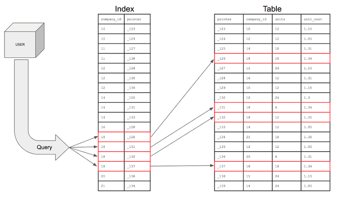
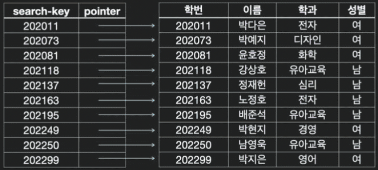
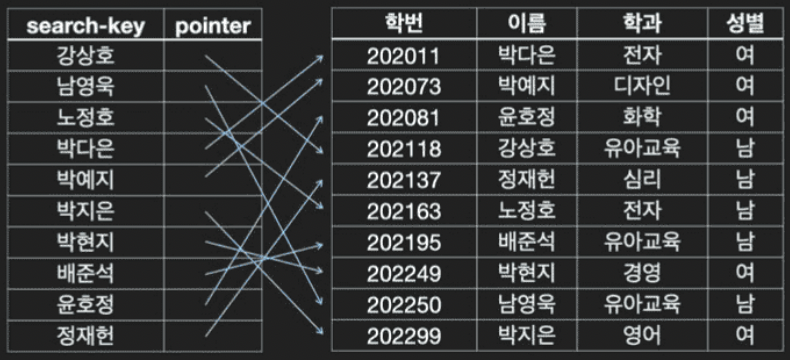
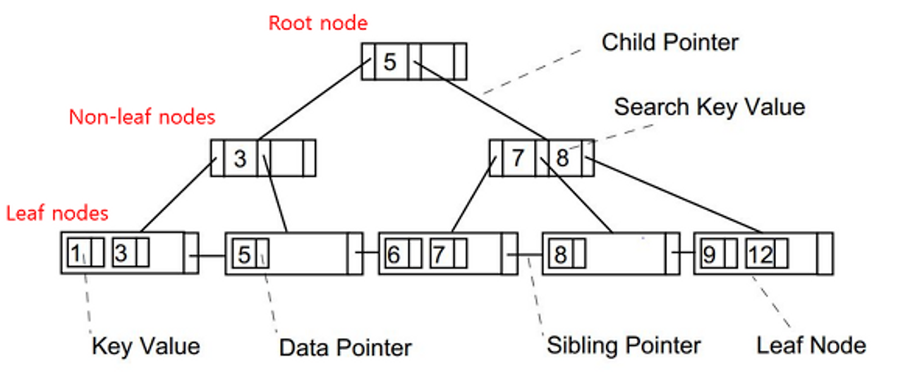
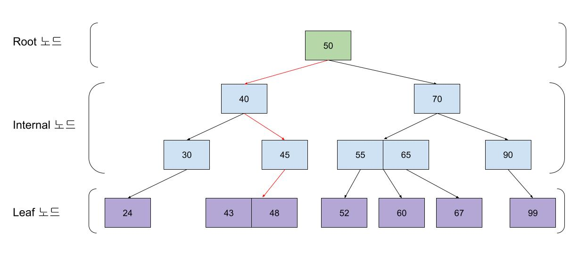
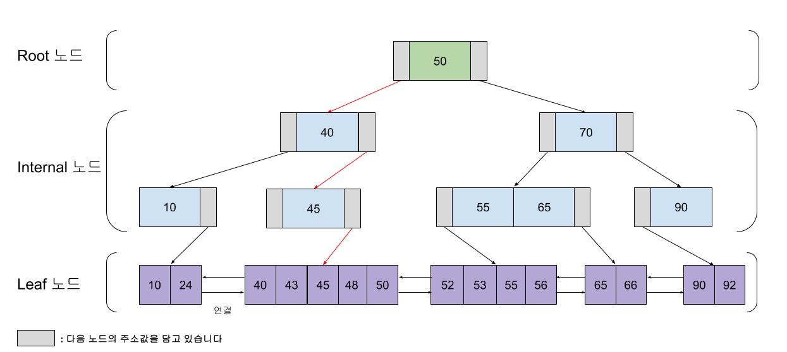
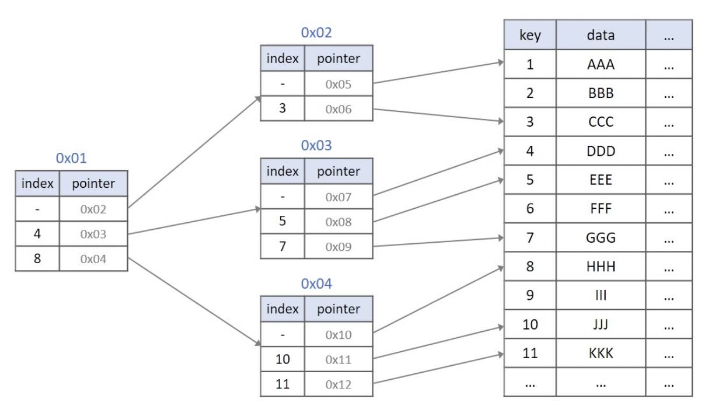
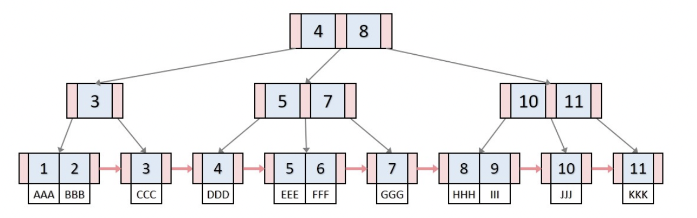
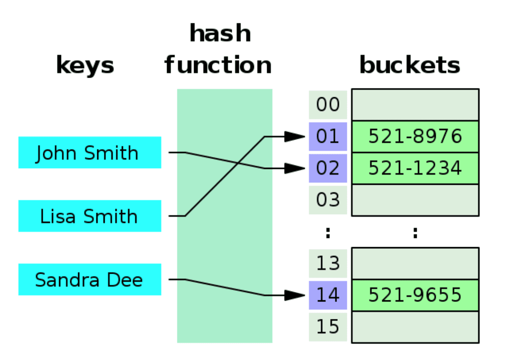

> 정의
> 

테이블의 데이터 조회 속도를 높여주는 자료구조 (= 데이터 위치를 빠르게 찾아주는 역할)

- 데이터와 데이터의 위치를 포함한 자료구조를 의미 ➡️ 추가적인 **쓰기 작업 + 저장 공간 사용**
- 효율적인 select, order by를 위한 기초 제공

    - 인덱스가 없는 칼럼을 조회하려면 full scan이 불가피하다 (→ 처리속도 떨어짐)
    - select 외에도 update, delete의 성능이 함께 향상됨  (∵ 해당 연산을 수행하려면 조회가 선행 되어야 하므로)

- 테이블과 별도로 인덱스 관리 테이블이 존재한다.
    - 테이블에서 순서와 상관 없이 인덱스 테이블에서는 정렬된 상태로 존재
        
        ⇒ {인덱스 번호 : 주소값} 즉 컬럼의 값과 레코드가 저장된 주소를 key-value로 저장
        
    - **MYI (MySQL Index) 파일**에 인덱스 저장 (= 하드디스크 용량을 차지한다)
- 보통 B+TREE 인덱스를 사용함

### ✅ 인덱스 관리 방법

DBMS는 인덱스를 항상 최신 정렬된 상태로 유지해야 원하는 값 빠르게 탐색할 수 있다.

→ 인덱스 적용된 칼럼에 INSERT, UPDATE, DELETE 수행하면 추가적 연산이 필요함

- INSERT : 새로운 데이터에 대한 인덱스 추가
- DELETE : 삭제하는 데이터의 인덱스를 사용 막는 사후 조치 진행
- UPDATE : 기존의 인덱스 사용 막고, 갱신된 데이터에 대한 인덱스 추가 (INSERT + DELETE)

## 인덱스 장점, 단점

### 👍 장점

- 테이블 조회 속도 및 성능 향상
    - 옵티마이저가 인덱스를 통해 데이터를 찾는다
         ❗ 옵티마이저 : SQL을 빠르고 효율적으로 수행할 수 있는 최적의 처리 경로를 생성해주는 DBMS 내부의 핵심 엔진
    - Full Scan 시간을 O(logN)으로 처리 가능 (B+Tree)
- 전반적 시스템 부하 경감
- 중복 데이터 방지, 특정 컬럼의 유일성을 보장할 수 있다.
- order by절, group by절, where절 등이 사용되는 작업의 효율성을 증가시켜줌

### 👎 단점

- 인덱스 저장하기 위해 데이터베이스의 약 10%에 해당하는 저장공간 사용
    - 필요없는 인덱스를 생성함으로써 무의미한 공간 차지 + 탐색 속도 역효과 (탐색 방해)

- 처음 인덱스 생성 시 시간 소요 큼
- 인덱스 관리를 위한 추가 작업(=연산) 필요
- 인덱스 잘못쓰면 성능 저하 역효과
    - 인덱스 잘못쓰는 경우 : DML이 자주 일어나는 속성에 인덱스 건 경우
        
        ❗ 인덱스가 추가될 때마다 정렬 + 밀림이 발생
        
        ❗ UPDATE, DELETE 연산의 경우 **기존 인덱스를 삭제하는게 아닌, 사용하지 않음 처리만** 수행함 (→ 실제 사용하는 인덱스보다 훨씬 많은 공간 차지하여 성능 하락 발생)
        

#### 💡 사용하지 않는 인덱스는 바로 제거해주는 작업을 수행하는게 좋다

### 어떤 경우에 인덱스를 써야 하나?

- 테이블의 규모가 큰 경우 (= 대량의 데이터를 검색하는 경우)

- INSERT, UPDATE, DELETE의 발생 빈도가 높지 않은 컬럼
- JOIN, WHERE, ORDER BY에 주로 사용되는 컬럼 (사용 빈도가 높은 경우)
- 데이터 중복도 낮은 컬럼 등 (= 유니크한 값을 가지고 있는 필드에 대해 중복되지 않는 값을 빠르게 검색할 수 있다.)

---

### 인덱스 생성 전략

- 인덱스는 열 단위에 생성
- where 절에서 (자주) 사용되는 열에 생성

- 데이터 중복도 높은 열에는 인덱스 만들어도 효과 없음 ➡️ 중복도 낮은 열에 생성할 것
    - 후보가 여러 개 존재하므로 특정 컬럼을 검색하는데 탐색이 중복됨 (O(N))
- 외래키를 설정한 열에는 자동으로 외래키 인덱스 생성됨
    - 다중컬럼이 인덱스로 설정 될 수도 있음 (복합키)
- join에 자주 사용되는 열에는 인덱스를 생성하는게 좋음
- 데이터 변경 작업 자주 일어나지 않는 곳
- 클러스터형 인덱스는 테이블 당 한 개! 보조는 여러 개 가능
- 사용하지 않는 인덱스는 제거해라 (공간 차지)

## 인덱스의 종류

> 일반적으로 DBMS에선 B+Tree 자료구조를 사용해 구현한다
> 

### 클러스터형 인덱스 (↔ Non-clustered Index)

> 비슷한 것들을 묶어서 저장하는 형태로 구현되는 인덱스
> 

- 비슷한 값(= 물리적으로 인접한 장소에 저장된 데이터들) 들을 동시에 조회하는 경우가 많다는 점에서 착안된 것
- 인덱스가 적용된 속성 값에 의해 레코드의 저장 위치가 결정됨 + 속성 값이 변경되면 그 레코드의 물리적 저장 위치 또한 변경되어야 한다
    
    → 대용량의 데이터가 이미 테이블에 존재하는 상태라면, 부하 ⬆️
    
- 테이블 당 하나만 생성된다.
- B+Tree 형태로 구성되어있다.
- 보조인덱스보다 검색 속도 빠르다.
- Data가 정렬되어 저장되므로, 보조인덱스에 비해 범위로 질의하는것에 유리하다 (I/O 덜 발생)
    - create, update, delete에 대해서는 느리다
- (MySQL) PK에 대해 자동으로 클러스터형 인덱스가 생성된다. (= 해당 컬럼을 기준으로 정렬)
    - 행마다 고유하며 Null값을 가질 수 없기 때문에 물리적 정렬 기준으로 적합하므로 PK 값이 비슷한 레코드끼리 묶어서 저장한다
    - innoDB는 클러스터링이 default 이므로 별도의 옵션 없이도 사용자에게 보이지 않는 clustered index가 생성된다
    - 지정 우선순위 : PK > Unique, not null > 자체 생성

##### 💡 Non-clustered Index = Secondary Index

### 보조 인덱스 - Secondary Index (↔ Primary Index)

> 후보키에만 부여 가능함
> 

- 보조 인덱스 생성 시 데이터 페이지는 냅두고 ****별도의 페이지에 인덱스 구성 (자동 정렬 X)

    - PK 이외에 필요한 정렬 기준이 있을 경우 사용한다
- 클러스터형 인덱스보다 검색 속도가 느리지만 데이터의 입력/수정/삭제 시 성능 부하가 적다
    - 인덱스 테이블만 처리하면 되므로 (아예 없는건 아니다)
    - 레코드가 인덱스순으로 정렬되지 않아 범위 조건으로 검색 시 많은 I/O 발생 가능 (성능 저하)
- 보조 인덱스는 테이블 당 여러개 생성 가능하다 (과유불급)
    - whrere, join 조건으로 자주 쓰이는 컬럼만 지정하는 걸 권장한다
- 검색 순서 : 루프 → 리프 → 데이터 페이지
    
    : 클러스터보다 느릴수밖에 없음 (시간 복잡도 `O(2logN)` )
    

> 데이터 insert 발생하는 경우
>
- 클러스터형 인덱스 : 데이터 삽입을 위해 페이지 분할 발생

- 보조 인덱스 : 데이터 페이지를 정렬할 필요 없음 → 데이터 페이지 뒤쪽 빈 부분에 삽입 발생

---

## 인덱스 자료구조

> DBMS는 인덱스를 어떻게 관리할까?

### B+Tree

- Root Node : 검색 경로 출발점
- Leaf Node : 실제 검색할 데이터가 저장된 노드
- Non-leaf node : lead node까지 가기 위해 다음 경로 노드의 key값을 가진 노드
- LinkedList : 부등호를 이용한 순차 검색 연산이 용이하도록 Leaf node들을 LinkedList로 연결

> Select 발생 시 → Root node에서 시작 ~ Non Leaf node 거쳐 ~ Leaf node 검색
> 

##### B-Tree, B+Tree 비교

차이점 : Leaf노드가 LinkedList 형태로 연결됐는지/안됐는지

**❓ A 이상, B이하 범위를 찾아야 하는 상황의 경우**

1. A값, B값의 위치를 알아야 함 

2. B-Tree의 경우, root노드 부터 시작해서 A 찾고 → 다시 root노드 부터 시작해서 B 찾음

3. B+Tree의 경우, root노드 부터 A 선형검색으로 찾고, B나올 때 까지 탐색

- B-Tree에서 Leaf 노드 간에 '연결성'이 추가된 자료구조 → 하나의 A or B 중 하나만 선형 검색으로 위치 찾으면 → leaf 노드 간 연결성을 통해 나머지 값 탐색 가능

#### 인덱스 기반 B+Tree 생성 과정

### Hash

- key:value 형태의 hash 는 탐색 짱빠르다 (O(1)) → 등 호 한 정!!!

- 부등호를 이용한 조건 조회가 불가능하다.

    - 데이터베이스는 범위를 통해 접근하는 경우가 많다. (<, = , >를 사용해 다양한 범위를 지정해 탐색할 수 있다.)
    - 해시 테이블은 모든 값이 정렬되어 있지 않으므로 특정 기준보다 크거나 작은 값을 찾을 수 없다.
        
        즉, 범위 검색에서는 O(1)의 시간 복잡도를 보장할 수 없고 매우 비효율적이다. 
        
        ⇒ 그렇기에 기준 값보다 크거나 작은 요소를 탐색할 수 있어야 하는 DB 인덱스 용도로 해시 테이블은 적합하지 않다.

### ➕ 데이터베이스에서 해시테이블은 아예 안쓰나?

Index로만 사용이 안될뿐이지 Join할 경우 해시테이블 자료구조를 사용하게 된다.

컬럼의 Index가 없고 ’**=’** 연산자로 Join 연산을 수행할 경우 Hash Join에 사용된다.
#### Hash Join 과정 

- 적은 데이터의 테이블을 Driving Table로 선택해서, 메모리에 해시테이블로 올려놓는다

- 나머지 테이블 값을 Hashing해 생성한 해시 값으로 Equal Join을 수행한다
    
    ⇒ 이때 Index없는 Nested Loops보다 평균적으로 빠르게 조회할 수 있다.

### 출처

https://mangkyu.tistory.com/96

https://velog.io/@juhyeon1114/MySQL-Index의-구조-B-Tree-BTree

https://velog.io/@sweet_sumin/클러스터드-인덱스-Clustered-Index-넌-클러스터드-인덱스-Non-Clustered-Index

https://sasca37.tistory.com/215

https://foot-develop.tistory.com/56

https://velog.io/@semi-cloud/11-데이터베이스-NL-SM-해시-조인