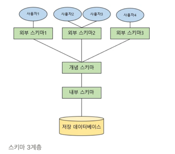

2차원 구조 모델을 기반으로 한 수평적 구조. 테이블 형식으로 데이터를 저장.

정규화를 통한 중복 데이터 최소화

SQL을 통해 데이터를 관리하고, 트랜잭션, 데이터 무결성 보장 등의 기능을 제공

ACID특성을 제공하여 데이터의 일관성과 안정성을 보장한다.

### ACID :  트랜잭션의 신뢰성을 보장하는 네가지 원칙

원자성 : 트랜잭션 내의 모든 작업이 모두 성공하거나 실패해야한다는 원칙. 중간에 오류가 난다면 이전의 변경사항은 모두 롤백된다.

일관성 : 트랜잭션이 완료되면 언제나 일관된(모순되지 않는) db상태를 유지하는 원칙.

격리성 : 트랜잭션은 다른 트랜잭션으로부터 독립적으로 수행되어야 한다는 원칙.

지속성 : 트랜잭션이 성공적으로 완료된 이후에는 그 결과가 영구적으로 저장되어야 한다는 원칙.

## 스키마

<aside>
💡 **스키마(Schema)**는 DB의 구조와 제약 조건에 관한 전반적인 명세를 정의한 것
****개체의 특성을 나타내는 **속성(Attribute)**과, 속성들의 집합으로 이루어진 **개체(Entity)**, 그리고 개체 사이에 존재하는 **관계(Relation)**에 대한 정의를 포함하여, 이들이 지켜야 할 **제약 조건**을 기술한 것

</aside>

Entity : 데이터로 표현하려고 하는 개체. 학생, 직원

속성 : 개체가 갖는 특성. 개체는 하나 이상의 속성을 가져야한다. 이름, 나이, 과목, 부서 등

관계 : 개체와 개체 사이의 연관성. 학생은 과목을 ‘수강하다’라는 관계를 가짐

### 외부 스키마 : 개별 사용자 입장

- 사용자가 필요로 하는 데이터만을 선택적으로 보여준다.

ex) 각 부서의 직원들이 자신들의 부서와 관련된 데이터만 볼 수 있도록 부서별로 서로 다른 외부 스키마를 설계할 수 있다

### 개념 스키마 : 조직 전체 관점

- 데이터베이스의 전반적인 구조를 파악하는데 중점을 둠
- 데이터베이스의 논리적 모델
- 개체간의 관계와 제약 조건을 나타내고 데이터베이스의 접근 권한, 보안 및 무결성 규칙에 관한 명세를 정의한다.
- 하나의 db에는 하나의 개념스키마만 존재한다.

**ex) 개발자는 개념스키마를 정의할 때 데이터 모델링** 도구를 사용해 **엔터티(Entity)**, **속성(Attribute)**, **관계(Relationship)** 등을 설계한다.

### 내부 스키마 : 디스크 관점

- 물리적인 저장장치 입장에서 데이터가 저장되는 방법을 기술한 것.
- 저장 방식, 인덱싱, 데이터 압축, 성능 최적화 등의 세부 사항이 포함.

ex) **인덱스를 추가**하여 특정 쿼리의 속도를 높이거나, **파티셔닝**을 통해 대량의 데이터를 효율적으로 관리한다.

---

### View

<aside>
💡 사용자에게 접근이 허용된 자료만을 제한적으로 보여주기 위해 만들어진 가상 테이블

</aside>

- 복잡한 조인이나 계산이 필요한 쿼리를 미리 정의된 뷰로 대체함으로써, 간단한 쿼리만 작성하여 데이터를 추출할 수 있다.
- 데이터 값을 가지는 것이 아니라 실제적으로는 SQL문만을 가진다.
- 동일한 쿼리를 여러 곳에서 재사용할 수 있다. 조회만 하면 됨.
- 민감한 데이터를 모아두지 않고, 필요한 데이터만 제공할 수 있다.

---

## 데이터의 독립성

데이터베이스의 구조와 데이터의 내용이 서로 영향을 미치지 않는 것

### 논리적 데이터 독립성

데이터베이스의 논리적 구조가 변경되어도 응용 프로그램이나 사용자의 요구에 영향을 주지 않는 것

→ 테이블의 속성이나 관계가 추가되어도 기존의 쿼리나 트랜잭션은 그대로 유지

데이터베이스 구조의 확장이나 재설계에서 발생하는 변화에 중점

### 물리적 데이터 독립성

물리적 구조가 변경되어도 논리적 구조나 데이터의 내용에 영향을 주지 않는 것

→ 인덱스의 구성이 바뀌어도 데이터베이스의 스키마나 데이터는 그대로 유지

---

## 데이터의 정합성

데이터들이 서로 일치하는 상태.

데이터들은 모순없이 존재해야 하며, 정규화되지 않은 상태일 때 이상현상이 발생하여 정합성이 깨짐

→ 구조화된 데이터를 저장하고 처리하는데 효율적이다.

→ 복잡한 관계를 표현, 관리하는데 효과적이다.

---

## Primary key

- 테이블 내의 각 레코드들을 식별할 수 있는 ID값 → 고유한 값이어야 한다.
- NULL일 수 없다.
- PK는 보통 하나의 필드로 구성되지만, 여러 필드를 조합하여 PK로 사용할 수 있다.(복합키)
- 꼭 PK가 존재해야 하는 것은 아니다.

기본 키 선정시 고려사항(유일성, 최소성)

- 각 튜플을 식별할 수 있는 고유한 값이어야 함.
- 변동이 일어나지 않는 속성
- 민감한 데이터는 제외

## Foreign key

- 다른 테이블의 `pk와 연결해` 정합성을 지켜줌.
- 부모와 자식테이블을 연결하는 키
- 존재하지 않는 PK를 참조하는 일을 막아준다.
- null 가능 → 하지만 null일 경우 참조 무결성 발생 가능

## Super Key

- 데이터를 유일하게 식별 할 수 있는 하나 혹은 그 이상 속성들의 집합
- 유일성 만족

## **Candidate Key**

- 기본키가 될 수 있는 후보들
- Super Key들 중 최소한의 속성들의 집합
- 유일성, 최소성 만족

## Composite key

- 두 개 이상의 컬럼으로 이루어진 키

---

## 무결성 제약조건

데이터의 정확성, 일관성, 유효성이 유지되는 것. db 연산에 제한을 두어 무결성을 유지한다.

→ 데이터에 결함이 없는 상태를 유지하는 조건

### 개체 무결성 - 각 행을 고유하게 식별할 수 있어야한다.

- 모든 테이블은 NULL이 아닌 pk를 가져야한다
- 기본키가 같다면 삽입이 금지됨.
- 이미 있는 값이나 NULL로 수정이 금지

### 참조 무결성 - 기본키와 외래키간의 관계가 항상 유지되도록 보장

- fk는 참조하는 테이블의 pk와 동일해야한다.
- fk를 설정할 때 제약조건을 달아 참조 무결성을 유지할 수 있다.
- 자식 엔티티의 값이 변경될 때 부모 엔티티의 값에 제약을 받는다.

### 도메인 무결성 - 정의된 영역을 벗어나지 않도록 규정

- 필드의 타입, 길이, NULL값 허용, UNIQUE 등 제약조건으로 무결성을 유지
- ex) 나이는 음수가 될 수 없다, 성별은 ‘남’, ‘여’만 저장될 수 있다.

### 고유 무결성

- 특정 필드에 고유한 값을 가지도록 조건이 주어진 경우 각 레코드마다 고유한 값을 가져야 한다.
- unique key로 설정 (주민번호, 학번)

### NULL 무결성

- 특정 속성은 NULL이 될 수 없다.
- NOT NULL로 설정
