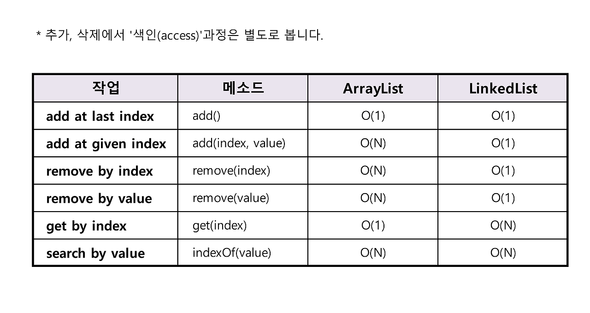
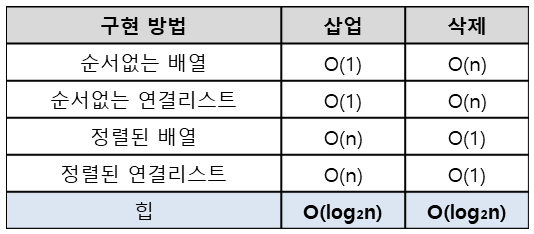
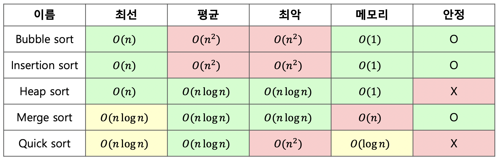
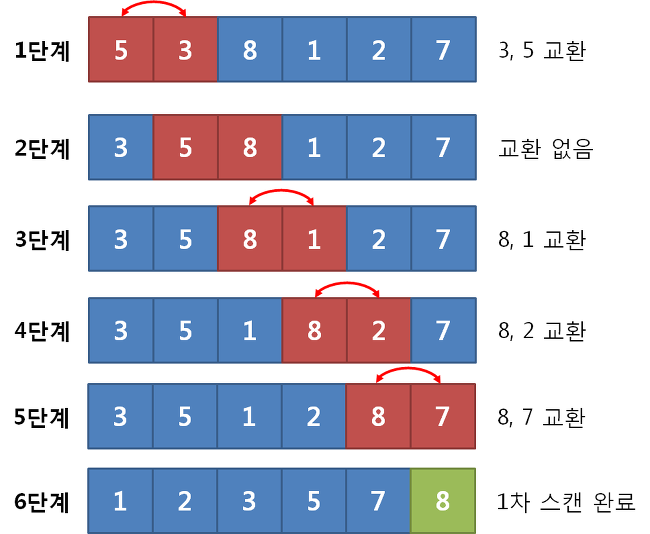
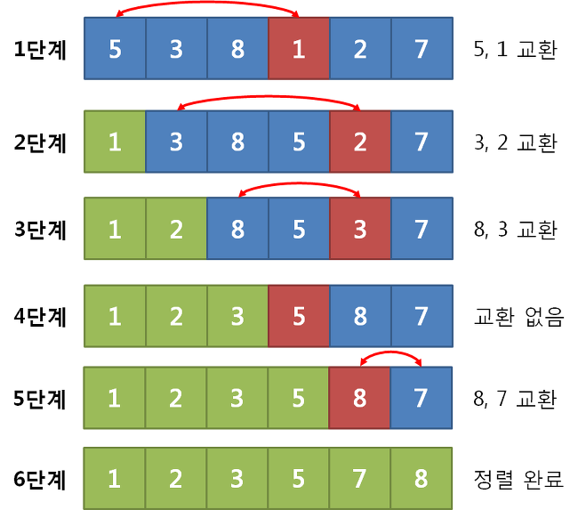
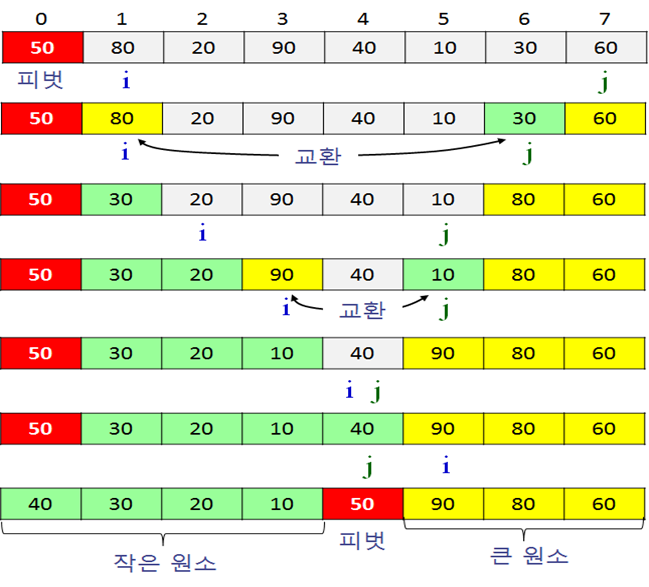
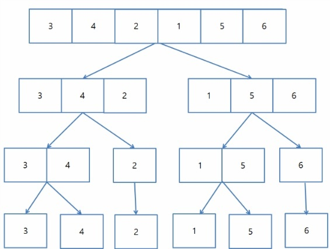
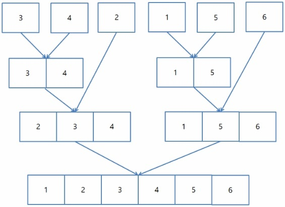

## Array, ArrayList, LinkedList

### Array

- 메모리의 연속 공간에 값이 채워져 있는 형태의 자료 구조
- **인덱스를 통해 참조 가능 (값에 빠르게 접근 가능)**
- 선언한 자료형의 값만 저장 가능
- 새로운 값을 삽입하거나 특정 인덱스에 있는 값을 삭제하기 어려움 (값 이동 or 삭제 하려면 해당 인덱스 주변 값을 이동해줘야 함)
- 배열의 크기는 선언할 때 지정 후 변경 불가능
- 구조 간단 → 코딩 테스트에서 제일 사용 多

### ArrayList

- 배열을 이용하여 컬렉션을 구성한다.
- 장점
    - 선언할 때 크기 별도로 지정 하지 않음 → 크기 유동적
    - index를 갖고 있으므로 데이터를 빠르게 찾을 수 있음
- 단점
    - 삽입 및 삭제가 느리다
    - 중간에 데이터를 추가 및 삭제할 때 시간이 오래걸린다 (마찬가지로 밀거나 당겨와야되므로)

### LinkedList

- 연속적인 메모리 위치에 저장되지 않는 선형 데이터 구조. **포인터를 사용해서 연결함**
    - 각 노드의 구성 : 데이터 필드 + 다음 노드에 대한 참조
    - 단일 노드 : 뒤의 노드만 가리킴 / 다중 : 앞, 뒤 노드 모두 가리킴
- 장점
    - 크기가 고정되어 있지 않음
    - 포인터로 연결됨 → 데이터 삽입/삭제 연산 속도 빠름
- 단점
    - 인덱스 없음 → 값에 접근하려면 Head 포인터부터 순서대로 접근해야 함 
    ⇒  접근하는 속도가 느리다
    - 포인터 저장할 공간 필요 → 배열보다 구조 복잡함

### Array vs. ArrayList vs. LinkedList 차이

- ArrayList는 Array의 크기가 가변적인 버전이다.
    - 초기 설정한 크기의 배수로 크기를 증가해나간다.
    - 단,  데이터 추가/삭제 시 메모리를 재할당하므로 속도가 느리다.
- ArrayList는 index가 있지만, LinkedList는 각 원소마다 앞, 뒤 원소의 위치값을 가지고 있다.
    
    ⇒ 이러한 차이로 인해, 조회/삽입/삭제의 시간복잡도 차이가 발생한다.
    

### 배열 vs. 리스트 선택 기준

- *배열 (Array)*
    - 데이터의 크기가 픽스 되어 있는 경우
    - 데이터에 접근하는 경우가 많은 경우
- *리스트 (ArrayList, LinkedList)*
    - 크기가 변하는 데이터 다룰 때
    - 데이터 삽입/삭제가 많은 경우

### 큐

- **선입선출(FIFO)** : 삽입/삭제가 양 방향에서 발생
- 용어
    - rear : 데이터 새로 추가되는 부분 (가장 끝 데이터)
    - front : 데이터 삭제되는 부분 (가장 앞 데이터)
    - add : rear 부분에 새로운 데이터 삽입
    - poll : front 부분에 있는 데이터 삭제하고 확인
    - peek : front 데이터 확인

## 힙 (우선순위 큐)

- 우선순위 큐를 위해 만들어진 자료구조
- 완전 이진 트리의 일종으로, 부모노드와 자식노드 간 대소관계가 성립되는 반 정렬 상태.
    - 이진 탐색 트리와 달리 중복된 값 허용한다
- 시간 복잡도 : `O(logn)`
- 종류
    - 최대 힙 : 부모 노드의 키 값이 자식 노드의 키 값보다 크거나 같은 완전 이진 트리
    - 최소 힙 : 부모 노드의 키 값이 자식 노드의 키 값보다 작거나 같은 완전 이진 트리
- 구현
    - 힙을 저장하는 표준적인 자료 구조는 배열 (완전 이진탐색트리이므로 배열일 때 공간 효율성 가장 높음)
    - 구현을 쉽게 하기 위해 배열의 첫번째 인덱스 0은 사용 X
    - 특정 위치의 노드 번호는 새로운 노드가 추가되어도 변하지  않음
- 삽입
    - 힙에 새로운 요소가 들어오면, 힙의 마지막 노드에 삽입
    - 새로운 노드를 부모 노드들과 교환하며 정렬 맞춤
- 삭제
    - 루트노드 삭제 후, 힙의 마지막 노드 가져옴
    - 이후 재정렬하며 힙을 재구성함
- 구현 방법 별 삽입/삭제 시간 복잡도 비교
    
    우선순위 큐는 힙 외에도 배열, 연결 리스트로 구현 가능하다.
    

## 해시

### 해시의 개념과 정의

데이터를 효율적으로 관리하기 위해, 임의의 데이터를 고정된 길이의 데이터로 매핑하는 것

해시함수를 구현하여 데이터 값을 해시 값으로 매핑한다

적은 자원으로 많은 데이터를 효율적으로 관리하기 위해, 많은 데이터들을 유한한 개수의 해시값으로 매핑하면 작은 메모리로도 프로세스 관리가 가능해진다

### 해시 함수 (Hash Function)

- 입력된 키를 일정한 크기의 숫자로 매핑하는 함수
    - key를 해시함수에 넣으면, 해당 키와 값을 저장할 배열의  인덱스를 반환하는 형식
    - 해당하는 인덱스에 key, value, hash 값 3가지가 함께 저장된다
- 가능한 서로 다른 키들에 대해 다른 해시 값을 생성한다
- 좋은 해시함수는 해시 충돌을 최소화하고, 데이터를 고르게 분산시킬 수 있음 (체이닝, open addressing, …)

### 해시 테이블

- 시간 복잡도
    - 삽입 : O(1) (평균), O(N) (최악: 충돌이 일어난 경우 - 인덱스 값 탐색 후 LinkedList로 순차탐색 해야 함, 결국 길이 n만큼 소요)
    - 탐색 : O(1) (평균), O(N) (최악)
    - 삭제 : O(1) (평균), O(N) (최악)
- 장점
    - 해시 중복 방지 (충돌을 피하는 설계를 하게 되니 가장 이상적)ㅇ
    - 서버에 작업을 시키지 않고 자료를 캐싱 가능함

### 해시 충돌

> 데이터가 많아지면, 다른 데이터가 같은 해시 값으로 겹치며 충돌이 발생 가능 ⇒ collision 현상
> 
- 그럼에도 해시 테이블을 왜 쓰는걸까?
    - 언제나 동일한 해시값을 리턴하므로, 인덱스를 안다면 빠른 데이터 검색이 가능하므로
    - 해시테이블의 시간 복잡도는 O(1)이다. (이진탐색트리로 구성할 경우 제외)
- 충돌 문제의 해결 방법
    1. **체이닝**
        
        각 배열의 인덱스에 LinkedList를 사용해 키를 계속 추가해나가는 방식 
        (제한 없이 계속 연결할 수 있다. but 메모리 이슈)
        
    2. **Open Addressing (개방 주소법)**
        
        충돌이 발생하면, 해시 함수로 얻은 주소가 아닌 다른 주소에 데이터를 저장할 수 있도록 허용함. 즉, 다른 빈 버킷을 찾아 이동하거나 다른 인덱스에 저장할 수 있게끔 허용한다는 것.
        
        (ex. 해당 키 값에 저장되어 있는 경우 그 다음 주소에 저장)
        
    3. **선형 탐사**
        
        정해진 고정 폭으로 옮겨 해시값의 중복을 피함
        
    4. **제곱 탐사**
        
        정해진 고정 폭을 제곱수로 옮겨 해시값의 중복을 피함
        

### Resize : 해시 테이블 크기 조정

데이터가 가득 차면, 해시테이블의 크기를 늘려줘야 함

### 조정 과정

1. **현재 데이터 이동**
    
    기존 해시 테이블의 데이터 ⇒ 새로운 크기의 해시 테이블로 이동
    
    → 이동 시, 각 데이터의 해시 값 재계산하지 않고 저장된 해시값 재활용해서 쉽게 찾을 수 있다.
    
2. **새로운 해시 함수 사용**
    
    리사이징시, 해시 함수의 결과의 범주도 함께 늘려줘야 함 (가능한 인덱스 범위도 증가하니)
    
    **→ 새로운 해시 함수를 사용**해 데이터를 저장함
    
3. **크기 조절**
    
    일반적으로 해시 테이블의 크기를 2배로 늘리는 경우 多
    
    → 보통 기존 크기의 2배인 소수를 선택
    
    - 왜 **소수**?  해시 함수의 결과가 균등하게 분포되도록 할 수 있다.
4. **재해시(Rehashing)**
    
    해시 테이블안의 모든 데이터를 새로운 크기에 맞게 **다시 해싱**해서 새 테이블로 옮김
    
5. **데이터 이동**
    
    재해시된 결과를 기반으로 데이터를 **새로운 크기의 해시 테이블에 이동시킴**
    

---

## 정렬 알고리즘 시간 복잡도

| 버블 | 데이터의 인접 요소끼리 비교 → swap 연산 수행 해 정렬 |
| --- | --- |
| 선택 | 대상에서 가장 크거나 작은 데이터 찾기 → 선택 해 위치 변경하며 정렬 |
| 삽입 | 대상을 선택해 정렬된 영역에서 선택 데이터의 적절한 위치를 찾아 삽입 |
| 퀵 | pivot 값 선정 → 그 값을 기준으로 정렬 |
| 병합 | 이미 정렬된 부분 집합들을 효율적으로 병합 해 전체 정렬 |
| 기수 | 데이터의 자릿수를 바탕으로 비교해 데이터 정렬 |

💡 ***정렬 알고리즘을 사용할 경우***

- 일반적인 경우엔 **`Arrays.sort()`** 를 사용한다
    - *dual-pivot Quick sort* 알고리즘 사용 → 평균 시간 복잡도 `O(nlongn)`
    - QuickSort 이므로, **최악의 경우 `O(n^2)` 가능**
- 차선책 : **`Collections**.**sort()**` 사용
    - *Timsort* 알고리즘 사용 → 시간 복잡도 **`O(n)`** ~ **`O(nlogn)`**
    - Collections class method 이므로 Array 상태로 이용 불가능 → 리스트 변환 필요
- best : **`Counting sort`**구현 해 사용
    - 시간 복잡도 : **`O(kn)`** (k : 자릿수) 보장 → 데이터 많을 수록 O(n)에 가까움
    - input 범위에 해당하는 Array 구현 → 입력 값 확인 시 마다 해당 index 에 들어있는 값 +1 한 뒤, 최종적으로 값이 0 이 아닌 index값 차례대로 출력하는 방식

### 버블 정렬 [Bubble Sort]

> 서로 인접한 두 원소의 대소를 비교하고, 조건에 맞지 않다면 자리를 교환하며 정렬
> 
- **시간복잡도** : **`O(n^2)`**
    - **최악 : `n^2`**
    - **평균 `n^2`**
    - **최선 : `n` - 이미 정렬된 경우**
- **공간 복잡도 : `O(1)`**
    - 정렬하고자 하는 배열 안에서 교환하는 방식 (제자리 정렬) → 다른 메모리 공간 필요 X
- **정렬 과정**
    1. 비교 연산이 필요한 루프 범위 설정
    2. 인접한 데이터 값을 비교
    3. swap 조건에 부합하면 swap 연산을 수행
    4. 루프 범위가 끝날 때 까지 2️⃣ ~ 3️⃣ 과정 반복
    5. 정렬 영역을 재설정 (다음 루프 실행 시 정렬된 범위 제외)
    6. 비교 대상이 없을 때 까지 1️⃣ ~ 5️⃣ 반복
    
    > **특정한 영역에서 swap이 한 번도 발생 X** ⇒ **그 영역 뒤에 있는 데이터가 모두 정렬됐다는 것**
    > 
    > 
    > ⇒ 프로세스 종료!
    > 
    
    
    
- **특징**
    - 루프를 돌면서 인접 데이터 간 swap 연산을 통해 정렬
    - 특정한 loop의 전체 영역에서 swap이 한 번도 발생하지 않았다
        
        → 해당 영역 앞 데이터가 모두 정렬됨을 의미 ⏩ 프로세스 종료
        
    - 구현이 간단, 소스 코드가 직관적
    - 안정 정렬 (입력 데이터에 동일한 키 값을 갖는 레코드가 여러 개 존재할 경우, 이들의 상대적인 위치가 정렬 후에도 그대로 바뀌지 않는 정렬)
    - 평균 시간복잡도 O(n^2)로, 매우 비효율적이다
    - 제자리 정렬 (정렬하고자 하는 배열 안에서 연산 수행)

### 선택 정렬 [Selection Sort]

> 각 순서마다 원소 넣을 위치가 먼저 정해져 있고, 어떤 원소 넣을지 선택하며 정렬
- 삽입 정렬과 차이 : **해당 자리를 선택**하고 **그 자리에** 오는 값을 찾는 것은 선택 정렬
> 
- **시간복잡도** : **`O(n^2)`**
    - **최악 : `n^2`**
    - **평균 : `n^2`**
    - **최선 : `n^2`**
    
    n개의 데이터에 대해 n번 회전하며 n-i번 비교 ⇒ n(n-1)/2
    
- **공간 복잡도 : `O(1)`**
- **정렬 과정**
    
    최솟값 or 최댓값을 찾고, 남은 정렬 부분의 가장 앞에 있는 데이터와 swap 하는 것
    
    1. 남은 정렬 부분에서 최솟값(or 최댓값) 찾음
    2. 남은 정렬 부분에서 가장 앞에 있는 데이터와 선택된 데이터를 swap
    3. 이미 정렬된 고정 부분 확장 (index++) → 남은 정렬 부분의 범위 축소
    4. 전체 데이터 크기만큼 index가 커질 때까지(=남은 정렬 부분 없을 때 까지 반복)
    
    
    
- **특징**
    - 구현이 단순하지만 시간 복잡도 큰 편 → 비효율적, 자주 사용하지 않음
    - 이미 정렬된 경우 매우 빠른 속도를 가짐 (역순은 최악)
    - 값이 같은 레코드가 있는 경우에 상대적인 위치가 변경될 수 있음 → 불안정 정렬
    - 제자리 정렬

### 삽입 정렬 [Insertion Sort]

> 이미 정렬된 데이터 범위에 정렬되지 않은 데이터를 적절한 위치에 삽입 시켜서 정렬
> 
- **시간 복잡도** : **`O(n^2)`**
    - **최악 :  `n^2`** - 역순으로 배열된 경우 … N(N-1)/2
    - **평균 : `n^2`**
    - **최선 : `n`**
- **공간 복잡도 : `O(n)`**
- **정렬 과정**
    1. 현재 index에 있는 데이터 값 선택 (2번째 원소부터 시작)
    2. 현재 선택한 데이터가 정렬된 데이터 범위에 삽입될 위치 탐색
    3. 삽입 위치부터 index에 있는 위치까지 shift 연산 수행
    4. 삽입 위치에 현재 선택한 데이터 삽입 → index ++ 수행
    5. 전체 데이터의 크기만큼 index 커질 때 까지 (= 선택할 데이터 없을 때 까지) 반복
    
    
    
    - 삽입 위치 탐색 ⇒ 이진 탐색 등 적절한 탐색 알고리즘 선택 해 시간 복잡도 줄일 수 있다
- **특징**
    - 앞에는 미리 정렬 됐다고 가정 → 정렬 된 것 중 가장 뒤에 값을 하나씩 꺼내와서 비교하는 것
    - 구현 하기 쉬움
    - 대부분의 원소가 이미 정렬된 경우, 매우 효율적으로 동작 가능
    - 제자리 정렬, 안정 정렬
    - selection, bubble sort와 같은 O(n^2) 알고리즘에 비해 상대적으로 빠르다
    - 선택정렬은 k+1번째 요소를 찾기 위해 나머지 모든 요소들을 탐색하지만, 삽입 정렬은 k+1번째 요소를 배치하는데 필요한 만큼의 요소만 탐색 → 훨씬 효율적으로 실행됨

## O(n^2) 삼형제 : 삽입, 버블, 선택 정렬

- 버블 정렬보다 교환 횟수가 적음 → 항상 선택 정렬이 우수함
- 선택정렬은 k번째 반복 후, k+1번째 요소를 찾기 위해 나머지 요소를 탐색함
    
    But 삽입 정렬은 필요한만큼만 탐색함 → 훨씬 효율적으로 실행됨
    
    … 그래봤자 O(n^2)이므로 도긴개긴이다
    

## 퀵 정렬 (Quick Sort)

> 기준값(`pivot`)을 선정 → Divide & Conquer의 반복 + Combine
> 
- **시간복잡도 :  `O(nlogn)`**
    - **최악 : `n^2`**
    - **평균 : `nlogn`**
    - **최선 : `nlogn`**
    
    `pivot`을 어느 위치로 고르는 지에 따라 천차만별
    
- **공간 복잡도 : `O(logn)`**
    - 재귀 호출로 인해 발생하는 스택 메모리 사용 비용 (최악의 경우 깊이 n이므로 O(n))
- **정렬 과정**
    1. 데이터를 분할하는 pivot 설정 (보통 왼쪽/ 오른쪽 끝 or 정 중앙)
    2. pivot을 기준으로 아래 과정을 거쳐 데이터를 2개의 집합으로 분리
        1. i(start)가 가리키는 데이터 < pivot이 가리키는 데이터 인 경우: i++(오른쪽 +1)
        2. j(end)가 가리키는 데이터 > pivot이 가리키는 데이터인 경우 : j-- (왼쪽 +1)
        3. i가 가리키는 데이터 > pivot이 가리키는 데이터 && j가 가리키는 데이터 <pivot이 가리키는 데이터 : swap 후 i++, j--
        4. i와 j가 만날 때 까지 a~c 반복
        5. i와 j가 만난 지점의 데이터 > pivot 데이터 : 만난 지점 - 1 에 pivot 삽입
        
              i와 j가 만난 지점의 데이터 < pivot 데이터 : 만난 지점 +1에 pivot 데이터 삽입
        
    3. 2개로 분리된 집합 (작은 원소 집합/ 큰 원소 집합) → 각각 pivot 다시 선정
    4. 분리 집합이 1개 이하가 될 때 까지 1 ~ 3 과정 반복

- **특징**
    - **pivot**을 중심으로 데이터를 2개의 집합으로 나누며 각각 정렬함
        
        (좌측→ pivot보다 작은 수들 / 우측→ pivot보다 큰 수들)
        
    - 순환 호출이 한번 진행될 때 마다 최소한 하나의 원소(피벗)는 최종적으로 위치가 정해짐
    - **pivot**을 기준으로 양쪽 그룹으로 나눠진 후, 각각의 그룹에서 또 **pivot**을 선정하여 분할 정렬을 계속함 ⇒ ***재귀함수*** 사용
    - 시간 복잡도가 O(nlogn)인 정렬 알고리즘 중 가장 빠르다
    - 제자리 정렬, 불안정 정렬
    - 정렬된 배열일 경우 오히려 수행시간이 더 오래 걸림 (불균형 분할)
    - `Arrays.sort()`가 ***Dual Pivot Quick Sort로 구현***되어 있을정도로 효율적인 알고리즘. 기술 면접에 빈번하게 나온다

### Pivot 위치 선정

- 일반적으로는 왼쪽 끝 원소를 pivot으로 정함
- pivot을 중간값으로 잘  정해야 성능이 잘나옴
    
    ⇒ 배열 안 데이터 일부를 뽑아서 그것의 중간 값을 피벗으로 설정 하는 등… 
    
- 데이터가 대부분 정렬되어 있는 경우, 앞쪽에 있는 수를 pivot으로 설정할 경우, 시간복잡도 최악이 될 수도…

### 머지 정렬 [Merge Sort]

> divide and Conquer 방식 사용 → 데이터 분할 후 집합 정렬하여 Merge
> 
- **시간복잡도 :  `O(nlogn)`**
    - **최악 : `nlogn`**
    - **평균 : `nlogn`**
    - **최선 : `nlogn`**
- **공간 복잡도 : `O(n)`**
- **특징**
    - Timsort 방식이다 (머지 & 삽입)
    - 가장 작은 데이터 집합 단위로 분할
    - 병합하면서 정렬 (분할된 set 끼리 병합하면서 정렬 반복)
    - stable sort(안정 정렬)

### **정렬 과정** : 분할 과정 + 병합 과정

1. 배열 원소 개수 6개 → 최초에 6개의 그룹으로 나눔
2. 그룹을 2개씩 합치며 오름차순 정렬, 남는 원소는 보류
3. 나머지 원소와 합치며 3개씩 2개 생성
    
    ⇒ 각 그룹 원소에서 앞 data 1개씩 꺼내오며 크기 비교
    
    ex) (2/1) -(1 꺼냄)→ (2/5) -(2 꺼냄)→ (3/5) -3꺼냄→ 4/5 -4꺼냄→ 5 → 6
    

##### ✳️ 투 포인터 개념을 사용해 2개의 그룹 병합

- 왼쪽 포인터 vs. 오른쪽 포인터 값 비교
    
    → 작은 값을 결과 배열에 추가 + 포인터 오른쪽으로 1칸 이동
    
---

참고
    
https://gyoogle.dev/blog/algorithm/Selection%20Sort.html
    
https://wonjayk.tistory.com/217
    
https://gmlwjd9405.github.io/2018/05/06/algorithm-selection-sort.html

https://gyoogle.dev/blog/algorithm/Quick%20Sort.html
    
https://dev-coco.tistory.com/19
    
https://engineerinsight.tistory.com/332

https://devlog-wjdrbs96.tistory.com/64