# 1. 멀티 스레드

## a. 멀티 스레드의 정의 및 필요성

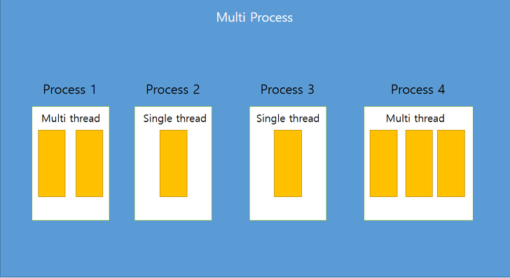

<aside>
💡

> 멀티 스레드 : Application 내부에서의 멀티 태스킹 </br>
> 멀티 프로세스 : Application 단위의 멀티 태스킹

</aside>

- 멀티 프로세스
    - OS에서 할당받은 메모리로 실행 ⇒ 서로 독립적
    - 독립적이기 때문에 하나의 프로세스에 오류가 발생해도 다른 프로세스에 영향 X
- 멀티 스레드
    - 프로세스 내부에 생성 ⇒ 서로 영향을 미칠 수 있음
    - 하나의 스레드 예외 발생 시 프로세스 자체가 종료될 수 있기 때문에 영향을 미침
- 왜 필요함? 독립적인 든든한 멀티 프로세스 쓰면 되지?
    - 리소스 효율성
        - 동일 프로세스 내에서 작업 ⇒ 같은 메모리 공간 공유 ⇒ 메모리 효율 굿
    - Context Switching
        - 멀티 프로세스는 context switching에 오버 헤드 유발 (독립적)
        - 멀티 스레드는 같은 메모리 공간 공유로 context switching에 유리함
    - I/O 작업 병렬 처리
        - CPU 연산보다 I/O 연산 많은 경우 유리 ⇒ CPU가 I/O 작업 기다리는 동안 다른 스레드가 CPU 자원 사용할 수 있기 때문에 응답성 향상

➡️ 멀티 스레드의 장점 :  반응성, 자원 공유 가능, 경제성, 확장성 (병렬성) 

➡️ 프로세스 : 공장 / 스레드 : 공장 직원 / 공장 크기 (프로세스 메모리 한계)에 따라 직원 수(스레드 수) 결정

---

# 2. Java의 멀티 스레드

## a. 구현 방법

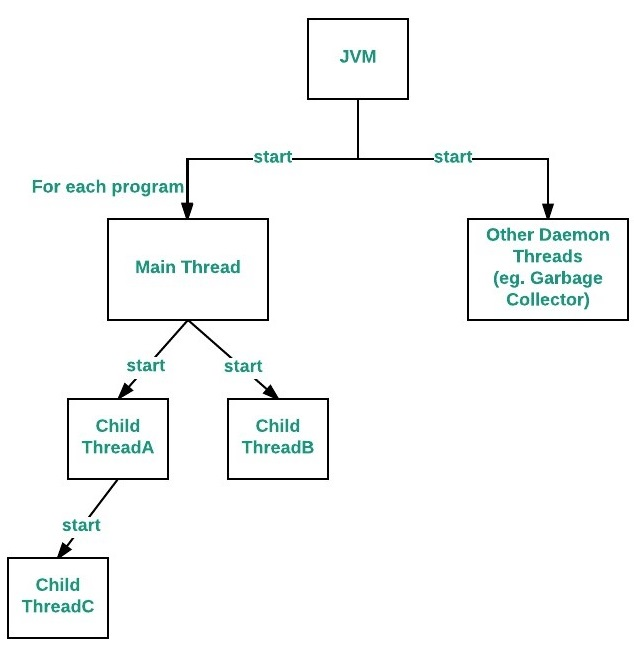

<aside>
💡

Java ⇒ Main 스레드 : main() 메서드 + (작업 스레드 : Thread, Runnable 구현)

</aside>

- **JVM** 이 먼저 Main 스레드를 자동 생성
    - `main()` 메서드 실행
- 별도의 스레드 (작업 스레드) 없으면 단일 스레드로 `main()` 만 실행됨
- `main()`  내부에 또 다른 스레드를 생성 및 실행하는 코드가 있다면 그 스레드 동시 실행

**메인 스레드는 JVM이 만들어주면 작업 스레드는 누가 만드나요? ⇒ 바로바로 개발자 여러분**

### a-1) [Thread](https://docs.oracle.com/javase/8/docs/api/java/lang/Thread.html) (Class) `java.lang.Thread`

- Thread 하위 클래스로 생성하는 방법
    - 실행 작업을 Runnable 로 만들지 않고, Thread의 하위 클래스로 작업 스레드 정의
    
    ```java
    public class WorkerThread extends Thread{
    	@Override
        	public void run() {
            // 스레드가 실행할 코드
            }
    }
    
    Thread thread = new WorkerThread();
    ```
    
    - 익명 객체 구현 시 더 간단
    
    ```java
    Thread thread = new Thread() {
    		public void run() {
    				// 스레드가 실행할 코드.
    		}
    }
    ```
    
    - Thread 클래스에서 매개변수로 받은 Runnable 구현체가 아닌 Thread 자체 메서드를 사용 가능

### a-2) Runnable (Interface)

- Thread 클래스 직접 객체화해서 생성하는 방법
    
    ```java
    public class ThreadTest {
    	Thread thread = new Thread(new Runnable() {
    			
    			@Override
    			public void run() {
    					// 스레드가 실행할 코드
    			}
    	});
    }
    ```
    
    - Runnable 인터페이스라 `run()` 메서드 구현된 target이 필요
        - `run()` : 작업 스레드가 실행할 코드 작성
        - ! ! ! !실제 스레드 아님! ! ! ! ⇒ 어떤 작업할지에 대한 코드이지 절대 스레드 아님
        - Runnable 구현체를 매개값으로 Thread 생성자 호출해야 작업 스레드 생성
    - 작업 스레드 생성되면 바로 실행되는 것이 아닌 `thread.start()`  호출해야 실행됨

**[간단 정리]**

| **기준** | **`Runnable` 구현 방식** | **`Thread` 상속 방식** |
| --- | --- | --- |
| **유연성** | **다른 클래스도 상속 가능, 더 유연한 구조** | **다중 상속 불가, 상속 구조의 제한** |
| **재사용성** | **`Runnable` 구현체는 여러 스레드에서 재사용 가능** | **각 스레드가 고유한 작업 로직을 가짐** |
| **객체 지향 설계 원칙** | **구성(Composition) 원칙** | **상속 (Ingeritance) 사용** |
| **코드 복잡성** | **다소 복잡, `Thread` 와 `Runnable` 분리** | **간결하고 직관적** |
| **스레드 동작 변경** | **`Thread` 의 동작을 직접 수정하기 어려움** | **`Thread` 클래스의 동작을 직접 변경 가능** |
| **작업과 스레드 결합** | **작업 로직과 스레드 분리 가능** | **작업 로직과 스레드 강하게 결합** |

➡️ `extends Thread` 
       방식은 하나만 상속 가능함 (단점) / run() 외에 다른 메서드를 Override 해야한다면 사
       (장점)

➡️ `implements Runnable` 
      run() 만 사용해도 되는 경우 Runnable 사용 / Thread를 상속받을 클래스가 다른 클래스도
      상속 받아야 한다면 Runnable 사용

## b. 생명 주기

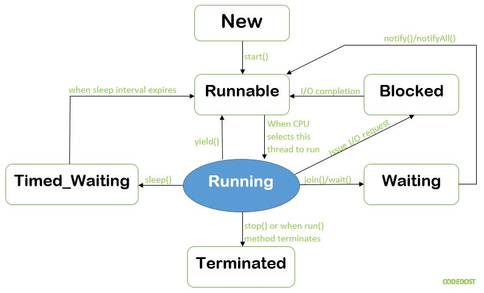

### b-1) 스레드의 상태

- **New :** 스레드 생성 후 아직 `start()`  호출 안된 상태
- **Runnable :** 실행 중 혹은 실행 가능한 상태
- **Blocked :** 동기화 블록에 의해 일시정지된 상태 (Lock이 풀릴 때 까지 기다림)
- **Waiting, Timed_waiting** : 스레드의 작업이 종료된 상태는 아니지만 실행 불가능 (UnRunnable) 일시정지 상태, Timed가 붙으면 정지 시간이 지정된 경우
- **Terminated :** 스레드의 작업이 종료된 상태

```java
// Thread 상태 확인 방법
public static void main(String[] args) throws Exception {
    Thread thread = new Thread();
    System.out.println(thread.getState()); // 출력 : NEW
}
```

```java
public static void main(String[] args) throws Exception {
    Thread thread = new Thread();
    System.out.println(thread.getState()); // 출력 : RUNNABLE
}
```

### b-2) 각 상태 간 전이와 메서드 정리

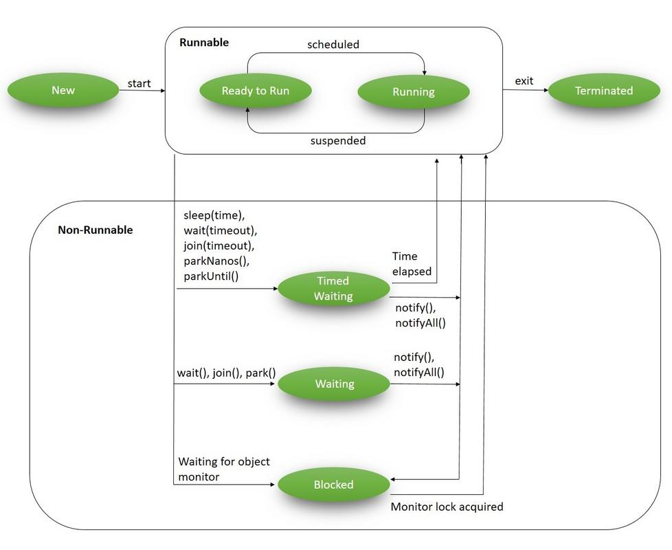

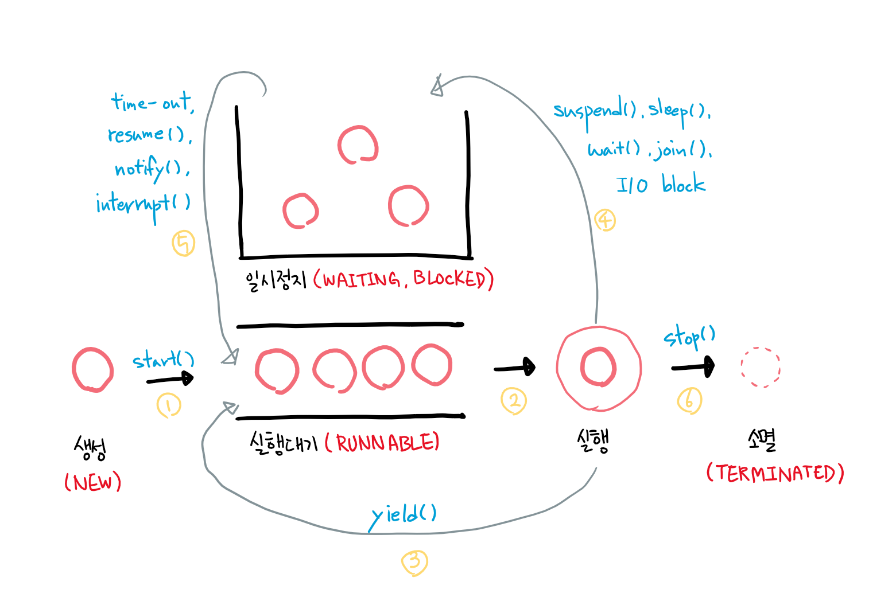

| **전이 상태** | **조건 및 메서드** |
| --- | --- |
| **New → Runnable** | 조건 : start() 메서드 호출 </br>- `start()` : 메서드 호출 시 스레드가 Runnable 상태로 변함 |
| **Runnable → Blocked** | 다른 스레드가 해당 모니터 락 점유 시 </br>동기화된 메서드 또는 블록에 진입 시 자동 발생 |
| **Runnable → Waiting** | 조건 : 스레드가 무기한 대기해야 할 때</br> -  `Object.wait()`  : 스레드가 특정 객체 모니터 락을 해제하고 다른 스레드의 신호 대기 </br> -  `Thread.join()` : 특정 스레드가 종료될 때 까지 대기 </br> -  `LockSupport.park()` : 스레드가 외부의 신호를 받을 때 까지 대기 |
| **Runnable → Timed_waiting** | 조건 : 스레드가 일정 시간 동안 대기해야 할 때 </br>-  `Thread.sleep(long millis)` : 지정된 시간 동안 일시 중단 </br> - `Object.wait(long timeout)` : 특정 객체의 모니터 락 해제 후 주어진 시간 동안 대기 </br> - `Thread.join(long millis)` : 주어진 시간 동안 다른 스레드가 종료될 때 까지 대기 </br> - `LockSupport.parkNanos(long nanos)` / `parkUntil(long deadline)` : 주어진 시간 또는 시간 한계까지 스레드 중단 |
| **Blocked → Runnable** | 조건 : 스레드가 기다리던 모니터 락 흭득 시
락 점유 스레드 해제 시 자동으로 해당 모니터 락 흭득 |
| **Waiting → Runnable** | 조건 : 스레드가 기다리던 조건이 충족되거나 신호를 받으면 </br>- `Object.notify` /`notifyAll()`  : 대기 중인 스레드에 신호 보낸 후 다시 실행 가능하게 </br>- `LockSupport.unpark()`  : 대기 중인 스레드를 다시 실행 가능한 상태로 |
| **Timed_waiting → Runnable** | 조건 : 대기 시간 끝나면 자동으로 다시 실행 가능 상태로 </br> - `Thread.sleep()`  / `wait()`  에서 지정된 시간 끝나면 자동 전이 |
| **Runnable → Terminated** | 조건 : `run()`  메서드가 정상적으로 종료되거나 예외 발생으로 스레드가 실행 안될 때</br> - `run()`  종료 혹은 예외 발생 시 자동으로 Terminated 상태 |

## c. 동작 원리

### c-1) JVM에서의 멀티스레드 동작 원리

<aside>
💡

1 자바 애플리케이션 = 1 JVM = 여러 개의 스레드 실행 가능
즉, JVM이 프로세스의 단위라 할 수 있음
JVM 띄우는 데 필요한 메모리에 비해 스레드 사용이 훨씬 유리 ⇒ 스레드 사용

</aside>

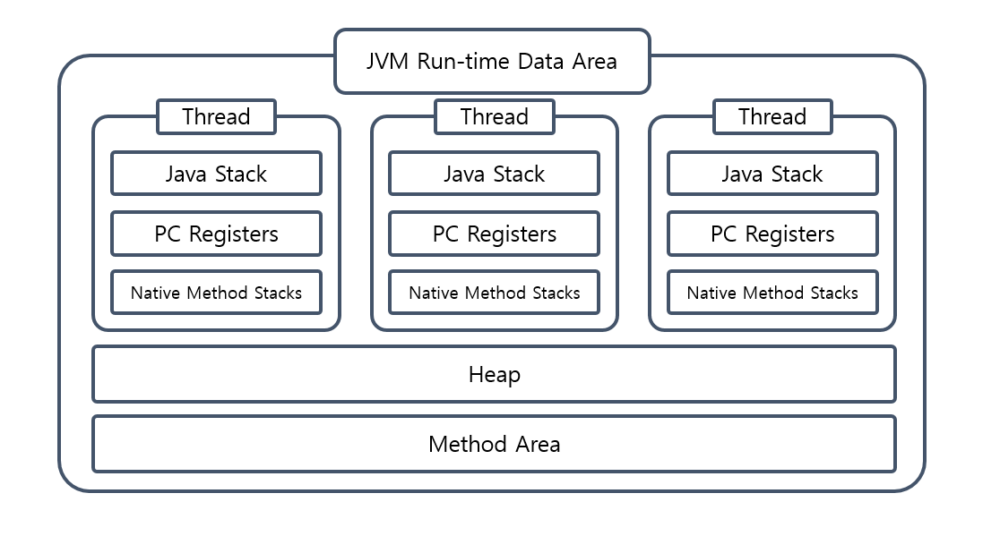

- 공통 영역 : 이 자식이 꼬이면 안되니 [동기화](https://www.notion.so/1-fff024f8fc7481769980f7f04dcf1ea7?pvs=21)가 중요하겠구나
    - Method 영역 : 클래스 정보, 정적 변수 등 JVM 프로세스가 시작될 때 데이터 할당
    - Heap 영역 : 동적으로 데이터 할당, 레퍼런스 타입 객체 생성 시 실제 객체 올라가는
                           영역
- 독자적인 영역
    - Stack Area
        - 메서드 호출 시 호출된 메서드를 위한 frame 생성
        - 메서드 scope 내에서 발생하는 지역변수, 매개변수, 리턴값 등을 frame에 저장
        - 메서드 scope 종료 시 (return 시) frame에 할당된 변수 및 frame 반환
        - 메서드 내에서 메서드 호출 시 호출된 메서드 frame이 바로 위에 생기며 실행 흐름이 해당 메서드로 넘어감
    - PC Registers
        - 해당 스레드에서의 명령 흐름 추적 및 관리
        - 현재 수행중인 JVM 명령의 주소 저장
        - 연산을 위해 필요한 피연산자를 임시 저장
    - Native Method Stack
        - 자바가 아닌 다른 언어를 JNI 를 통해 실행하기 위한 코드 공간

### c-2) 스레드의 스케줄링 및 운영체제와의 상호작용

<aside>
💡

멀티스레드 = 동시성 or 병렬성으로 실행
- 동시성 : 멀티 태스킹을 위해 하나의 코어에서 멀티 스레드를 바꿔가며 실행하는 
                   성질
- 병렬성 : 멀티 태스킹을 위해 멀티 코어에서 개별 스레드를 동시에 실행하는 성질
- 싱글 코어 CPU를 이용한 멀티 스레드 작업은 병렬 실행되는 것 같지만, 번갈아 실행되는 동시성 작업 ⇒ 빠르게 진행되기 때문에 병렬성으로 보임

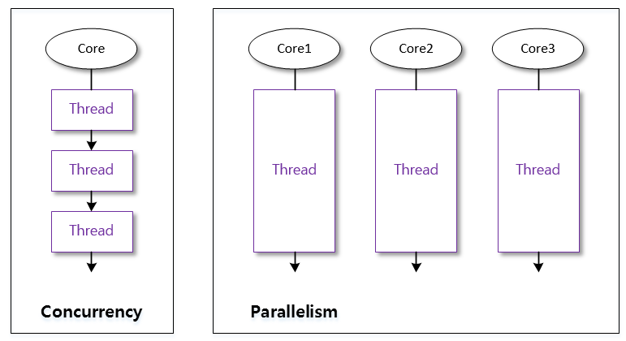

</aside>

- 우선순위, RR (Round-Robin) 등등…
    - 우선순위 : 개발자가 코드로 제어 가능
    - Round Robin : 개발자가 코드로 제어 불가능
        - 시간 할당량을 정해서 하나의 스레드를 정해진 시간만큼 실행, 다시 다른 스레드 실행 ⇒ **OS가 설정하기 때문에 개발자는 아무것도 못함**
- 자바에서 생성된 Thread는 모두 5의 우선순위를 가짐
    - main 함수 또한 우선순위가 5임
    - 스레드의 우선순위 = 상속받는 스레드로부터 받음 (main이 기본이라 5)
- Thread에 할당할 수 있는 우선순위는 1~10으로 분류, 숫자가 작을수록 우선순위 낮음
- `getPriority(), setPriority(int p)` 메서드 이용해 우선순위 설정
- !!!!!! 우선순위는 절대적으로 지켜지지 않음 !!!!!!! 그저 우선순위가 높은 스레드에게 상대적으로 많은 양의 실행시간이 주어짐 
⇒ 왜? OS한테 힌트를 주는 것이기 때문에 모든 결정은 OS 선생님이 해줌

### c-3) 스레드 풀과 JVM의 스레드 관리

<aside>
💡

JVM 생성보다는 스레드 생성이 가볍지만 스레드 생성이 과연 모든 요청마다 생성할 만큼 가벼운가? ⇒ 아님.

그럼 어떻게 관리? ⇒ 스레드 풀 Thread Pool

</aside>

- 웹 환경에서 고객의 요청이 들어올 때 마다 스레드를 생성하면 응답 속도 매우 낮아짐
- 스레드들이 Context Switching 할 때도 오버 헤드 발생
- Thread Pool : 스레드를 효과적으로 관리하고 재사용하는데 도움을 주는 객체
    - 스레드 생성, 소멸 비용 감소
    - 여러 작업 동시 실행 지원
    - 스레드를 특정 개수 만들어 놓고 기존 스레드 재사용하는 방식
- **WAS의 주요 튜닝 포인트 = 최대 스레드 수(max thread)**
    
    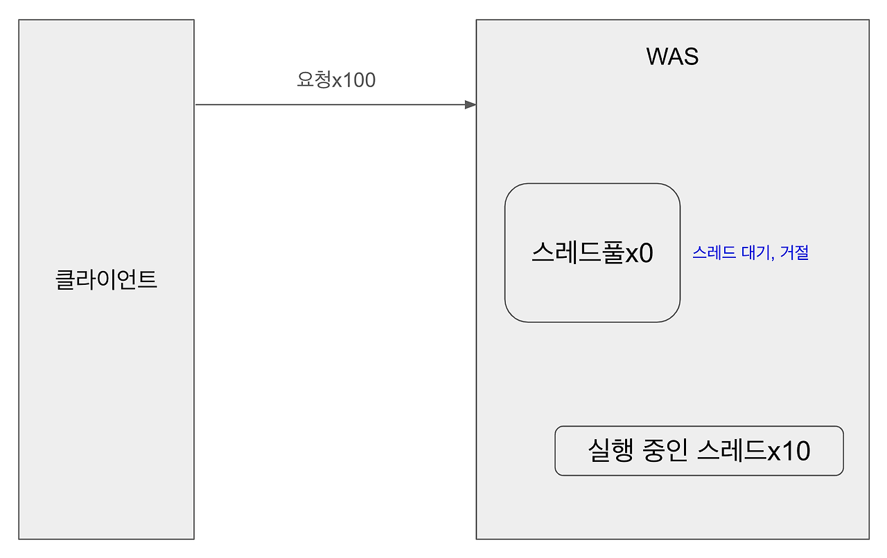
    
    - 낮을 경우 : 동시 요청이 많은 경우 서버 리소스 여유, 클라이언트 응답 지연
    - 높을 경우 : 동시 요청이 많은 경우 서버 리소스 임계점 초과로 서버 다운
    - 장애 발생 : 클라우드 서버? 서버를 늘린 후 튜닝하기
    - 기준이 정말 애매함. 그냥 적당한 값 (= CPU, 로직 복잡도, I/O 리소스 상황, 운영 중인 하드웨어 제원 등등 요인이 굉장히 많음)
- 구현 코드 `Executors` 클래스 사용 : 스레드 개수 5로 제한

```java
ExecutorService executor = Executors.newFixedThreadPool(5);
executor.submit(() -> {
    // 실행할 작업
});
executor.shutdown();

```

### c-4) 데몬 스레드와 비데몬 스레드

- 비데몬 스레드 (사용자 스레드)
    - 주요 작업을 수행하는 스레드 (일반 스레드란 의미)
    - JVM이 종료되기 전에 모든  비데몬 스레드는 종료되어야 함
- 데몬 스레드 (백그라운드 작업)
    - JVM 종료 시 자동으로 종료
    - 보조 작업에 사용됨
    - 사용법 `setDaemon(boolean tf)`
    
    ```java
    Thread thread = new Thread(new Runnable() {
    	//구현
    }
    thread.setDaemon(true); // 데몬 스레드 설정
    ```
    

---

# 3. 동기화

## a. 동기화의 필요성 및 문제점

- 특정 메모리 공간을 공유하기 때문에 메모리에 올라간 객체, 변수 등등 변화 발생 시 갱신을 알려줘야함
- 스레드 A가 객체 Obj 변경 ⇒ 스레드 B에서 Obj 변경 동기화 없이 사용 시 에러 발생

<aside>
💡

이런 문제점을 어떻게 해결?

멀티 스레드 프로그램에서 단 하나의 스레드만 실행할 수 있는 코드영역
임계영역(critical section) + 잠금(lock)

</aside>

➡️ 임계영역 : 공유 데이터 사용하는 코드 영역

➡️ 잠금(락, lock) : 공유 데이터(객체)가 가지고 있는 성질 (lcok을 흭득한 단 하나의 스레드만 코드 수행 가능)

➡️ 이 모든 과정 : 스레드의 동기화 **Synchronized**

## b. 자바의 동기화 메커니즘

### b-1) Synchronized

```java
public synchronized void cal() {
	// 연산 처리
	...
}

synchronized(객체 참조변수) {
	//...
}
```

메서드에 synchronized 키워드 사용 시 메서드 전체가 임계 영역으로 설정됨

특정 코드만 임계 영역 설정 시 synchronized(객체 참조변수) 활용
⇒ synchronized 블록으로 이 영역에 들어가면 지정된 객체의 lock을 얻고 벗어나면 lock 반납하는 시스템

[뱅킹 시스템 예제]

```java
class Main {
    public static void main(String[] args) {
        Runnable r = new RunnableEx();
        new Thread(r).start();
        new Thread(r).start();
        new Thread(r).start();
    }
}

class Account {
    private int balance = 1000;

    public int getBalance() {
        return balance;
    }

    public void withdraw(int money) {
        if (balance >= money) {
            try {
                Thread.sleep(1000);
            } catch (InterruptedException e) {

            }
            balance -= money;
        }
    }
}

class RunnableEx implements Runnable {
    Account acc = new Account();

    public void run() {
        while (acc.getBalance() > 0) {
            // 100, 200, 300 중 임의의 한 값으로 출금(withdraw)
            int money = (int) (Math.random() * 3 + 1) * 100;
            acc.withdraw(money);
            System.out.println("balance : " + acc.getBalance());
            System.out.println("출금되었습니다.");
        }
    }
}
```


- 잔고 음수면 출금이 안되게 했는데 출금이 된다 ⇒ 은행 파산
- if문 돌면서 다른 스레드가 나타나서 출금함 ⇒ 싱크 안맞음

```java

class Account {
    private int balance = 1000;

    public int getBalance() {
        return balance;
    }

    public synchronized void withdraw(int money) {
        if (balance >= money) {
            try {
                Thread.sleep(1000);
            } catch (InterruptedException e) {

            }
            balance -= money;
        }
    }
```

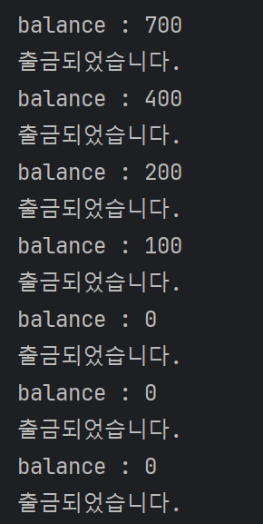

### b-2) 객체 락과 모니터링 - wait(), notify()

- `Object` 객체에 구현되어 있는 `wait()`, `notify()`
- `wait()`  : Runnable 상태에서 Waiting 상태로 (lock 소유 ⇒ lock release)
- `notify()`  : Waiting 상태에서 Runnable 상태로 ⇒ 스레드 중 임의로 선택(구현에 따라 다름)
- [wati() 와 notify() 흐름 예제 (Consumer-Producer)](https://www.geeksforgeeks.org/inter-thread-communication-java/)
    
    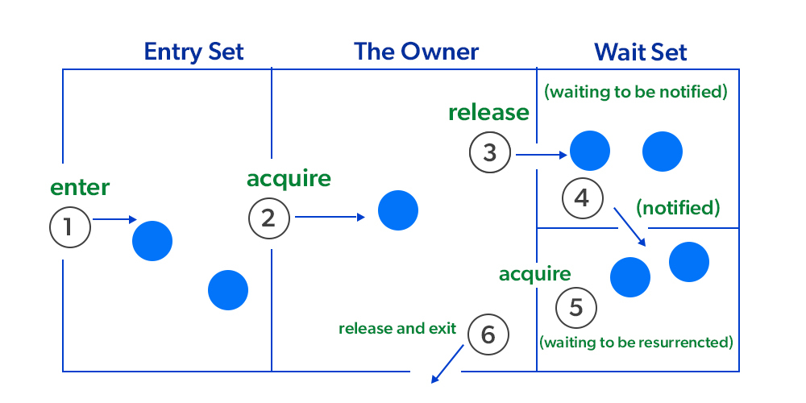
    
    ```java
    import java.util.LinkedList;
    import java.util.Queue;
    
    public class ProducerConsumer {
        // Shared queue used by both producer and consumer
        private static final Queue<Integer> queue = new LinkedList<>();
        // Maximum capacity of the queue
        private static final int CAPACITY = 10;
    
        // Producer task
        private static final Runnable producer = new Runnable() {
            public void run() {
                while (true) {
                    synchronized (queue) {
                        // Wait if the queue is full
                        while (queue.size() == CAPACITY) {
                            try {
                                System.out.println("Queue is at max capacity");
                                queue.wait(); // Release the lock and wait
                            } catch (InterruptedException e) {
                                e.printStackTrace();
                            }
                        }
                        // Add item to the queue
                        queue.add(10);
                        System.out.println("Added 10 to the queue");
                        queue.notifyAll(); // Notify all waiting consumers
                        try {
                            Thread.sleep(2000); // Simulate some delay in production
                        } catch (InterruptedException e) {
                            e.printStackTrace();
                        }
                    }
                }
            }
        };
    
        // Consumer task
        private static final Runnable consumer = new Runnable() {
            public void run() {
                while (true) {
                    synchronized (queue) {
                        // Wait if the queue is empty
                        while (queue.isEmpty()) {
                            try {
                                System.out.println("Queue is empty, waiting");
                                queue.wait(); // Release the lock and wait
                            } catch (InterruptedException e) {
                                e.printStackTrace();
                            }
                        }
                        // Remove item from the queue
                        System.out.println("Removed " + queue.remove() + " from the queue");
                        queue.notifyAll(); // Notify all waiting producers
                        try {
                            Thread.sleep(2000); // Simulate some delay in consumption
                        } catch (InterruptedException e) {
                            e.printStackTrace();
                        }
                    }
                }
            }
        };
    
        public static void main(String[] args) {
            System.out.println("Main thread started");
            // Create and start the producer thread
            Thread producerThread = new Thread(producer, "Producer");
            // Create and start the consumer thread
            Thread consumerThread = new Thread(consumer, "Consumer");
            producerThread.start();
            consumerThread.start();
            System.out.println("Main thread exiting");
        }
    }
    ```
    
- 문제점
    - Consumer가 계속 wait를 해도 notify 대상이 Consumer만 나오면 Producer는 lock을 흭득하지 못함
    - Starvation (기아 현상)
    - 어떻게 해결하나요? ⇒ notifyAll() : 모두를 깨워버리자!
        - 여러 쓰레드가 lock을 얻으려고 노력
        - Race Condition (경쟁 상태)

➡️ [`java.util.concurrent`  패키지를 사용해 문제점 해결](https://www.notion.so/1-fff024f8fc7481769980f7f04dcf1ea7?pvs=21)

## c. Volatile vs Synchronized vs Atomic

- **Synchronized : 특정 메서드 또는 객체 동시성 해결 키워드**

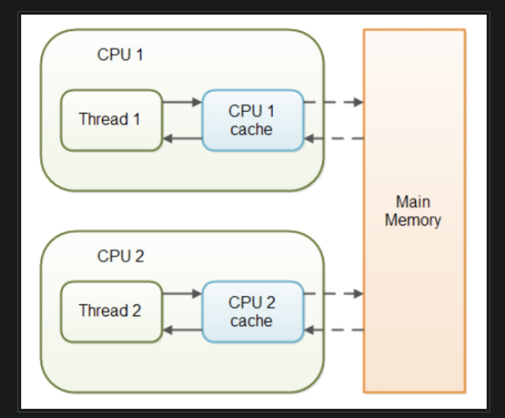

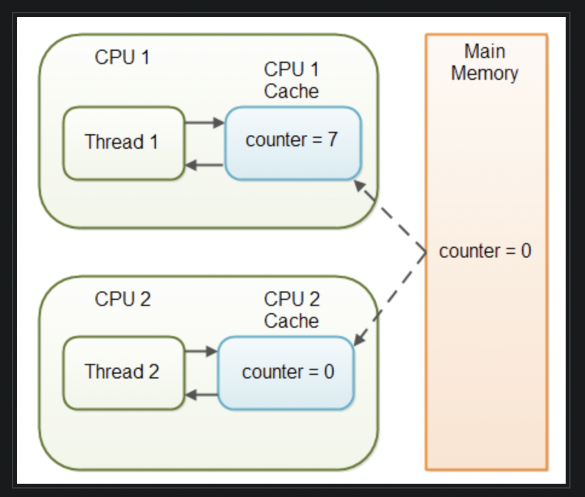

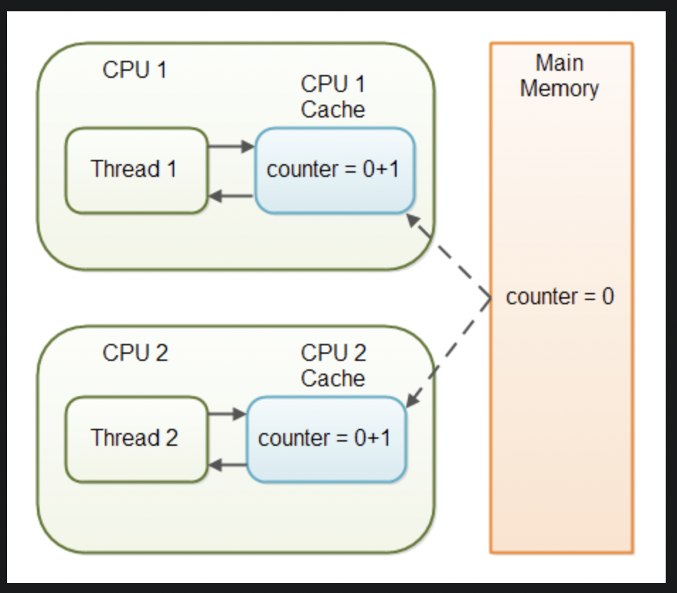

- **volatile : 변수의 가시성 문제를 해결하기 위한 키워드**
    - Java 변수를 Caching 하지 않을 것이다.
    - **Main Memory  그것만이 내 세상**
    - 여러 스레드에서 동시에 접근 가능해서 멀티 스레드에선… (원자성 보장 X)
- **Atomic : volatile의 원자성 보장 X 문제 해결**
    - 동기화 / 락 안함 ⇒ CAS(Compare-And-Swap) 알고리즘 채택
        - 스레드가 공유 변수값 read
        - 가져온 값을 새로운 값으로 연산
        - 공유 변수의 현재 값이 이전에 읽은 값과 같은지 비교
        - 현재 값이 이전 읽었던 값과 같으면 새로운 값, 아니면 다시 받아서 연산
    - 완전 럭키비키 동시성 해결이네?
        
        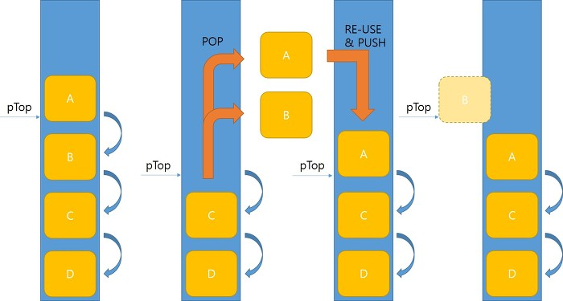
        
        - 절대 아님.
        - ex) 스레드 1에서 Atomic 변수 값을 읽은 상태
        1. 스레드 2가 같은 변수의 값을 변경 후 원래 값으로 되돌림
        2. 스레드 1이 변수 값을 다시 읽음 (같다고 판단)
        3. 중간에 값이 변경됐다가 다시 돌아온 것이라 다름
           3-1. ABA 문제 : 스택이나 큐에서 pop() 연산 등에서 발생
        4. 데이터 무결성, ABA로 인한 데드락 등의 문제가 있음
    - `AtomicStampedReference` , `AtomicMarkableReference`  등 사용 가능하지만 ABA 문제만 해결 가능 (참조 주소값 + 연산 횟수 확인으로 중간에 값이 변경됐는지까지 확인)
    
    ```java
    CAS(&s->top, top, new_top) && CAS(&->pop_count, pop_count, pop_count+1)
    ```
    
    ➡️ 어떤 자료구조를 사용해야 이런 일이 없을지까지 고려해야한다.
    

## d. [Deadlock, Livelock](https://howudong.tistory.com/356)

- DeadLock : 둘 이상 작업이 서로 작업이 끝나기를 기다리고 있어서 아무것도 못하는 상태
    
    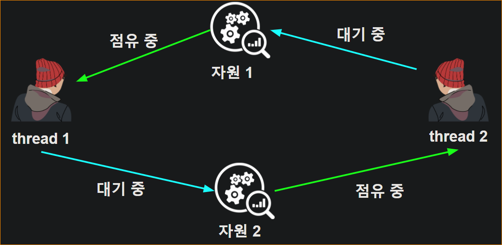
    
    
    
    - 위 4가지 조건 모두 만족해야 데드락 상태, 예방 방법도 넷 중 하나만 해결해서 해결
    - 회피 : 자원 요청 방식에 추가 정보 제공 → circular wait 발생 회피
        - 자원 할당 그래프 알고리즘
        - 은행원 알고리즘
    - 무시 : 뭐.. 별로 상관 없으면 그냥 무시..하는 것도 방법!
    
    [Oracle이 준 Deadlock 예제]
    
    ```java
    public class Deadlock {
        static class Friend {
            private final String name;
            public Friend(String name) {
                this.name = name;
            }
            public String getName() {
                return this.name;
            }
            public synchronized void bow(Friend bower) {
                System.out.format("%s: %s"
                    + "  has bowed to me!%n",
                    this.name, bower.getName());
                bower.bowBack(this);
            }
            public synchronized void bowBack(Friend bower) {
                System.out.format("%s: %s"
                    + " has bowed back to me!%n",
                    this.name, bower.getName());
            }
        }
    
        public static void main(String[] args) {
            final Friend alphonse =
                new Friend("Alphonse");
            final Friend gaston =
                new Friend("Gaston");
            new Thread(new Runnable() {
                public void run() { alphonse.bow(gaston); }
            }).start();
            new Thread(new Runnable() {
                public void run() { gaston.bow(alphonse); }
            }).start();
        }
    }
    ```
    
- LiveLock : 두 스레드가 서로 양보하려다가 작업이 안되는 상황
    - 각 스레드가 실패한 작업 동시 재시도할 시 발생 (양보 상황)
    - 각 스레드가 실패한 행동 재시도하는 시간을 무작위로하면 회피 가능
    - 흔하지 않지만 멀티 스레드 설계에 있어 아주 어려움

➡️ 어떻게 해결하나요? ⇒ 스레드 풀 Thread Pool 사용

## e.  Appendix: `java.util.concurrent`

<aside>
💡 멀티 스레드 동시성 해결을 위해 유용하게 사용되는 패키지
- Locks : 상호 배제를 사용할 수 있는 클래스 제공
- Atomic : 동기화가 되어 있는 변수 제공
- Executors : 스레드 풀 생성, 스레드 생명 주기 관리, Task 등록 및 실행 처리
- Synchronizers : 특수 목적의 동기화를 처리하는 5개 클래스

</aside>

| 이름 | 기능 | Class |
| --- | --- | --- |
| Locks | Synchronized를 더 정교하고 명시적으로 사용하기 위함, fairness 제공 | `ReentrantLock`
`ReadWriteLock` |
| Aotmic | Atomic을 위해 제공. CAS 알고리즘 사용 | `AtomicInteger` 
`AtomicReference` |
| Executors | 스레드 풀 사용을 위한 클래스 | `Executor` 인터페이스 |
| Synchronizers | 스레드 간의 협력을 쉽게 구현하기 위한 도구 | `CountDownLatch`: 스레드가 조건 만족할 떄까지 기다리거나 특정 수의 작업이 완료될 때까지 기다림
`CyclicBarrier`:일정 수의 스레드가 모두 모일 때까지 기다렸다가 모이면 동시에 실행
 `Semaphore` :일정 수의 스레드만 임계 구역 진입 가능 |

---

# 4. 스레드 로컬 ThreadLocal

## a. ThreadLocal 클래스의 개념

<aside>
💡

자바에서 지원하는 Thread Safe한 기술로 각각의 스레드 별로 별도의 저장공간을 제공하는 컨테이너

- ThreadLocal이 활용되는 환경은 해당 컨테이너를 가진 서비스가 싱글톤 객체로 공유되는 객체
- 즉, 모든 스레드는 동일한 ThreadLocal에 접근함
</aside>

- 필요한 이유
    
    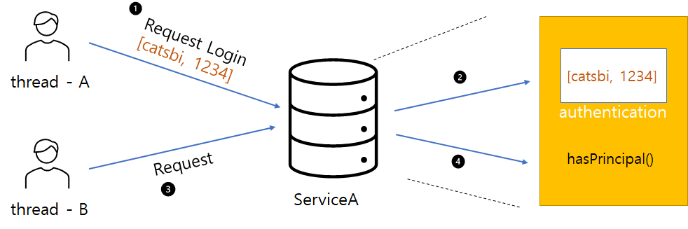
    
    ```java
    public class ServiceA {
    	//사용자 인증 정보
    	private Authentication authentication;
    	private UserRepository userRepository;
    	private final ServiceA instance = new ServiceA();
    
    	public static ServiceA getInstance(){
    		return instance;
    	}
    
    	public boolean login(LoginForm form) {
    		User user = userRepository.findById(form.getId()).orElseThrow(NoSuchException::new);
    	
    		if(PasswordEncoder.matches(user.getPassword(), form.getPassword())){
    			authentication = Authentication.of(form.getId(), form.getPassword, ...);
    		}
    	}
    
    	public boolean hasPrincipal(){
    		return !authentication == null;
    	}
    }
    ```
    
    - 스레드 A에서 로그인 요청하며 로그인 정보 전달
    - 서비스 A는 로그인 정보 비교 후 인증 정보 저장
    - 스레드 B에서 자원 접근 요청
    - 서비스 A는 hasPrincipal() 메서드를 통해 인증 정보 존재 확인
    - 스레드 A를 통해 저장된 인증정보가 있어 스레드 B의 요청인 자원 접근 허가
- **싱글톤 객체이기 때문에 내부 자원들도 모두 공유됨 ⇒ 모든 스레드 공유 가능**
- 심지어 정보 변경도 가능(접근 가능하니)하기 때문에 ThreadLocal 필요

## b. 스레드별 데이터 격리

- 그럼 어떻게 작동하나요 ⇒ Thread + ThreadLocal

[Thread]

```java
public class Thread implements Runnable {
	//...logics
	ThreadLocal.ThreadLocalMap threadLocals = null;
}
```

[ThreadLocal]

```java
public class ThreadLocal<T> {
		ThreadLocalMap getMap(Thread t) {
        return t.threadLocals;
    }

    void createMap(Thread t, T firstValue) { 
        t.threadLocals = new ThreadLocalMap(this, firstValue);
    }

    public void set(T value) {
        Thread t = Thread.currentThread();
        ThreadLocalMap map = getMap(t); 
        if (map != null)                                   
             map.set(this, value);
        else
            createMap(t, value);                      
    }

    public T get() {
        Thread t = Thread.currentThread();
        ThreadLocalMap map = getMap(t);
        if (map != null) {
            ThreadLocalMap.Entry e = map.getEntry(this);
            if (e != null) {
                @SuppressWarnings("unchecked")
                T result = (T)e.value;
                return result;
            }
        }
        return setInitialValue();
    }

    public void remove() {
        ThreadLocalMap m = getMap(Thread.currentThread());
        if (m != null)
            m.remove(this);
   }

	static class ThreadLocalMap {
		static class Entry extends WeakReference<ThreadLocal<?>> {
            /** The value associated with this ThreadLocal. */
            Object value;

            Entry(ThreadLocal<?> k, Object v) {
                super(k);
                value = v;
            }
        }
	}
}
```

- `Thread` 에서 객체를 `threadLocals` 라는 인스턴스 변수를 가지고 있음
- `ThreadLocal` 에서 `ThreadLocalMap` 클래스를 이용해 key/value 로 보관
- get, set을 현재 수행중인 `Thread` 를 `currentThread()` 를 통해 리턴 ⇒ 현재 사용 중인 스레드만 사용 가능을 보장

## c. 어디에 사용?

- Spring Security
    
    ```java
    package org.springframework.security.core.context;
    
    import org.springframework.util.Assert;
    
    final class ThreadLocalSecurityContextHolderStrategy implements SecurityContextHolderStrategy {
    
    	private static final ThreadLocal<SecurityContext> contextHolder = new ThreadLocal<>();
    
    	@Override
    	public void clearContext() {
    		contextHolder.remove();
    	}
    
    	@Override
    	public SecurityContext getContext() {
    		SecurityContext ctx = contextHolder.get();
    		if (ctx == null) {
    			ctx = createEmptyContext();
    			contextHolder.set(ctx);
    		}
    		return ctx;
    	}
    
    	@Override
    	public void setContext(SecurityContext context) {
    		Assert.notNull(context, "Only non-null SecurityContext instances are permitted");
    		contextHolder.set(context);
    	}
    
    	@Override
    	public SecurityContext createEmptyContext() {
    		return new SecurityContextImpl();
    	}
    
    }
    ```
    
    - SecurityContextHolder의 SecurityContext 안에 Authentication 보관
        - 기본 전략 : MODE_THREADLOCAL = 스레드 로컬 사용해서 보관
- RequestContextHolder
    
    ```java
    public abstract class RequestContextHolder {
      ...
      private static final ThreadLocal<RequestAttributes> requestAttributesHolder = new NamedThreadLocal("Request attributes");
      private static final ThreadLocal<RequestAttributes> inheritableRequestAttributesHolder = new NamedInheritableThreadLocal("Request context");
      ...
    	public static void resetRequestAttributes() {
    		requestAttributesHolder.remove();
    		inheritableRequestAttributesHolder.remove();
    	}
    }
    ```
    
    - HttpServletRequest 를 조회할 수 있는 RequestContextHolder에서도 요청 정보를 ThreadLocal을 이용해 관리

# Reference

[volatile, synchronized, atomic](https://velog.io/@ifi9/Java-synchronized-volatile-Atomic)

[Concurrent](https://yonghwankim-dev.tistory.com/472?category=1021726)

[Atomic, CAS](https://wannabe-gosu.tistory.com/29)

[DeadLock, LiveLock](https://velog.io/@paulhana6006/Deadlock%EA%B3%BC-Livelock-%EC%89%BD%EA%B2%8C-%EC%9D%B4%ED%95%B4%ED%95%98%EA%B8%B0)

[전반적인 지식](https://catch-me-java.tistory.com/47)

[전반적인 지식2](https://musma.github.io/2023/08/03/java-multi-thread.html)

[스레드풀](https://catsbi.oopy.io/3ddf4078-55f0-4fde-9d51-907613a44c0d)