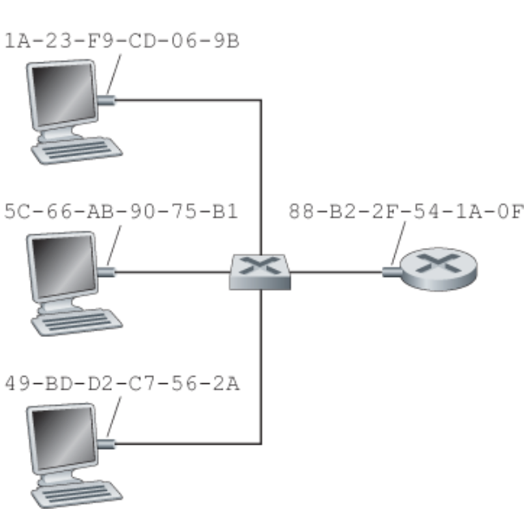
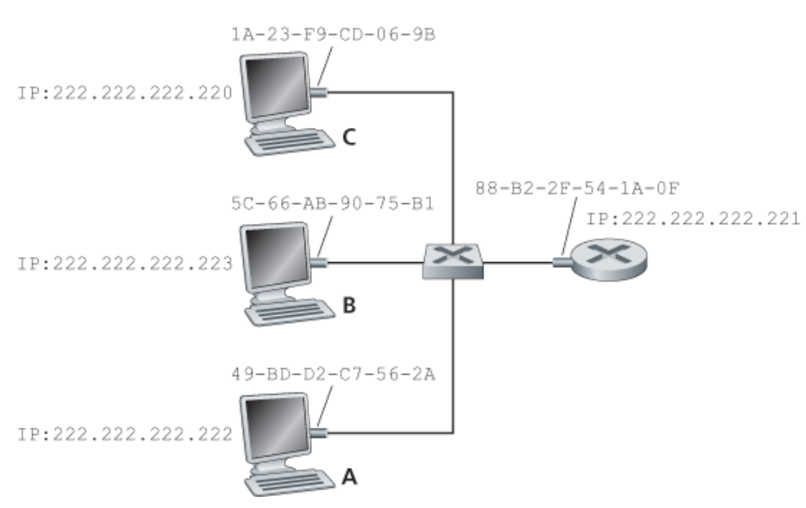
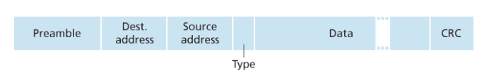
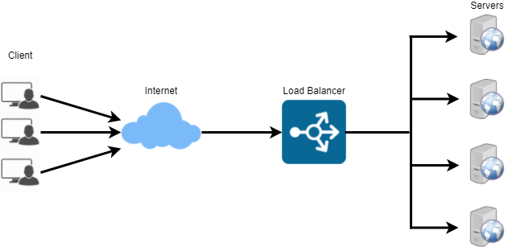

# L2: 데이터링크 계층 

## 데이터 링크 계층 주소체계와 ARP

### 네트워크 계층 주소와 링크 계층 주소

- 네트워크 계층 주소 체계가 있는데도 링크 계층 주소를 갖는 이유
    - 만약 어댑터가 MAC 주소 대신에 네트워크 계층 주소를 사용한다면, 네트워크 계층 주소를 어댑터 RAM에 저장하고 어댑터를 이동할 때마다 재구성해야 함.
- 즉 네트워크 구조에서 계층이 독립적인 구성요소가 되도록 하려면 각 계층은 자신만의 주소 기법을 가져야함

#### MAC 주소

실제로 링크 계층 주소를 가진 것은 호스트나 라우터가 아닌 호스트나 라우터의 어탭더(네트워크 인터페이스)디.

- MAC 주소를 활용한 어댑터의 송수신
1. 송신 어댑터는 프레임에 목적지 어댑터의 MAC주소를 넣고 랜상에 전송
2. 프레임을 수신한 어댑터는 프레임 안에 목적지 MAC 주소와 자신의 MAC 주소를 일치하는 검사
3. 일치하면 데이터그램을 추출하여 프로토콜 스택의 위쪽으로 전달

#### ARP(Address Resolution Protocol)

네트워크 계층 주소와 링크 계층 주소가 있으므로 이들 주소 사이에 변환햊주는 프로토콜을 ``ARP``이라고 한다.

``ARP 모듈``은 IP와 MAC 주소와 마찬가지로 인터페이스마다 존재함.

위 그림에서 A에서 C로 데이터그램을 전송한다고 가정해보자.

여기서, 목적지 IP 뿐만 아니라 MAC주소로 주어야 적절하게 C로 전달할 수 있음.

송신 호스트의 ARP 모듈은 입력값으로 임의의 IP 주소에 대응되는 MAC 주소를 돌려준다. 

결국, DNS와 비슷한 면이 있다. 하지만, ARP는 동일한 서브넷상에 있는 호스트나 라우터 인터페이스의 IP 주소만으로 해결

#### ARP 동작 과정

각 호스트와 라우터는 자신의 메모리에 ``ARP 테이블``을 가지고 있음.

이 테이블은 IP주소와 MAC 주소 간의 매핑 정보를 포함하여, 각 매핑이 언제 삭제되는지를 나타내는 TTL(time-to-live) 값을 포함. (일반적으로 20분)

동작 과정
1. 송신 노드 MAC 주소를 해결하기 위해 ARP 프로토콜을 사용하여 ``ARP 패킷``이라는 특수 패킷을 어댑터에 보냄
2. 어댑터는 ARP패킷을 링크 계층 프레임에 캡슐화하고, 목적지 주소를 MAC 브로드캐스트 주소(FF-FF-FF-FF-FF-FF)로 하여 패킷 전송
3. 이 질의는 서브넷 상의 다른 모든 어댑터에 수신되며, 브로드캐스트 주소이므로 ARP 패킷을 자신의 ARP 모듈로 전달
4. ARP 모듈은 자신의 IP 주소가 ARP 패킷에 들어 있는 목적지 IP주소와 일치하는지 검사
5. 일치하는 노드는 요구된 매핑 정보가 포함된 응답 패킷을 돌려줌
6. 질의 호스트는 자신의 ARP 테이블을 갱신

- 즉 노드의 ``ARP 테이블``은 ``플러그 앤 플레이``로, 관리자가 구성하지 않아도 자동으로 구축

#### 이더넷
- 인터넷이 글로벌 네트워킹에 대한 것이라면, 이더넷은 근거리 네트워크 

이더넷 프레임 구조 

- 데이터 필드
- 목적지 주소(6바이트)
- 출발지 주소(6바이트)
- 타입 필드(2바이트)
- 순환 중복검사(CRC)(4바이트)
    - 오류가 생겼는지 검출
- 프리앰블(8바이트)

### 링크 계층 스위치

스위치의 역할은 들어오는 링크 계층 프레임을 수신해서 출력 링크로 전달하는 것

**포워딩과 필터링**
- 필터링
    - 프레임을 인터페이스로 전달할지 또는 폐기할지 결정하는 스위치 기능
    - 스위치 테이블을 이용
- 포워딩
    - 프레임이 전송될 인터페이스를 결정하고 프레임을 해당 인터페이스로 내보내는 기능
    - 스위치 테이블을 이용
- 스위치 테이블
    - 일부 노드에 대한 엔트리가 포함
    - 스위치 테이블 엔트리 구성
        - MAC 주소
        - MAC 주소로 가게 하는 스위치 인터페이스

**스위치 동작과정**
- 테이블에 목적지에 대한 엔트리가 없는 경우 
    - 모든 인터페이스의 출력 버퍼로 전달. 즉, 브로드캐스트
- 테이블에 목적지 주소가 테이블에 있는 경우
    - 포워딩 기능 수행

**자가학습**
- 동작 과정
1. 초기에는 비어있음
2. 인터페이스로 수신한 각 프레임에 대해 스위치는 다음과 같은 정보를 저장
    - 프레임의 출발지 주소 필드에 있는 MAC 주소
    - 프레임이 도착한 인터페이스
    - 도착 시간
3. 랜에 있는 모든 호스트가 프레임을 송신하면, 결국 모든 정보가 테이블에 기록 

#### 스위치 VS 라우터 VS 허브
- 라우터
    - 네트워크 계층 주소를 사용해서 패킷을 전달함
    - 3계층 장비 
- 스위치
    - MAC 주소를 사용해서 패킷 전달
    - 2계층 장비 
- 허브 
    - 데이터 패킷을 받으면 연결된 모든 장치들에게 보냄
    - 1계층 장비

# 기타
## 프록시

 **Proxy란?**
사전적 의미로 "대리"하는 것을 뜻함.

그래서, 프로토콜 상에서 무엇인가를 대신 하는 것 

## Proxy 서버

클라이언트에서 서버로 접속할 때, 직접적으로 접속하지않고 중간에 대신 전달해주는 서버

1. 클라이언트에서 프록시 서버로 전달한 요청을 보냄
2. 프록시 서버는 클라이언트로부터 전달 받은 요청을 서버에 요청
3. 서버는 요청에 맞게 데이터를 프록시 서버로 전달
4. 프록시 서버는 서버로부터 전달 받은 데이터를 클라이언트에 전달

## Proxy 서버는 왜 필요?

### 보안
가장 큰 이유는 보안. 

사바의 주소가 쉽게 노출된다면 다른 익명의 사용자가 서버로 접근하기 쉬워짐.

즉, 서버의 IP를 숨기는 것이 가능하고, 외부로부터 위험을 막아줌

### 캐시
다음 번에 재요청을 보낼 때 서버를 거치지 않고 데이터를 주고 받을 수 있기 때문에 속도가 더 빨라질 수 있음

## Forward Proxy와 Reverse Proxy

### Forward Proxy 

보안을 위해 사용하는 방식. 

클라이언트에서 요청을 할 때, 프록시 서버를 거치는 방식이 포워드 프록시 

### Reverse Proxy

서버에서 클라이언트에 직접 데이터를 전달하지 않고, 프록시 서버를 거치는 방식 

## 로드밸런싱(Load Balancing)
- 로드 밸런싱이란?
컴퓨터 자원들에게 작업을 나누는 것

### 로드밸런싱의 필요성 
사업의 규모가 확장되고, 클라이언트 수가 늘게 되면 기존의 적은 서버로는 정상적인 서비스가 불가능.

증가한 트래픽을 대처할 수 있는 방법은 크게 2가지
1. Scale-up
서버 자체의 성능을 확장하는 것. 예를 들면, CPU i3인 컴퓨터를 i7으로 업그레이드
2. Scale-out
기존 서버와 동일하거나 낮은 서버를 두 대 이상 증설하여 운영하는 것

-> 이 경우에는 여러 대의 서버로 트래픽을 균등하게 분상해주는 로드밸런싱이 반드시 필요 

#### 알고리즘

- 라운드 로빈
    - 클러스터에 A,B,C 서버가 있을 때 순회하여 부하를 분산 
- 최소 연결
    - 가장 클라이언트 연결 갯수가 적은 서버로 부하를 분산 
- IP 해시
    - 클라이언트 IP를 해쉬해서 특정 서버로 연결

OSI 7 Layer를 기준으로 부하를 어떻게 분산할지 나누어짐. 상위 계층일수록 섬세한 로드 밸런싱이 가능하고 하위 계층일수록 간단한 로드 밸런싱만 가능.

#### 종류
1. L4 Load Balancing
- 전송 계층에서 로드를 분산
- IP나 포트번호, MAC주소 등에 따라 트래픽을 나누고 분산처리가 가능

2. L7 Load Balancing 
- 애플리케이션 계층에서 로드를 분산
- OSI 7계층의 프로토콜(HTTP, SMTP, FTP 등)을 바탕으로 분산 처리 가능 

가장 많이 사용하는 것은 L4와 L7 

L4 로드 밸런서부터 포트 번호를 바탕으로 로드를 분산하는 것이 가능.

L7 로드 밸런서는 HTTP 헤더와 쿠키 등과 같은 사용자의 요청을 기준으로 특정 서버에 트래픽 분산하는 것이 가능. 또한, 서버의 응답까지도 알고 분석할 수 있음. 서버로부터 필요한 정보를 응답 받아 클라의 요청을 전달하기 전에 서버의 상태를 파악한 후 로드밸런싱을 진행할 수 있음.
