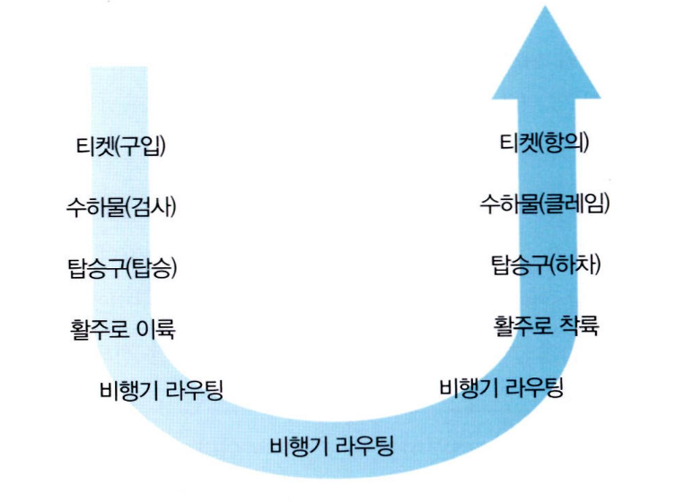
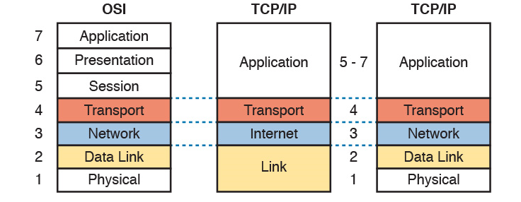
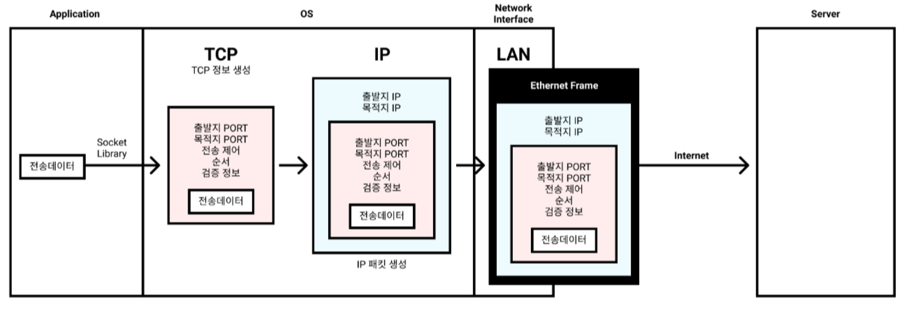
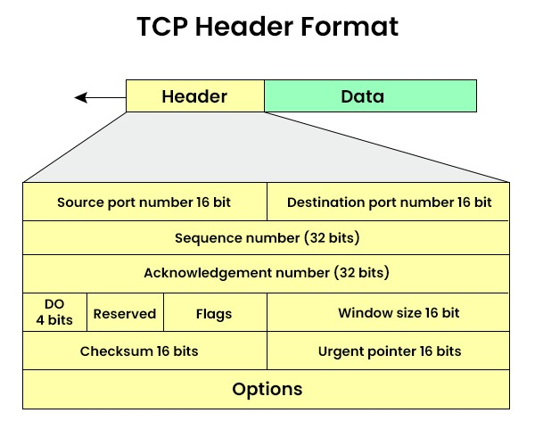
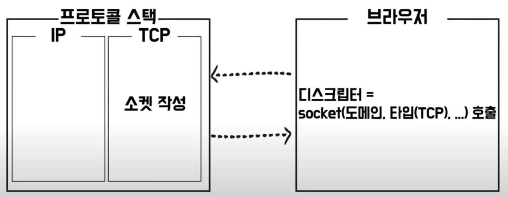
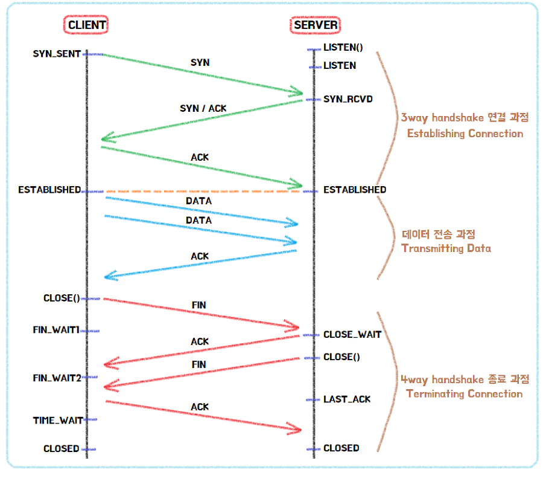
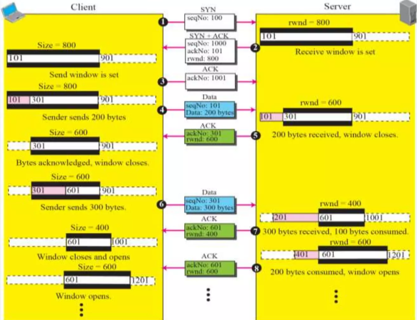
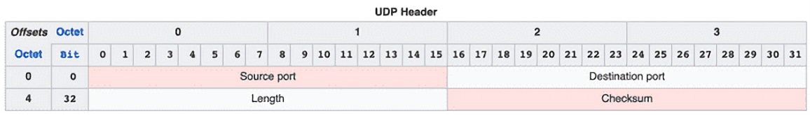

# 네트워크 계층화?

종단 시스템을 이어주는 역할 = 네트워크, 종단 시스템 : 셀 수 없이 많음, 이들을 연결하는 라우터, 스위치도 셀 수 없이 많음

<aside>
✅ 계층화를 왜 했을까? → 네트워크가 너무 복잡함

</aside>

- 4계층 → 3계층 → 2계층… : 계층 간 교환, 통신 = interface
  - 장점 : 책임이 명확해지기 때문에 문제 발생 시 추적 용이
  - 단점 : 최적화가 어려움

---

# TCP/IP

**OSI 7계층**

- 네트워크 통신의 각 기능을 세부적으로 나누어 설명하는 데 유용, 교육적 목적으로 많이 사용
- ISO(국제 표준화 기구)에 의해 개발, 이론적으로 매우 체계적 + 표준화 된 방식

**TCP/IP**

- 실질적인 네트워크 프로토콜 구현에 더 초점을 맞춤, 인터넷 등에 실제로 사용
- OSI 모델의 5,6,7 계층을 Application 계층으로 단순화해 실용적이고 널리 사용됨

<aside>
✅ 결론 - OSI 7계층, TCP/IP 4계층(5계층) 모두 네트워크 통신 이해 및 구조화를 위함

**OSI = 이론, 구체적 - TCP/IP = 실용적, 단순화**

</aside>

---

# Transport Layer

- Application 계층은 Transport 계층에 의존적
- 통신 당사자 간 연결을 **설정, 관리, 해체, 데이터 송수신을 책임짐**
- 프로토콜 → **TCP, UDP**
- transport 계층에서 패킷 = segment ( 전송 계층의 데이터 단위 ) + 프로토콜의 Header
  Demultiplexing
- Multiplexing 다중화
  - Server에서 여러 프로세스는 각각 socket을 가지고 있음
  - **Transport 계층에서 여러 socket에서 오는 데이터를 Network 계층의 목표 지점으로 보내는 과정**
  - Application 데이터 생성 -> port 번호 부여 -> Data Header 추가 -> Network 계층으로 전달
- Demultiplexing 역다중화
  - **수신 측에서 전송된 데이터를 다시 개별 Application으로 분리하는 과정**
  - Network 계층에서 데이터 수신 -> port 번호 확인 -> 목적지 Application에 전달

---

# TCP - Transmission Control Protocol

- Internet Protocol (IP) 규칙으로 부족하거나 불안정한 단점을 커버
  - 패킷 순서 이상, 패킷 유실 등
- **패킷 전송을 제어 + 신뢰성 보증**

### TCP 과정

> 소켓 생성 → 연결 설정 (3way-handshake) → 데이터 송수신 → 연결 종료 (4-way handshake)

[➡️TCP 통신을 리눅스 환경에서 확인해 볼 수 있는 Inpa님 블로그💡](https://inpa.tistory.com/entry/NW-%F0%9F%8C%90-%EC%95%84%EC%A7%81%EB%8F%84-%EB%AA%A8%ED%98%B8%ED%95%9C-TCP-UDP-%EA%B0%9C%EB%85%90-%E2%9D%93-%EC%89%BD%EA%B2%8C-%EC%9D%B4%ED%95%B4%ED%95%98%EC%9E%90)

- TCP Header

| Port number       | Source = 송신자 포트 번호, Destination : 수신자 포트 번호                                                                                                                                                                                                                                             |
| ----------------- | ----------------------------------------------------------------------------------------------------------------------------------------------------------------------------------------------------------------------------------------------------------------------------------------------------- |
| Sequence number   | 세그먼트의 첫 번째 바이트의 위치를 나타냄                                                                                                                                                                                                                                                             |
| Ack number        | 수신자가 다음으로 기대하는 데이터의 바이트 위치. 수신 측에서 받는 데이터의 확인 응답으로 사용됨                                                                                                                                                                                                       |
| DO=HLEN=헤더 길이 | TCP 헤더의 길이, 32비트 단위로 계산                                                                                                                                                                                                                                                                   |
| Reserved          | 현재는 사용 X, 향후 확장을 위해 예약된 필드                                                                                                                                                                                                                                                           |
| Flags             | 제어 비트로 상태나 목적을 나타냄  \- URG : 긴급 포인터 필드가 유효함을 나타냄 \- ACK : 확인 응답 번호 필드가 유효함을 나타냄 \- PSH : 수신 측에서 데이터를 즉시 상위 계층에 전달하도록 지시 \- RST : 연결을 강제로 재설정 \- SYN : 연결 설정을 요청 \- FIN : 연결 종료를 요청 |
| window size       | 수신자가 한 번에 수신할 수 있는 데이터의 최대 크기를 바이트 단위로 나타냄. 흐름 제어에 사용                                                                                                                                                                                                           |
| checksum          | 데이터와 헤더의 무결성을 확인하기 위한 필드                                                                                                                                                                                                                                                           |
| urgent pointer    | URG 플래그 설정 시, 긴급 데이터의 끝 위치를 나타냄                                                                                                                                                                                                                                                    |
| Options (padding) | 가변 길이로 다양한 옵션 정보를 포함, 필드의 크기를 32비트의 배수로 맞추기 위해 패딩을 포함하기도 함                                                                                                                                                                                                   |

- 소켓 생성
  
  - 브라우저에서 소켓 생성
  - 도메인과 사용할 타입인 TCP 설정
  - OS의 네트워크 제어용 SW인 프로토콜 스택이 디스크립터 반환
- 3-way handshake + 데이터 전송 + 4-way handshake
  
  - **3-way handshake : 클라 통신 신청 → 서버 수락 및 확인증 발급 → 클라이언트 확인증 발급**
    TCP 연결은 클라이언트와 서버 간의 세 단계의 핸드셰이크 (악수를 무려 세번 신청)로 설정됨. 이 과정에서 두 장치는 통신할 준비가 되었음을 확인하고, 서로의 초기 시퀀스 번호(ISN)를 교환함.
    1. **SYN (Synchronize):** 클라이언트는 연결을 시작하기 위해 서버에게 SYN 패킷을 보냅니다. 이 패킷에는 클라이언트의 초기 시퀀스 번호(ISN)를 포함
       **Client = SYN_SENT 상태
       +)** 시퀀스 번호 = 패킷의 전달 순서 식별을 위한 값. 운영체제에서 난수로 생성, 서버는 동기화에 대한 답신으로 seq + 1번호를 ack에 담아 응답
    2. **SYN-ACK (Synchronize-Acknowledge):** LISTEN 상태였던 서버는 클라이언트의 요청을 받으면, 자신의 초기 시퀀스 번호와 클라이언트의 ISN에 대한 확인 응답(ACK)을 포함한 SYN-ACK 패킷을 보냄 (서버 to 클라이언트 : 양방향 통신을 위함)
       **Server = SYN_RECEIVED 상태**
    3. **ACK (Acknowledge):** 클라이언트는 서버의 SYN-ACK 패킷을 수신하고, 서버의 시퀀스 번호에 대한 확인 응답(ACK)을 보냅니다. 이로써 연결이 설정 (**ESTABLISHED 상태)**
  - 데이터 통신 과정
    1. Established 된 상태에서 서버에게 데이터 전송
    2. 서버는 전송 받음 확인을 위해 ACK 플래그를 넣어 응답
    3. 클라이언트가 서버로부터 ACK를 못받으면 제대로 송신 못한걸로 판단, 데이터 재전송
  - **4-way handshake :**
    TCP 연결을 종료하기 위해 네 단계의 핸드셰이크 (악수 무려 네번 신청)가 필요함
    1. **FIN (Finish):** 클라이언트가 연결을 종료하고 싶을 때 FIN 패킷을 보냄
       **Client = FIN_WAIT 1 상태**
    2. **ACK:** 서버는 클라이언트의 FIN 패킷을 수신하고, 이를 확인하는 ACK 패킷을 보냄.
       이 때, 서버는 클라이언트에게 종료 전 보내야하는 데이터를 모두 전송
       **Server = CLOSE_WAIT 상태
       Client = FIN_WAIT 2 상태 (**서버에서 종료 전 보내야할 데이터를 수신함)
    3. **FIN:** 서버가 자신의 데이터 전송이 끝났음을 알리기 위해 **CLOSE()를 호출 후** FIN 패킷을 보냄
       **Server = LAST_ACK 상태**
    4. **ACK:** 클라이언트는 서버의 FIN 패킷을 수신하고, 마지막 ACK를 보냅니다. 이로써 연결이 종료됩니다.
       **Client = TIME_WAIT 상태**

### TCP 전송 제어 기법 - https://velog.io/@jsj3282/TCP-흐름제어혼잡제어-오류제어

<aside>
✅ TCP는 **신뢰성**이 중요 = 전송 흐름 제어 기능을 프로토콜 자체에 포함

</aside>

- 흐름 제어 - Flow Control
  
  송신자는 수신자의 데이터 처리 속도 모름 ⇒ 얼마나 빠르게 어느 정도의 데이터를 전송할 지 제어
  주요 알고리즘 : [windowing](https://www.notion.so/TCP-UDP-440def75c45a45068f6097ada86d88a8?pvs=21) / TCP persist timer
  - 수신자(recv)의 buffer 눈치를 보고 window size를 조절하겠다.
  - 수신자(recv)가 buffer 다 찼다고 알리면 송신자(sender)가 데이터를 더 이상 안보냄
    = Lock 상태 = TCP의 flow control
  - 수신자가 이제 버퍼 괜찮다는 데이터가 전송 중 유실됨 ⇒ 데드락 발생
    - 이런 경우를 위해 TCP persist timer를 사용
    - 송신자가 수신자한테 1byte짜리 메시지를 계속 보내서 확인함 ⇒ 버퍼 괜찮나요?
- 오류 제어 - Error Control
  - ARQ : Automatic Repeat reQuest
    - 프레임이 손상되었거나 손실되었을 경우, 재전송을 통해 오류를 복구함.
  1. Checksum
     각 segment의 checksum 필드를 이용해 오류 확인 및 삭제
  2. Acknowledgment
     Ack와 Seq No.로 오류 확인
  3. Retransmission [TCP - Retransmission](https://pcmc.tistory.com/entry/190618-TCP-Retransmission)
     1. time-out 기반
     2. 중복 ACK 기반
     3. RTO, RTT
     4. Karn, Partridge 알고리즘
     5. Fast retransmission
- 혼잡 제어 - Congestion Control
  한 라우터에 데이터가 몰려 모든 데이터를 처리할 수 없는 경우 **네트워크 혼잡 발생
  →** 송신측에서 보내는 데이터의 전송 속도를 제어하는 개념
  - Additive Increase
  - AIMD, Additive Increase, Multiplicative Decrease
  - Slow Start - Excponential Increase
  - TCP Throughput

# UDP

> 비연결형 서비스 + 데이터그램 방식 ⇒ **신뢰성이 낮지만 속도가 빠름**

주로 스트리밍 서비스 같이 많은 데이터를 요구하지만 신뢰가 중요치 않은 경우에 사용

### UDP Header

| Source Port   | 데이터를 생성한 Application 포트 번호                        |
| ------------- | ------------------------------------------------------------ |
| Distance Port | 목적지 Application의 포트 번호                               |
| Checksum      | 중복 검사용, TCP의 checksum은 필수(mandatory)지만 UDP는 선택 |

➡️ Header만 봐도 TCP에 비해 뭔가 없음 ⇒ 단순하고 전송 빠름

### UDP를 선택한 HTTP 3.0

<aside>
✅ 구글이 개발한 QUIC를 채택한 HTTP 3.0
https://medium.com/rate-labs/quic-프로토콜-구글-또-너야-932befde91a1 - 발표 논문에 대한 상세 설명

</aside>

- 기존 HTTP 1.1, HTTP 2.0의 문제점
  - TCP는 연결지향적이라 안정적이지만 헤더가 너무 무겁고 안정성을 위한 Latency가 너무 높음
  - 초기 연결 설정 → 3-way handshake 너무 오래 걸림
  - 패킷 손실 시 재전송으로 인한 지연
  - Multiplexing을 제공했지만 단일 TCP 연결에서 패킷 손실 발생 시 해당 연결 내 모든 스트림이 지연됨 ⇒ **Head-of-Line Blocking 문제**
- UDP를 그대로 사용했는가?
  - QUIC (Quick UDP Internet Connections)라는 새로운 프로토콜 사용
  - 신뢰성, 순서 보장 등 TCP의 기능을 제공하진 않지만 **낮은 오버헤드 / 빠른 데이터 전송 가능**
  - UDP에 필요한 헤더를 우리가 추가할 수 있음 = 커스텀 가능
  - TCP의 Head-of-Line Blocking 문제를 겪지 않음. UDP는 개별 스트림이 독립 처리되기 때문에 하나의 스트림에 패킷 손실 발생해도 다른 스트림에 영향 X
- TCP에 비해 굉장히 최신 기술이기 때문에 아직 안정성과 신뢰성에 대한 보장이 부족

### 출처

https://inpa.tistory.com/entry/NW-🌐-아직도-모호한-TCP-UDP-개념-❓-쉽게-이해하자

https://velog.io/@pakxe/컴퓨터-네트워크-multiplexin-demultiplexing

https://orhanergun.net/optimizing-tcp-window-size-bandwidth-delay-product

https://ddongwon.tistory.com/87

Data Communications and Networking 8E, Forouzan, McGrawHill Education
