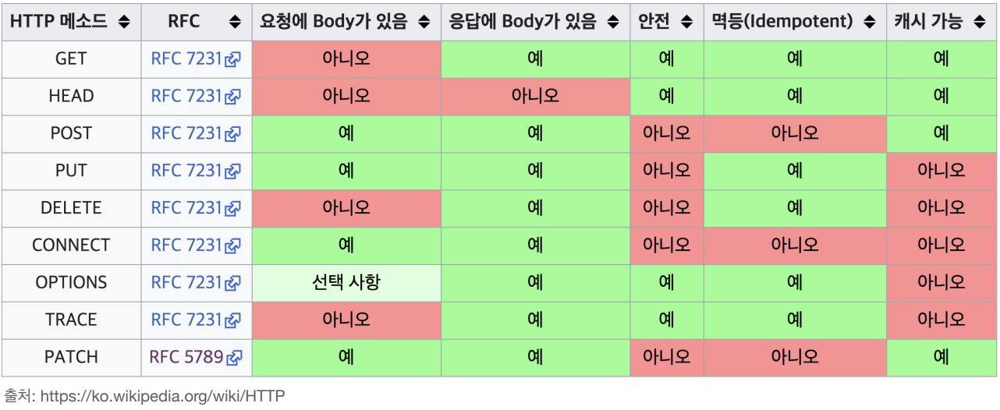

### HTTP란?

- 웹에서 클라이언트와 서버간에 데이터를 주고받기 위한 기본 프로토콜.
- `애플리케이션 계층`의 프로토콜이며 TCP하에서 작동한다.
- 텍스트나 문서, 이미지, 비디오 등 다양한 데이터들을 요청하고 전송하는데 사용
- 요청, 응답을 기반으로 동작. 이 과정에서 GET, POST 등 요청의 목적을 지정하고 상태코드를 통해 요청의 결과(응답)을 알려준다.

---

## HTTP 1.0 - Non-Persistent Connection(비지속 연결)

- TCP 연결 한번에 최대 하나의 객체를 전송할 수 있다.
- 따라서 두 개 이상의 객체를 전송하려면 두 번 이상의 연결이 필요하다.
- 요청마다 연결, 해제를 반복하기 때문에 오버헤드가 늘어난다.

## HTTP 1.1 - Persistent Connection(지속 연결)

- HTTP 1.0의 단점을 보완한  `텍스트 기반` 프로토콜
- keep-alive 옵션으로 TCP연결 한번에 여러개의 객체를 전송할 수 있다.
- `파이프라이닝` 기능 지원 → 응답을 받지 않아도 요청을 보낼 수 있다 → 하지만 응답의 순서가 지켜져야 함 → HOLB 발생 가능성

## HTTP2

- `멀티플렉싱(응답 다중화)` 지원 → 여러 리소스를 한번에 요청할 수 있다. → `파이프라이닝 단점(HOLB) 개선`
    - 요청한 리소스간의 우선순위를 설정하기 때문에 스트림 별로 가중치가 매겨지고 수신하는 순서를 결정
    - 하나의 TCP연결에 여러 스트림이 존재 가능
- HTTP 1.1은 텍스트 기반 프로토콜이었기 때문에 불필요하게 데이터가 커지는 문제가 발생
    
    → 이진 데이터로 변환해서 전송하는 방식으로 변경됨 → `파싱, 전송 속도 개선`
    
- `헤더필드 압축 지원` → 요청을 할 때 달라지지 않은 부분은 전송하지 않음 → 불필요한 오버헤드 최소화

## HTTP3

- `QUIC 프로토콜 기반` → TCP 대신 UDP를 사용하여 전송 계층을 구현 → 연결 설정 시간 단축(Zero RTT) 및 패킷 손실에 대한 빠른 복구
    - QUIC는 UDP 위에서 동작하며, TLS 1.3을 기본적으로 통합 → `내장된 암호화`로 추가적인 보안 설정 없이 안전한 통신 가능
    - IP 주소가 변경되더라도 연결을 유지 → 모바일 환경에서 네트워크 변경 시에도 연결이 끊어지지 않음
- **`멀티플렉싱 지원`** → HTTP/2와 유사하게 여러 리소스를 동시에 요청 가능 → `HOLB 문제를 해결`하여 더 나은 스트리밍 성능 제공
    - 개별 스트림이 독립적으로 처리되어 패킷 손실 시 다른 스트림에 영향을 미치지 않음
    - 하나의 연결에 여러 스트림 존재 가능
- **`성능 최적화`** → QUIC의 Zero RTT 기능으로 초기 연결 설정 시간이 감소 → 빠른 데이터 전송 및 저지연 통신
    - 패킷이 손실되어도 TCP처럼 전체 연결이 지연되지 않고 손실된 패킷만 재전송 → 전송 속도 및 안정성 개선
- **`헤더 압축 및 데이터 효율성`** → HTTP/2에서 도입된 헤더 필드 압축 방식을 유지하면서, 전송 효율성을 더욱 높임 → 불필요한 데이터 전송 최소화

## HTTPS

- **SSL/TLS 프로토콜 사용** → HTTP에 보안 계층 추가 → `데이터 암호화` 및 `기밀성 보장`
    - 클라이언트와 서버 간에 암호화된 통신을 제공하여, 데이터가 도청이나 중간자 공격에 노출되지 않음
    - 비대칭키 암호화를 사용
- **서버 인증** → SSL/TLS 인증서를 통해 서버의 신원을 인증
    - 클라이언트는 서버가 신뢰할 수 있는 기관에 의해 발급된 인증서를 통해 진짜 서버임을 확인 가능
    - 인증서 검증을 통해 중간자 공격을 방지하고, 안전한 연결을 보장
- **데이터 무결성 보장** → 전송 중 데이터가 변경되지 않았음을 확인 → `데이터 위변조 방지`
    - 메시지 인증 코드(MAC) 또는 해시 값을 사용하여 데이터의 무결성을 검증
    - 데이터가 전송 도중 변경되거나 손상된 경우 이를 감지하여 경고
- **TLS 버전 지원** → 최신 버전의 TLS 1.3까지 지원 → `성능 향상` 및 `보안 강화`
    - TLS 1.3에서는 핸드셰이크 과정이 간소화되어 연결 설정 시간이 단축되고, 불필요한 취약점이 제거됨
    - Zero RTT와 같은 기능을 통해 재연결 시 더 빠른 성능을 제공

---

## HTTP 특징 - Stateless, Connectionless

### Stateless

- 서버가 클라이언트의 상태를 보존하지 않는다.(이전 요청을 기억하지 않는다)
- 모든 정보를 stateless 방식으로 설계할 수는 없기 때문에 쿠키, 세션, 토큰으로 사용자의 상태를 유지한다.

### Connectionless

- 클라이언트가 요청하고 서버가 응답하면 연결을 종료한다 → 자원을 효율적으로 사용할 수 있다.
- 연결이 끊어지고 다시 요청을 할 때 TCP/IP 연결을 맺어야 하므로 3-way handshake 비용이 추가된다.
    
    → 지속 연결로 단점 보완 (header에 Connection : keep-alive 추가)
    
    - 지속연결 : 일정 시간 혹은 최대 몇개의 요청동안 동일한 TCP 연결을 사용하여 여러 요청을 처리하는 방식

---

## HTTP method

서버에 요청을 보낼 때 어떤 유형의 작업이 수행되어야 하는지를 나타내는 표준화된 동작.

이 메서드에 따라 서버는 어떤 요청을 처리해야 하는지 결정한다.

### GET - 리소스 조회

- 데이터를 읽을 때 사용되고, 수정하거나 생성할 때는 사용하지 않는다.
- 조회할 데이터에 대한 정보는 URL에 파라미터를 넣어서 전송한다.

### POST - 리소스 생성

- 본문에 생성할 데이터들의 정보를 담는다.

### PUT - 리소스 대체(전체 수정)

### PATCH - 리소스 수정(일부 수정)

### DELETE - 리소스 삭제

### HEAD - GET과 동일하나 body부분 제외하고 조회

### OPTIONS - 통신 옵션 확인

- 목표 리소스와의 통신 옵션을 설명하기 위해 사용됨. 주로(CORS에서 사용)
- 서버가 어떤 method, header, content-type 제공하는지 알 수 있다.

### CONNECT : 대상 자원으로 식별되는 서버에 대한 연결 요청

- 요청한 리소스에 대해 양방향 연결을 시작하는 메서드. 터널을 열기 위해 사용

### TRACE

- 클라이언트와 서버 간의 통신 경로를 진단하거나 디버깅하기 위해 사용.

## HTTP 메서드의 속성

안전성 : 호출해도 리소스를 변경하지 않는다.(GET)

멱등성 : 똑같은 연산을 몇 번 하든 응답은 똑같다. (GET, DELETE, PUT)

캐시 가능 : 응답 결과 리소스를 캐싱해서 사용해도 되는지 (GET,HEAD,POST,PATCH)

`GET에도 본문을 실을 수 있다.`

하지만, GET 요청의 요청 본문에 민감한 데이터를 포함시키는 것은 보안 위험. 데이터가 다양한 로그, 브라우저 기록 및 URL이 기록되는 기타 장소에서 노출될 수 있음.

---

## SSL/TLS handshake

**SSL 인증서**를 이용한다. 

- 통신을 공인된 제 3자(CA)가 보증해주는 문서로 공개키, 발급자, 유효 기간 등의 정보가 담겨있다.

TLS는 SSL보다 최신의 기술로 강력한 SSL이라고 부를수 있다.

### 대칭 키

하나의 키로 암호화와 복호화를 모두 수행한다.

### 비대칭 키

공개키와 개인키로 암호화와 복호화를 수행한다.

공개키로 데이터를 암호화하면 반드시 개인키로만 복호화 가능하고, 개인키로 데이터를 암호화하면 공개키로만 복화할 수 있다.

### **공개 키(Public Key)**:

- 서버는 자신의 공개 키를 클라이언트에게 배포한다.
- 서버의 공개 키는 인증서에 포함되어 있으며, 이 인증서는 TLS 핸드셰이크 과정 중에 클라이언트에게 전송한다.
- 공개 키는 누구나 접근할 수 있으며, 클라이언트는 이 키를 사용해 데이터를 암호화하여 서버에 전송한다.

### **비밀 키(Private Key)**:

- 서버는 자신의 비밀 키를 소유.
- 이 비밀 키는 서버만 알고 있어야 하며, 외부에 절대 공개되지 않아야 한다.
- 서버는 클라이언트가 서버의 공개 키로 암호화한 데이터를 복호화할 때 이 비밀 키를 사용한다.

## TLS 핸드셰이크 과정

1. 연결이 되면 클라이언트는 hello 메시지를 보낸다. 
    - 클라이언트가 지원하는 SSL/TLS 버전, 사용할 수 있는 암호화 알고리즘(암호 모음) 목록, 세션 ID, 난수, 압축 방법 등이 포함된다.
2. 서버가 hello 메시지를 보낸다.
    - 클라이언트가 보낸 암호화 알고리즘 중 하나를 선택하고, SSL/TLS 버전을 확정한다.
3. Server Certificate : 서버의 인증서를 클라이언트에게 보낸다.
    - 인증서에 공개키가 포함되어 있다.
    - 이전에 주고 받았던 클라이언트 난수와 서버 난수를 조합하여 `pre master secret키` 생성
4. server hello done : 초기 설정이 끝났다고 클라이언트에 알린다.
5. client key exchange : 공개키로 `pre master secret`키를 암호화하여 서버에 보낸다.
6. Change Cipher Spec: 메시지를 보내 암호화 통신 시작할 준비가 되었다고 알린다.
    - `pre-master secret` 을 바탕으로 세션키를 생성하고 이를통해 암호화된 통신을 시작할 준비를 마침.
7. Finished : 클라이언트와 서버는 각각 Finished메시지를 보내서 핸드셰이크과정이 완료되었음을 확인