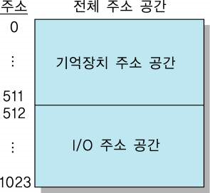

-   입출력 제어방식 : 컴퓨터와 입출력 장치 사이에서 데이터가 오가는 방식
    | 제어방식                              | CPU 관여 여부 |
    | ------------------------------------- | ------------- |
    | 프로그램에 의한 I/O(PIO, Program I/O) | O             |
    | Intrrupt에 의한 I/O                   | O             |
    | DMA(Direct Memory Access)에 의한 I/O  | X             |
    | Channel에 의한 I/O                    | X             |

# PIO (Programmed I/O)

> CPU가 입출력 장치를 기다리며 데이터를 입력/ 출력하는 방식이다.

-   (매우 빠른) 프로세서가 (매우 느린) 입출력 장치의 Status Register를 계속 확인하면서 입출력작업을 하는 방식이다. pooling 방식이라고도 한다.
-   입출력을 할 준비가 되었는지 알리는 신호(Flag)를 CPU가 계속 확인해야 한다. 즉, 입출력 준비 완료까지 대기시간 + 입출력 직접 진행하는 시간동안 다른 연산이 불가능하다.
    ⇒ CPU 활용률 하락(busy wait)이 발생, 비효율적이다.
-   CPU가 입출력 장치와 메모리간의 데이터의 이동을 담당한다.

### 동작 순서

1. 입출력 장치가 I/O 요청을 한다.

2. CPU가 수행하던 작업을 멈춘다.
3. CPU는 입출력 준비가 될 때까지 기다린다 (Flag를 확인한다) → 차이점
4. 입출력 준비 완료를 알리면 CPU는 입출력을 진행한다.
5. 입출력을 완료하면 기존에 하던 작업을 이어서 수행한다.

> PIO 방식은 입출력 장치와 메모리간의 데이터 이동을 CPU가 주도하고, 데이터도 반드시 CPU를 거쳐야 한다. (프로세스 레지스터에 우선적으로 저장되므로)
>
> ❓ 데이터 전송에서 CPU를 배제할 수는 없을까? ⇒ DMA 등장

# DMA (Direct Memory Access)

> 입출력장치가 CPU의 개입 없이 직접 메모리에 접근하여 데이터 블록을 읽고 쓸 수 있게하는 기능

-   DMA Controller [DMAC] : 프로세서는 배제하고, 버스의 주도권을 잡고 DMA를 가능하게 하는 주체
-   입출력이 필요하면. CPU는 입출력에 필요한 정보를 DMAC에 알림 ⇒ 이후 작업은 DMAC가 전담하고 CPU는 프로세스를 수행한다.
    -   DMAC가 입출력 작업을 마치면 인터럽트 신호를 CPU에게 보내 완료됐음을 알린다.
        ⇒ CPU 자원의 낭비를 최소화하고 데이터 전송의 효율성을 높인다. 특히 대용량 데이터 전송에 효율적이다.
-   Cycle Steal 이라는 방식을 이용해 데이터를 전송(=입출력을 수행)한다.
    -   Cycle Steal : DMAC가 데이터를 전송하는 과정에서 CPU와 동시에 메모리에 접근하면, DMAC가 우선권을 뺏어서 자료를 전송하는 방식으로 동작하는 방식
    -   일반적으로 입출력 장치가 CPU보다 적은 양의 memory cycle이 필요하므로 DMAC가 우선권을 가짐으로써 입출력의 효율이 높아진다.
-   장점
    -   효율성 : 대용량 데이터를 처리할 때 CPU의 부담 감소
    -   성능 향상 : CPU는 다른 중요한 작업에 집중 가능하기에 전체 시스템 성능이 향상된다.
    -   저지연 : 입출력 장치와 메모리 간 빠른 데이터 전송을 가능케함
-   단점
    -   복잡성 : DMAC의 관리와 구성이 복잡할 수 있다.
    -   자원 충돌 : 메모리 버스의 점유로 인해 다른 장치들의 메모리 접근이 지연될 수 있다.

### 동작 순서

1. CPU가 입출력에 대한 정보를 DMAC에게 전달

2. DMAC는 CPU에 버스의 사용을 요청 (Bus Request)
3. CPU는 DMAC에게 버스 사용을 허가 (Bus Grant)
4. DMAC가 메모리 주소를 지정하고 데이터 전송을 시작
5. 입출력 완료 후, DMAC가 CPU에게 완료 인터럽트 신호 보냄

-   버스 : 컴퓨터를 구성하는 요소(CPU, I/O 장치, 메모리)들을 연결해주는 통로

    -   데이터 버스 : CPU와 다른 장치 사이에서 데이터가 오가는 통로. Memory와 I/O장치의 명령어를 CPU로 보내거나 CPU가 연산한 결과를 반대로 전송할 때 사용하는 양방향 버스

    -   주소 버스 : 물리적 주소를 특정하기 위해 사용하는 버스. CPU나 입출력장치가 메모리에서 데이터를 읽거나 쓸 때 주소 버스에 데이터 버스에 실어보내는 값의 메모리 주소를 전달한다. _CPU ⇒ Memory, I/O 장치_ 방향만 존재하는 단방향 버스
    -   제어 버스 : 충돌을 방지하기 위해 데이터 버스와 주소 버스를 제어하고 데이터 흐름을 관리하는 버스

### CPU에서 DMAC로 보내는 자료

-   I/O 장치 주소

-   데이터가 있는 주기억장치의 시작 주소
-   DMA를 시작시키는 명령
-   입,출력 하고자 하는 자료의 양
-   입력/출력을 결정하는 명령

### DMA 구성요소

-   인터페이스 회로 : CPU와 입/출력 장치와의 통신 담당

-   주소 레지스터 및 주소 라인 : 기억장치 위치 지정을 위한 번지 기억 & 전송
-   워드 카운트 레지스터 : 전송되어야 할 워드 수를 기억함
-   제어 레지스터 : 전송 방식 결정
-   데이터 레지스터 : 전송에 사용할 자료나 주소를 임시로 기억하는 버퍼 역할 수행

https://microelectronics.tistory.com/26

https://h-devnote.tistory.com/20

https://velog.io/@orcasuit/Direct-Memory-Access

# Memory Mapped I/O

> CPU가 입출력장치를 액세스할 때, 입출력과 메모리의 주소 공간을 분리하지 않고 하나의 메모리 공간에 취급하여 배치하는 방식.

-   메모리의 일부 공간을 I/O 포트에 할당함 → I/O가 차지하는 만큼 메모리 용량은 감소한다.
-   CPU 입장에선 메모리와 I/O가 동일한 외부기기로 간주되므로 얘네한테 접근하기 위한 제어신호는 읽기(READ), 쓰기(WRITE) 신호 뿐이다.
-   소프트웨어적으로도 **메모리에 대한 데이터 접근**과 **I/O에 대한 데이터의 입출력**이 동일한 것으로 간주된다.
    → 메모리 영역에 접근하는 방식 그대로 `LOAD`**나** `STORE`**명령에 의해 수행**된다.
-   컴파일러의 최적화 방지를 위해 I/O 영역 변수는 volatile로 선언해야 한다.
-   RISC, 임베디드 시스템에서 주로 사용한다 (ex. ARM, MIPS, PowerPC)
-   포트 입출력 구현 시, 복잡성이 사라지므로 하드웨어 구성이 간단함
    but 주소, 데이터 버스 사용 多 → 기억장치 이용 효율이 낮다

## I/O Mapped I/O

> 메모리와 입출력의 주소 공간을 분리하여 접근하는 방식

-   메모리와 I/O가 별개의 주소영역에 할당됨 → I/O를 사용하더라도 메모리 용량에 영향 없다.
-   CPU는 메모리와 I/O를 구분해서 취급함 → 액세스 하기 위한 제어 신호는 read, write 신호 외에 memory request, I/O request 과 같은 구분 신호가 필요하다.
-   소프트웨어적으로도 메모리에 대한 데이터 액세스와 I/O에 대한 데이터의 입출력이 서로 다른 것으로 간주된다.
    → 메모리 액세스는 LOAD, STORE 명령에 의해 수행되는데 반해 I/O의 입출력은 INPUT, OUTPUT 명령에 의해 수행된다.
-   주로 인텔계열 프로세서(x86)에서 사용된다.
-   하드웨어 구성이 MMIO에 비해 복잡하다.

[https://safetyzone.tistory.com/entry/SoC-Memory-mapped-IO-MMIO-이해하기](Image/IO&Socket/TCPsocket.png)

https://eteo.tistory.com/101

http://jidum.com/jidums/view.do?jidumId=467

# Socket

> 운영체제가 제공하는 인터페이스(API)로, 애플리케이션 계층의 프로그램이 네트워크 서비스를 사용할 수 있게 한다.

-   소켓은 Transport 계층과 Application 계층 사이에 존재하기에 애플리케이션이 Transport 계층의 세부 사항을 신경쓰지 않고 네트워크 통신을 할 수 있도록 인터페이스를 제공한다.
    -   두 계층을 연결하기 위해 소켓 번호(= 파일 디스크립터 번호), 자신의 IP 주소, 자신의 포트 번호(= 프로세스에 할당된 포트 번호)가 필요하다.
-   클라이언트와 서버 컴퓨터의 각 프로세스가 통신으로 데이터를 주고받기 위해선 각 컴퓨터에 소켓이 필요하다.
    -   일종의 파일과 비슷한 역할을 수행한다. (클라이언트 프로세스는 반드시 소켓을 열어서 소켓에 데이터를 쓴 뒤 서버에게 보내야 한다)
-   프로세스마다 고유한 포트번호가 있고, 여러 개의 소켓을 가질 수 있다.
    -   각 소켓은 IP주소와 포트번호를 가진다. 프로세스에 맞게 생성되었다가 통신이 종료되면 소켓을 삭제하는 방식으로 동작한다.
-   운영체제에서 관리하는 과정으로 소프트웨어적으로 구현되어 있으며, 해당 프로세스의 파일 디스크립터에 저장된다
    -   파일 디스크립터 : 프로세스에서 특정 파일에 접근할 때 사용하는 추상적인 값. 일반적으로 0이 아닌 정수 값을 갖는다. 열린 소켓을 저장하는 배열 개념이다.
-   자바는 3가지 종류의 소켓을 제공한다.
    -   연결기반(TCP) 소켓
    -   비연결성(UDP) 소켓
    -   MulticastSocket : 인터넷의 멀티캐스팅 전송 방식. 서버는 데이터그램을 Multicast 주소로 전송한다.

### TCP 소켓 통신

> OS 커널에 구현되어 있는 TCP 프로토콜을 다루는 요소의 추상화된 인터페이스이다.

-   TCP 연결을 하게 된다면 특정 시각에 연결된 클라이언트 수가 N명일 때, 1개의 포트 번호에서 N+1개의 소켓을 사용하게 된다.

-   socket() : 소켓 생성
-   bind() : 서버는 통신할 포트 번호, IP 주소가 필요하므로 소켓과 연결하는 과정
    -   소켓과 포트번호를 결합 (bind) 한다. 소켓은 시스템이 관리하는 포트 중 하나의 포트를 사용하게 되는데, 다른 포트 번호와 충돌이 나면 안되므로 bind() 함수를 통해 OS에 지정된 포트를 사용하겠다고 요청하는 단계가 필요하다
-   listen() : 연결 대기
-   connect() : 클라이언트가 서버에 연결 요청을 하며 3-way handshake 수행
-   accept() : 연결 요청 수락하고, 새로운 소켓을 만들어 연결한다. (기존 소켓은 listen() 상태로 기다림)
-   recv(), send() : 새로운 소켓에서 클라이언트와 1대1로 데이터를 주고 받음
-   close() : 연결 종료를 하며 4-way handshake를 수행

### UDP 소켓 통신

> 비연결 지향 프로토콜이므로 listen() - connect() - accept() 과정이 필요 없다.

-   UDP 소켓 통신과정은 비교적 간단한 편으로, TCP와 다르게 새로운 소켓을 생성하지 않고, 하나의 소켓에서 전부 처리한다.

### 소켓과 웹소켓의 차이

-   공통점
    -   IP, 포트를 통한 통신을 한다.
    -   양방향 통신을 한다.
-   차이점
    -   소켓은 TCP/IP 레이어(4계층)에서 작동하고, 웹소켓은 HTTP레이어(=7계층)에서 작동한다.
    -   웹소켓은 TCP 통신으로만 가능하다.

⇒ 웹소켓은 TCP 소켓의 추상화 형태이다.

### HTTP와 웹소켓의 차이

-   HTTP는 요청/응답 모델을 기반으로 하는 비연결성(단방향) 프로토콜이다. 클라이언트가 서버에 요청을 보내고, 서버는 응답을 보낸다. HTTP는 각 요청이 독립적이며 상태를 유지하지 않으므로 실시간으로 데이터를 주고 받아야 하는 상황에는 적합하지 않다.
-   웹소켓은 클라이언트와 서버 간에 지속적인 연결을 유지하는 양방향 통신 프로토콜이다. 이를 통해 실시간 데이터를 주고 받을 수 있다.

### 소켓의 최대 생성 개수?

-   소켓은 포트 번호 개수만큼 생성된다? : ❌
    ⇒ 소켓은 TCP 통신에서 하나의 포트 번호 당 N(특정 시각에 연결된 클라이언트 수)+1개가 필요하다. 따라서 포트 번호 개수만큼 생성하면 모든 포트 번호를 활용하지 못하게된다.
-   소켓은 컴퓨터가 버틸 수 있을 때까지 계속 만들 수 있다.
    -   만들 수 있는 최대 개수는 터미널에서 명령어를 통해 확인할 수 있다.

https://twofootdog.tistory.com/51

[https://brightmango.tistory.com/entry/운영체제-소켓](https://brightmango.tistory.com/entry/%EC%9A%B4%EC%98%81%EC%B2%B4%EC%A0%9C-%EC%86%8C%EC%BC%93)

[https://velog.io/@leekhy02/소켓Socket](https://velog.io/@leekhy02/%EC%86%8C%EC%BC%93Socket)

https://hello70825.tistory.com/m/598

https://f-lab.kr/insight/websocket-vs-http
