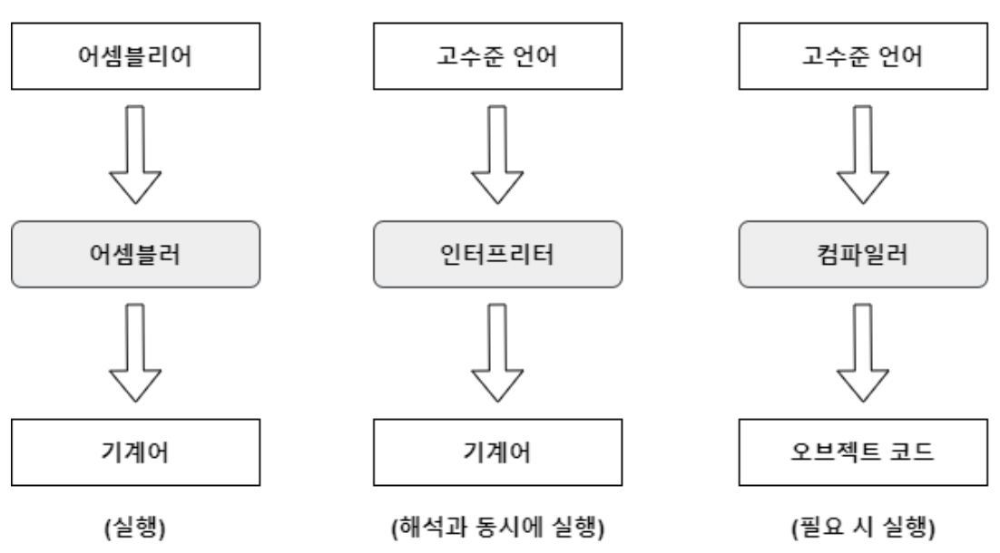
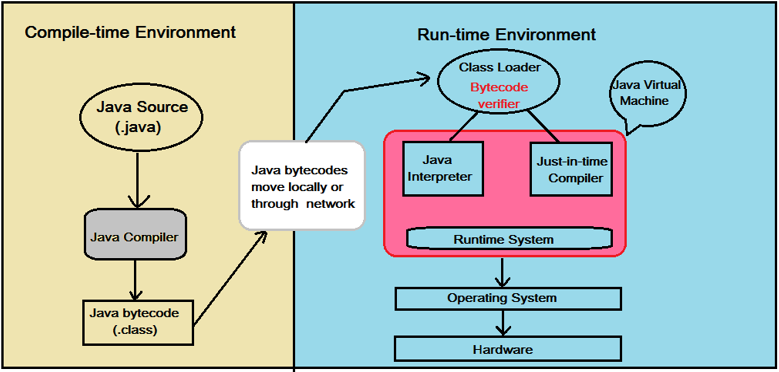

# 컴파일러

### 컴파일러 개념

프로그래밍 언어로 작성된 소스파일을 CPU가 인식할 수 있는 실행파일로 변환하는 소프트웨어 도구

-   **_컴파일_**
    고수준 언어 (프로그래머가 작성한 소스코드) =컴파일러⇒ 기계어 (컴퓨터가 동작하는 언어)의 과정

> 💡 텍스트 파일로 저장된 소스파일을 컴파일러에게 주면 → 컴파일러는 얘를 CPU가 직접 실행 가능한 실행파일 (= 기계 명령어)로 번역하는 과정

-   기계어와 오브젝트 코드의 차이

    -   기계어 : CPU가 이해하고 실행할 수 있는 이진 코드. CPU 아키텍처에 따라 달라짐. 일반적으로 어셈블리어로 변환된 후 기계어로 변환됨

    -   오브젝트 코드 : 소스코드를 컴파일러나 어셈블러를 통해 변환한 중간 형태의 코드. 기계어로 변환되기 전에 링크 작업을 수행하여 실행 가능한 형태로 만들어지기 전 상태. 링크 작업을 통해 최종 실행 파일이나 라이브러리로 변환되기전 상태

### 컴파일러의 특징 및 기능

-   형식이 다른 CPU는 각각 다른 기계어 코드를 가지고 있기에 컴파일 된 결과물을 즉, 마이크로 프로세서에 맞는 컴파일러를 사용해야 한다 ⇒ 플랫폼 (OS, CPU와 같은 하드웨어)에 종속적이다.

    -   프로그래밍 언어별로 여러 종류가 존재한다.

        -   자바의 컴파일러 : javac.exe

-   실행 가능한 바이너리 파일(C, C++)/바이트 코드(java)를 생성한다.

    -   바이너리 파일 : 컴퓨터에서 직접 실행할 수 있는 파일

    -   바이트 파일 (\*.class) : 이 파일을 JVM이 읽어들여 실행한다. 클래스 파일을 실행하기 위해서는 필요한 모든 .class 파일을 불러들이고, 코드를 검증한 뒤 메모리로 올리는 작업을 수행한다. 만약 클래스가 없거나 오류가 있다면 컴파일 에러를 발생시키고, 그렇지 않으면 정상 수행한다.

-   정적 프로그램이므로 변수 타입이 변경할 수 없다.

-   소스코드를 한 번에 모두 번역하고, 그 결과물을 별도의 파일에 저장한다.

    -   실행 속도가 빠르다.

    -   실행 단계 전 컴파일 과정에서 오류를 미리 확인할 수 있음

-   고급언어를 직접 기계어 코드로 변환한다. (`*.java` → `*.class`)

    -   자바의 경우 바이트 코드로 변환한 뒤, 가상머신인 JVM에 넘겨 실행된다.

        -   가상 머신 : 인터프리터, CPU 시물레이션 프로그램

        -   장점 : 한 번 컴파일 된 바이트 코드는 다른 플랫폼에서 재컴파일 없이 실행 가능하다.
        -   단점 : 바이트 코드를 해석해서 실행할 프로그램 구조가 필요함. 직접 기계어 코드 실행할 때보다 속도가 느리다.

    -   C/C++의 경우 직접 기계어 코드로 변환한다

> 자바는 컴파일 + 인터프리터 2가지로 구성되어 진행되는 하이브리드 언어이다.

### 컴파일 과정

컴파일러는 크게 보면 번역기, 작게 보면 텍스트 처리 프로그램이다.

즉, 소스코드를 분석하고 최적화하여 기계어로 번역한다.  
(이때 다양한 최적화 기술을 적용해서 실행 속도를 향상시키고 메모리 사용량을 최소화할 수 있음)

1. `어휘 분석(Lexical Analysis)` : 소스 코드를 구성하는 문자들을 단어로 분리하여 어휘 요소로 변환한다. 스캐닝이라고도 한다.
2. `구문 분석 (Syntax Analysis)` : 어휘 요소(토큰)들을 구문 규칙에 따라 해석함을 통해 구문 트리를 생성하는 과정이다.
3. `의미 분석 (Semantic Analysis)` : 구문 트리가 의미적으로 올바른지 검사하고, 변수의 정의와 사용, 함수 호출 등을 분석한다.

    ⇒ 이 과정을 통과함 == 컴파일 오류가 없다는 것

4. `중간 코드 생성 (Intermediate Code Generation)` : 검증된 구문 코드를 탐색한 결과를 바탕으로, 이해하기 쉬운 **_중간 코드 (IR Code)_**를 생성한다.
5. `최적화 (Optimization)` : 경우에 따라 중간 코드를 효율적으로 실행할 수 있도록 최적화 한다.
6. `기계어 코드 생성 (Code Genration)` : 최적화된 중간 코드를 어셈블리어 코드로 변환한 후, 이것을 기계 명령어로 번역하여 실행 파일을 만듦 (링킹 과정; 여러개의 오브젝트 코드 파일을 실행 가능한 하나의 오브젝트 코드 파일로 합침)

> 세상의 모든 프로그래밍 언어는 특정 구문에 따라 작성되는데, 컴파일러가 언어 구문에 따라 코드 구문을 분석하여 구문 트리를 만들고, 이 구문 트리를 기계어 / 바이트 코드로 번역해 CPU의 고유한 언어들에 상응하는 시뮬레이션 프로그램을 준비해 어디서든 실행 가능하게 함.

# 인터프리터

### 인터프리터의 개념

런타임에 프로그램 코드를 한 줄씩 읽어 들이며 번역해 실행하는 방식이다.

소스 코드를 직접 해석해 실행하므로 컴파일 과정이 필요하지 않다. 일종의 통역기 개념

→ 개발 과정에서 빠른 피드백이 가능하다.

-   대표적인 인터프리터 언어 : Python, JavaScript, Ruby 등

### 인터프리터 특징

-   고급 언어에서 중간 형태의 언어로 변형한 뒤, 가상 머신에 할당해 실행한다.
-   컴파일 단계가 없기에 컴파일 시간을 단축할 수 있다.
-   플랫폼으로부터 독립적으로 동작한다.
    -   반면에 컴파일러는 플랫폼에 종속적이다.
-   동적 프로그램이다. (변수 타입 변경 가능)
-   실행이 되는 중에야 오류 파악이 가능하다.
    -   실행중에 발생하는 오류를 즉시 처리한다. (구문 오류, 런타임 오류 등)
-   (한 번에 한 줄씩 읽어 수행하므로) 컴파일러보다 속도가 느리다.
-   줄 단위로 진행되어 시분할 시스템에 유용하다.
-   매번 실행할 때마다 번역을 새로 반복한다.
    ⇒ CPU 사용시간 낭비가 크다.

### 인터프리터의 실행 과정

1. `어휘 분석(Lexical Analysis)` : 소스 코드를 구성하는 문자들을 단어로 분리하여 어휘요소(토큰)으로 변환한다. 스캐닝이라고도 한다.

2. `구문 분석 (Parsing)` : 토큰들을 구문 규칙에 따라 해석함을 통해 구문 트리를 생성하는 과정이다.
3. `명령어 해석 (Interpretation)` : 구문 트리를 기반으로 명령어를 해석하고 실행한다. 구문 트리의 각 노드를 순회하며 프로그램의 명령어를 해석한다.
4. `실행 (Execution)` : 실제로 프로그램의 명령을 실행해 결과를 생성한다. 해석된 명령어를 기반으로 프로그램의 논리를 실시간으로 수행한다.
5. `결과 출력 (Output)` : 프로그램 출력 결과를 사용자에게 보여준다.

## 컴파일러, 인터프리터 비교

|           | 컴파일러              | 인터프리터                           |
| --------- | --------------------- | ------------------------------------ |
| 번역 단위 | 전체                  | 한 줄 마다                           |
| 실행 속도 | 빠름                  | 느림                                 |
| 번역 속도 | 느림                  | 빠름                                 |
| 목적 코드 | 생성 O                | 생성 X                               |
| 예시      | C, C++, Java Compiler | Python, JavaScript, Java Interpreter |

### 자바의 컴파일러 & 인터프리터

자바는 빌드 시 자바 파일을 **컴파일러를 사용해 중간단계의 언어(바이트 코드)로 변환**한다.

→ 이후 **런타임 시, 바이트 코드를 기계어로 바꿔주는데 이것이 바로 JVM의 역할**이다.

-   Class Loader를 통해 바이트 코더를 JVM으로 로드 한뒤, Runtime Data Areas를 거쳐 Execution Engine으로 향한다.
-   Excution Engine에서 바이트 코드로 변환하는 2가지 방식
    1. **인터프리터**

        위에서 설명한 방식

    2. **JIT(Just-In-Time) 컴파일러**

        인터프리터 방식을 사용하는 중, 적정한 때에 바이트코드 전체를 기계어로 변환하는 방식 (이때 기계어는 캐싱을 이용함 → 인터프리터 단점을 극복할 수 있다)

        빠르게 컴파일이 가능하다.

        - 동작 과정
            인터프리터 실행 → 동적 프로파일링 → 컴파일 대상 식별 → JIT 컴파일 → 기계어 실행

> 자바는 컴파일러로 바이트코드를 만들고, 바이트코드르 JVM을 통해 기계어로 번역한다.
> ⇒ JVM만 있으면 어디서든 동작 가능하다 (⇒ 이식성)

https://devparker.tistory.com/110#google_vignette

https://isloaded.tistory.com/32

https://haeunyah.tistory.com/37

https://yanacoding.tistory.com/56

[https://velog.io/@hosunghan0821/Java-자바의-동작과정-Java-Compiler-와-JVM](https://velog.io/@hosunghan0821/Java-%EC%9E%90%EB%B0%94%EC%9D%98-%EB%8F%99%EC%9E%91%EA%B3%BC%EC%A0%95-Java-Compiler-%EC%99%80-JVM)

https://ttuk-ttak.tistory.com/38

https://jae-yoon.tistory.com/3

https://beastit.tistory.com/13
