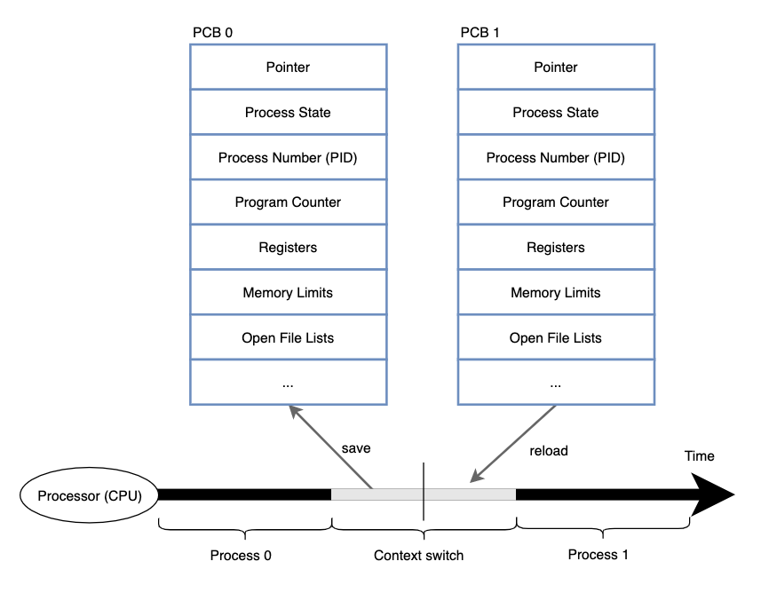
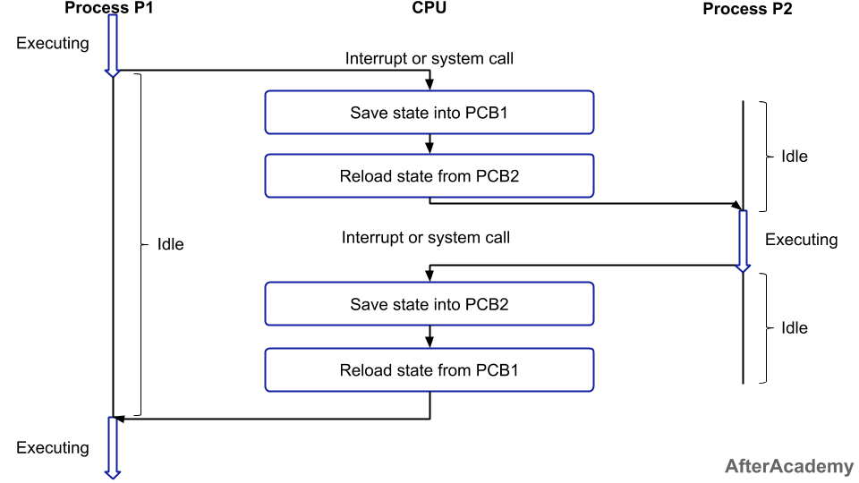

다양한 프로세스들을 최대한 효율적으로 CPU를 사용할 수 있게끔 하기 위해서 다양한 CPU 스케줄링 기법이 존재한다고 했다.

CPU를 다양한 프로세스들에게 할당해주는 과정에서, 이 문맥 교환이 발생한다.

## 문맥 교환이란?

> 문맥 (context) : 프로세스의 상태 정보를 의미함
>
> 문맥 교환(context switch) : 프로세스의 상태 정보를 교환

CPU 사용 프로세스가 변경되는 과정에서, 이전 프로세스의 상태, 수행 정보는 PCB에 저장해놓고, 현재 프로젝트의 정보는 PCB에서 읽어 레지스터에 적재함

-   현재 CPU상에서 실행되고 있던 프로세스의 정보(= 문맥)을 자신의 PCB에 저장 & 새롭게 CPU 할당 받을 프로세스는 PCB로부터 전에 저장해 놓은 자기 정보(문맥)을 복원 해 이어서 수행함

⇒ 프로세스의 정보, 상태, 문맥을 저장하는 곳

## 진행 과정

1. P1 실행 중 OS에서 프로세스 스케줄러에 의해 인터럽트 발생

2. 프로세스가 실행되는 사용자 모드 → 커널 모드로 전환

3. 기존에 실행 중이던 프로세스(P1)의 상태/정보를 자신의 PCB1에 저장

4. PCB2로부터 다음 실행될 프로세스(P2)의 상태/정보(문맥) 복구

5. 커널 모드 → 사용자 모드 전환

6. 프로세스 P2 실행

### PCB (Process Control Block)

-   OS가 시스템 내 프로세스들을 관리하기 위해 프로세스마다 유지해야 하는정보를 담는 커널 내 자료구조 (커널 내 data 영역에 존재)
-   저장되는 프로세스의 메타 데이터들
    Process ID, Process 상태, CPU Register, CPU 스케줄링 정보, 메모리 사용/관리 정보
-   PCB 생성 시마다 PCB List Head에 주소값으로 연결 → Linked List로 관리

### 자발적, 비자발적 문맥교환

-   자발적 문맥 교환 : 현재 사용 불가능한 자원을 요청했을 때 프로세스가 CPU 제어를 포기한 경우
-   비자발적 문맥교환 : 타임 슬라이스 끝나거나 우선순위가 더 높은 프로세스에 의해 CPU 뺏기는 경우

## 문맥 교환이 발생하는 경우

멀티태스킹, 인터럽트 핸들링, 사용자 모드와 커널 모드 간 전환

1. 멀티태스킹 (Multitasking) (=멀티 프로세싱)

    - 다수의 프로세스가 하나의 CPU 자원을 나누어서 번갈아 사용하는 것
    - 번갈아가며 프로세스가 CPU를 할당받는 과정에서(dispatch) 문맥 교환 발생

2. 인터럽트 핸들링

    : 인터럽트가 발생 할 때 CPU가 넘어가므로 문맥 교환이 발생.

    - 입출력 요청 등에 대한 인터럽트 발생
    - 할당된 CPU 사용 시간이 만료되어 다음 프로세스로 넘어갈 때
    - 자식 프로세스 생성, 인터럽트 처리 대기 등 프로세스가 다른 리소스 기다려야 할 때

    ⇒ 다른 리소스 기다릴 필요 없는 그 외 인터럽트나 시스템콜 발생 시에는 사용자 ↔ 커널 모드 전환만 발생하고 문맥 교환은 발생하지 않는다.

3. 사용자 → 커널 모드 전환

    운영체제에서 사용자 모드와 커널 모드 사이 전환이 필요한 경우, 즉 현재 프로세스의 상태를 저장하고 복원해야 할 필요가 있을 때 발생

### 문맥교환으로 인한 오버헤드 해결

-   다중 프로그래밍 수준 (time quantum) 주기를 낮춰 문맥 교환 빈도 줄이기

-   스레드를 이용해 문맥교환 부하 최소화 (∵ 스레드는 프로세스에서 코드, 데이터, 힙 자원을 공유하므로)

-   스택 이용 프로그램의 경우 스택 포인터를 활용해 부하 최소화

### 참조

https://yoongrammer.tistory.com/53

https://zu-techlog.tistory.com/123
