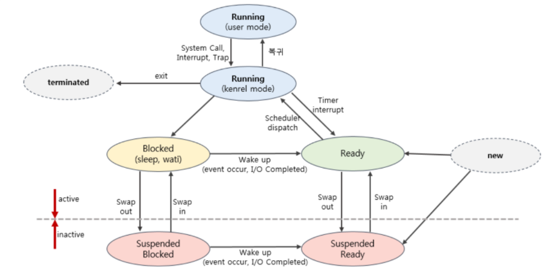
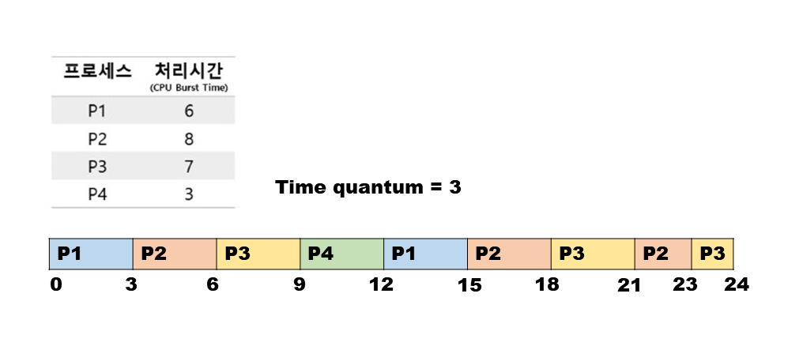
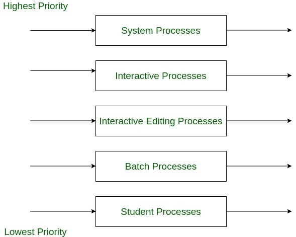
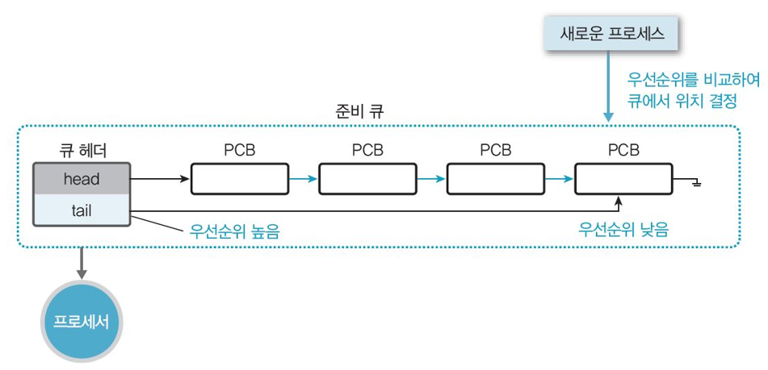

### 스케줄러

> 스케줄러 : 어떤 프로세스에게 자원(CPU)을 할당할지 결정하는 운영체제 커널의 모듈

-   스케줄링 : CPU를 사용해야 하는 프로세스 사이의 우선 순위를 관리하는 것
    >
-   CPU는 여러 개의 프로세스를 동시에 실행할 수 없다. 한 순간에 오직 1개의 프로세스를 수행한다.

-   이런 CPU의 사용을 극대화하기 위해서 적재 적소에 CPU 자원을 프로세스들에게 최대한 효율적으로 할당해 줄 필요가 있다. 시분할은 프로세스 간 문맥 전환이 빨리빨리 일어나야만 한다.

## Queue

프로세스들은 돌아가며 CPU 자원을 사용한다. 그렇기에 CPU를 사용하지 않을 때 프로세스들이 대기할 곳이 필요한데, 그곳이 바로 **Queue**이다.

1. 작업 큐 (Job Queue)

    시스템 안의 모든 프로세스들이 담긴 큐

2. 준비 큐 (Ready Queue)

    실행 준비가 완료된 프로세스들이 프로세서를 할당 받을 때 까지 대기하는 큐

3. 장치 큐 (Device Queue)

    수행 중이던 프로세스들이 I/O 처리를 대기하며 기다리는 큐

### 프로세스 상태

-   new : 생성 중인 상태 (커널 공간에 PCB가 만들어짐, 메모리는 아직 할당 전)
-   running : CPU 기다리는 상태 (메모리에 적재됨, 필요한 자원 준비됨)
-   ready : CPU를 할당 받아 명령어를 수행 중인 상태
-   blocked(waiting) : 특정 이벤트(I/O 접근 요청, 입력 필요, critical region에 대한 접근 필요할 때 등가 발생해서 기다리는 상태
    -   프로세스가 running 상태에서 입출력 작업 하는 동안은 CPU가 놀게 되므로 자원 반납하고 Device Queue에서 대기한다.
-   terminated : 종료 시스템 콜 받고 PCB가 할당 해제 되기 직전 상태
    -   프로세스의 실행 끝, 할당된 CPU 최종 반납 But 커널 내부에 PCB 블록은 아직 남아있음 ( 완전히 종료되면 프로세스로 취급 안하므로)
-   suspended : 프로세스 중지 상태 (메모리를 강제로 뺏긴 상태. 외부에서 다시 메모리로 불러오지 않는 이상 활성화 될 수 없음 ≠ blocked)
    -   suspended ready(ready 상태의 프로세스가 스왑아웃), suspended blocked (blocked 상태의 프로세스가 스왑아웃)

### 프로세스 상태 전이

-   `new → running` : new 상태에서 OS에 의해 승인을 받아 프로세스가 생성되면 해당 프로세스의 PCB가 Ready Queue에 적재된다.
-   `ready → running` : Ready Queue에 있는 프로세스들 중에서 스케줄링 알고리즘에 의해 선택받은 프로세스가 CPU를 할당 받는다. ⇒ `디스패치 (Dispatch)`
-   `running → ready` : CPU를 할당 받아 명령어를 수행하다 특정 이유로 다른 프로세스에게 CPU를 주고(dispatch) 다시 CPU를 기다린다. ⇒ `타이머 런 아웃 (Timer Run Out)`
    -   `time out` : CPU 할당 시간 끝났으니 프로세스 교체
    -   `interrupt` : 우선순위가 높은 프로세스가 Ready Queue에 존재하는 경우, 멈추고 해당 프로세스에게 CPU 할당
-   `running → blocked` : 현재 CPU를 받아 명령어를 수행중인 프로세스가 I/O 작업을 해야 하는 경우 CPU를 반납하고 Device Queue로 이동한다. ⇒ `블록 (Block)`
-   `blocked → ready` : 작업 끝나고 CPU에게 인터럽트 발생시켜 끝났음을 알린 후 Ready Queue로 복귀한다. ⇒ `웨이크 업 (Wake-up)`
-   `running → terminated` : 프로세스 실행이 완료되면 자원 반납
-   `blocked, ready → suspended blocked, suspended ready` : 메모리 부족 등의 재난 상황 발생해서 blocked, ready 상태의 프로세스들이 디스크로 swap됨
-   `suspended blocked → suspended ready` : suspended blocked인 프로세스가 blocked 되었던 조건 만족하면 (입출력 작업 끝 ..) ready상태로 들어감

### 디스패처 (Dispatcher)

-   CPU 코어의 제어를 CPU 스케줄러가 선택한 프로세스에 주는 모듈
-   프로세스 간 문맥 교환 진행, (커널 모드에서) 사용자 모드로 전환, 프로그램을 다시 시작하기 위해 사용 자 프로그램의 적절한 위치로 이동
-   디스패치 지연 (dispatch latency)
    : 디스패처가 하나의 프로세스를 정지하고 다른 프로세스의 수행을 시작하는데까지 소요되는 시간

## 스케줄러 종류

-   자주 사용되는 스케줄러는 단기, 장기 스케줄러로 주로 일괄처리 시스템에 사용된다.

### _장기 스케줄러 (Job Scheduler)_

> 디스크 내 작업을 어떤 순서로 메모리에 가져올 지 결정하는 프로그램

-   디스크에 있는 프로세스를 필요할 때 → Ready Queue로 이동(=메인 메모리에 적재)
    -   new → ready 상태로 전이
-   수십 초 내지 수 분 단위로 호출됨 → 속도 느린편
-   프로세스에 메모리(각종 자원)를 할당(admit)
-   메모리에 동시에 올라가 있는(실행 중인) 프로세스의 수 조절
    -   다중 프로그램의 정도(메모리에 있는 프로세스 수) 제어
-   시분할 시스템 → 대부분 장기 스케줄러 사용 ❌
    프로세스 메모리가 과거에는 작아서 장기 스케줄러의 조절이 필요했지만, 요즘 OS에서는 프로세스가 시작되면 장기 스케줄러 없이 바로 해당 프로세스에 메모리를 할당해 준비 큐에 넣어줌

### 중기 스케줄러 (Swapper)

> 메모리에서 **CPU를 점유하기 위해 경쟁**하는 프로세스를 **디스크로 보내는** 스케줄러

-   메모리에 적재된 프로세스의 수를 조절하는 역할 : ready → suspended
    -   프로세스를 통째로 메모리에서 디스크로 이전 시킴(=swapping)
    -   차후 다시 프로세스를 메모리로 불러와, 중단되었던 지점에서 실행 재개(=swapping) 시킴
-   시분할 시스템과 같은 일부 운영체제에서 도입함
-   blocked 상태는 다른 I/O 작업을 기다리는 상태이므로 스스로 ready state로 돌아갈 수 있지만, suspend는 디스크로 쫓겨난 상태이므로 스케줄러에 의해서만 이동될 수 있음

### _단기 스케줄러 (CPU Scheduler)_

> CPU를 사용해야 하는 준비 상태의 프로세스 중 어떤 것을 실행할지 결정하는 스케줄러

-   **프로세스 스케줄링 알고리즘**에 따라 CPU를 할당 해줌
-   CPU에게 필요한 데이터를 확보해주고, Ready Queue에 있는 프로세스 중 하나를 선택해서 CPU할당(= dispatch)하는 역할

    -   ready → running , running → ready 상태 전이에 관여

-   매우 빈번하게 수행됨 - **프로세스의 실행 순서를 어떻게 결정하느냐에 따라** 시스템의 반응 속도와 처리량이 달라진다.
     

> 프로세서의 스케줄링 기법은 크게 **선점(preemptive)/비선점(non-preemptive)** 로 나뉨

 

# CPU 스케줄링 기법

각 프로세스들의 대기 시간을 최소화하고, 최대한 공평하게 처리하는 것을 목표로 한다.

CPU를 할당하기 위해 Ready Queue에 있는 프로세스들을 선정하는 방식이다.

-   Ready Queue는 FIFO 방식의 큐 외에도, 우선순위 큐 , 트리 등으로 구현될 수 있다.
-   일반적으로 큐에 있는 레코드들은 프로세스의 PCB들이다.

### CPU 스케줄링 결정 상황

1. 프로세스가 실행상태(running)에서 대기 상태(waiting)로 전환될 때 (I/O 발생)
2. 프로세스가 실행 상태에서 준비 완료 상태(ready)로 전환 될 때 (인터럽트 발생)
3. 프로세스가 대기 상태에서 준비완료 상태로 전환 될 때 (I/O 종료)
4. 프로세스가 종료할 때

### CPU 스케줄링 기법 선택 기준

-   CPU 이용률, 처리량, 총 처리시간, 대기 시간, 응답 시간
    ⇒ 이용률, 처리량 ⬆️ 총 처리시간, 대기시간, 응답시간 ⬇️

 

## 비선점 스케줄링

CPU가 프로세스에게 할당되어 있는 상황에, 작업 종료 후 CPU 반환 시까지 다른 프로세스가 CPU를 빼앗을 수 없음

⇒ 한 프로세스가 맡으면 해당 프로세스가 완료될 때 까지 쭉 사용한다

-   공정하지만 priority가 높은 프로세스들이 존재하는 경우 비효율적일 수 있다 (짧은 작업 수행하는 프로세스가 오래 기다릴 수 있음)

-   일괄처리(batch processing)에 유리하다

### FCFS (First Come First Out)

> CPU를 요청한 순서대로 CPU를 배정 받는 스케줄링 기법

-   priority가 높은 프로세스가 늦게 들어오는 경우 불필요하게 대기하는 시간 발생함
    ⇒ **convey effect**
-   convey effect
    : 처리시간이 긴 프로세스가 먼저 도착하면 불필요한 대기 시간이 발생하는 것. (CPU와 장치들의 사용률을 낮추므로 지행하는 것이 좋다)

### SJF (Shortest Job First) (=SPF)

> Ready Queue에서 대기하는 프로세스 중 가장 CPU 요구량이 적은 것 먼저 실행 한다

-   평균 응답 시간을 최소화할 수 있음.

-   실행 시간이 긴 프로세스가 CPU를 할당 받지 못하고 계속 뒤로 밀리는 현상 (= 무한 대기 현상)이 발생할 수 있음
-   단 비선점 ⇒ 현재 작업중인 프로세스보다 작업시간이 짧은 프로세스가 들어와도 유지된다

### HRN (Highest Response ratio Next) (=HRRN)

> Ready Queue에 있는 프로세스들 중 응답률이 가장 높은 프로세스에게 우선순위를 부여해 실행한다

-   응답률(Response Ratio = (대기 시간 + CPU 요구량) / CPU 요구량
    ⇒ 즉, 짧은 작업과 대기 시간이 긴 작업의 우선순위를 높게 측정
-   SJN 방식의 약점인 (수행 시간 긴 프로세스의) 무한 대기 현상을 방지할 수 있다

 

## 선점 스케줄링

비선점형의 반대로, 특정 프로세스가 CPU를 작업 내내 사용할 수 없고 다른 프로세스에 의해 뺏을 수 있다.

-   CPU 회수가 발생할 수 있는 경우
    -   인터럽트나 시스템 호출 종료시에 더 높은 우선순위 프로세스가 발생 되었음을 알게된 경우
        (= 우선순위가 높은 프로세스들이 들어온 경우)
    -   타임 슬라이스가 소진된 경우
-   데이터가 다수의 프로세스에 의해 공유될 때 racing condition 발생 가능
    -   mutex lock, monitor 등 기법을 활용해 racing condition 방지
        ⇒ 인터럽트에 영향 받는 코드 블록은 반드시 동시 사용으로부터 보호 조치가 필요하다.
-   오버헤드가 높다 (프로세스가 바뀔 때마다 문맥 교환이 필요한데, 이것은 OS에서 오버헤드를 증가시키는 주된 요인 중 하나이다)
-   대화식 시분할 시스템에 유리 (빠른 응답 시간 유지)

### SRT (Shortest - Remaining Time)

> SJF 스케줄링의 선점형 버전, CPU 가용 시간이 짧은 프로세스를 최우선으로 처리한다.

-   SJF와 동일하게 평균 응답 시간을 단축 시킬 수 있으며, CPU 요구량이 적은 프로세스가 들어오면 CPU를 뺏어 처리하는 방식이다

    -   선점이라는 점에서 기존 SJF의 취지에 최적화 된 스케줄링 방법이라고 볼 수도 있다

-   현재 CPU를 할당 받아 running 상태여도, Ready Queue에 새로운 프로세스가 들어올 때 마다 시간을 비교해서 판단한다
    : `현재 CPU를 사용중인 프로세스의 잔여시간` VS. `새로 도착한 프로세스의 CPU 이용시간`
-   문제점

    -   기아(Starvation) 상태 가능

    -   CPU brust time을 정확히 파악할 수 없음 (과거 CPU brust time을 통해서 예측정도만 가능하다)

### Round Robin (RR)

> 순서는 FCFS 스케줄링 기반, 일정 시간 할당량 (time slice)을 정해 각 프로세스가 돌아가며 CPU를 사용함
> : timer로 시간 관리 ➡️ timer interrupt가 발생

-   CPU 스케줄링에서 현재 가장 많이 사용하는 방법의 근간

-   각 프로세스는 동일한 길이의 할당 시간 (time slice)을 부여받는다.
-   CPU 독점 방지, 짧은 **응답시간**을 보장한다 (CPU를 최초로 얻기까지 걸리는 시간은 짧다)

-   일반적으로 SJF보다 평균 소요시간은 길지만, 응답시간은 더 짧다.
-   대기 시간 **∝** CPU 사용 시간 (∴ 기아 상태 X)
-   문제점
    -   할당 시간(time slice)이 커질수록 FCFS에 가까워진다.
        할당 시간이 작다면 잦은 문맥 교환이 발생해 오버헤드 커진다.
    -   프로세스들의 수행시간이 다양하면 효율적이지만, 모든 시간이 동일한 경우에는 비효율적이다. (∵ 모든 작업이 조금씩 오래 수행되므로)

### Multi-Level-Queue (다단계 큐)

> CPU는 1개, 작업을 여러 종류의 그룹으로 분화해 큐를 여러 개 활용

-   Ready Queue를 우선순위 별로 분리해 놓고 각각 진행한다.

    → 프로세스들을 그룹화해서 각 Ready Queue에 적재 (우선순위 개수 만큼 큐가 필요함)

    -   전면 작업(전위 큐) : 빠른 응답 필요. 주로 interactive 작업들… 주로 RR 기법을 사용한다.

    -   후면 작업(후위 큐) : 일괄 처리 작업들, human interaction 없는 계산 위주 작업들 … 주로 FCFS 기법을 사용한다. (긴 프로세스들은 문맥 교환이 더 비효율적임)

-   우선순위가 낮은 하위 단계 큐의 작업은 CPU를 할당 받은 상태여도 상위 단계 큐에 프로세스가 도착하면 뺏기게 된다.
-   각 큐마다 독자적인 알고리즘으로 CPU를 할당한다.

#### 큐들을 전반적으로 조정할 스케줄링 방법도 필요하다.

1. 고정 우선순위 방식
   전위 큐에 있는 프로세스에게 CPU 우선 할당하고, 전위 큐가 비어있는 경우에만 후위큐로 넘어간다.
   → 후위 큐에 대해 기아현상 발생 가능성 존재
2. 타임 슬라이스 방식
   전위 큐에 우선순위 부여하되, 적정한 조절이 병행된다.
   각 큐에 CPU time을 적절한 비율로 할당 → 큐에 우선순위 부여 + 후위 큐 기아 현상 방지 가능하다.

---

### Priority Queue (우선순위 큐)

> 우선순위를 매겨 우선순위에 따라 CPU 할당

-   일반적으로 우선순위 값이 작을수록 높은 우선순위를 가짐
-   SJF는 일종의 우선순위 스케줄링 (우선순위 : 예상되는 다음 CPU brust time)
-   우선순위가 동일한 프로세스에 대해서는 FCFS 기법 채택
-   설정, 자원 상황에 따른 우선순위를 선정해 주요/긴급 프로세스에 대한 우선처리가 가능함
-   선점/비선점 방식 모두 가능

-   비선점
    먼저 CPU 잡으면 더 높은 우선순위 가진 프로세스가 큐에 들어와도 CPU brust가 완료될 때까지 CPU 점유 가능
-   선점
    CPU 사용중에도 더 높은 우선순위를 가진 프로세스가 들어오면 뺏김
    -   기아현상 발생 가능 → Aging으로 해결 (우선순위 책정 요소에 대기시간도 포함 → 어느정도 대기 시간을 채우면 제일 먼저 처리해 보내기)

#### 참조

[https://velog.io/@evergreen_tree/OS-스케줄러](https://velog.io/@evergreen_tree/OS-%EC%8A%A4%EC%BC%80%EC%A4%84%EB%9F%AC)

https://theheydaze.tistory.com/569?pidx=1

https://technote-mezza.tistory.com/70

[https://velog.io/@hax0r/선점비선점-프로세스-스케줄링](https://velog.io/@hax0r/%EC%84%A0%EC%A0%90%EB%B9%84%EC%84%A0%EC%A0%90-%ED%94%84%EB%A1%9C%EC%84%B8%EC%8A%A4-%EC%8A%A4%EC%BC%80%EC%A4%84%EB%A7%81)

https://structuring.tistory.com/149

[https://imbf.github.io/computer-science(cs)/2020/10/18/CPU-Scheduling.html](<https://imbf.github.io/computer-science(cs)/2020/10/18/CPU-Scheduling.html>)

[https://kjhoon0330.tistory.com/entry/운영체제OS-CPU-스케줄링-2-스케줄링-알고리즘](https://kjhoon0330.tistory.com/entry/%EC%9A%B4%EC%98%81%EC%B2%B4%EC%A0%9COS-CPU-%EC%8A%A4%EC%BC%80%EC%A4%84%EB%A7%81-2-%EC%8A%A4%EC%BC%80%EC%A4%84%EB%A7%81-%EC%95%8C%EA%B3%A0%EB%A6%AC%EC%A6%98)
