# 메모리 관리

Tags: 메모리 관리
Author: 박경완
Status: Not started

# 메모리 관리 전략

### 메모리 관리?

- 프로세스를 위해 메모리 할당 및 제거
- 프로그램 실행을 위한 메모리 **적재** 후 메모리 할당
- 동적인 메모리 **세분화**

> 이러한 관리를 위한 주요 정책 세 가지
> **1. 적재 정책 : 디스크에서 메모리로 프로세스를 반입할 시기를 결정 2. 배치 정책 : 디스크에서 반입한 프로세스를 메모리 어느 위치에 저장할 것 인지 결정 3. 대치 정책 : 현재 메모리에 적재된 프로세스 중 제거할 프로세스를 결정**

### 메모리의 구조

<aside>
✅ 명령어를 실행하는 과정에서 메모리는 주소의 연속

</aside>

- 메모리는 논리적 주소와 물리적 주소로 나눌 수 있음
  - 논리적 주소 = 프로그래밍에 사용하는 공간으로 보는 논리적 관점의 주소
  - 물리적 주소 = 실제로 적재할 주소, 메모리 칩이나 디스크 공간에서 만듬

결국, 메모리 관리는 **논리적 주소 → 물리적 주소** 에 관한 내용

논리적 주소를 물리적 주소로 바꾸는 것을 메모리 관리 장치 (MMU)가 담당하며 1. 고정 분할 2. 동적 분할 3. 페이징 4.세그멘테이션 5. 페이지화된 세그멘테이션 등을 통해 변환된다. 이 과정을 **Mapping 매핑** 이라고 함

이러한 매핑을 언제할 것인가 = **바인딩** : 1. 컴파일 시간 / 2. 적재 시간 / 3. 실행 시간

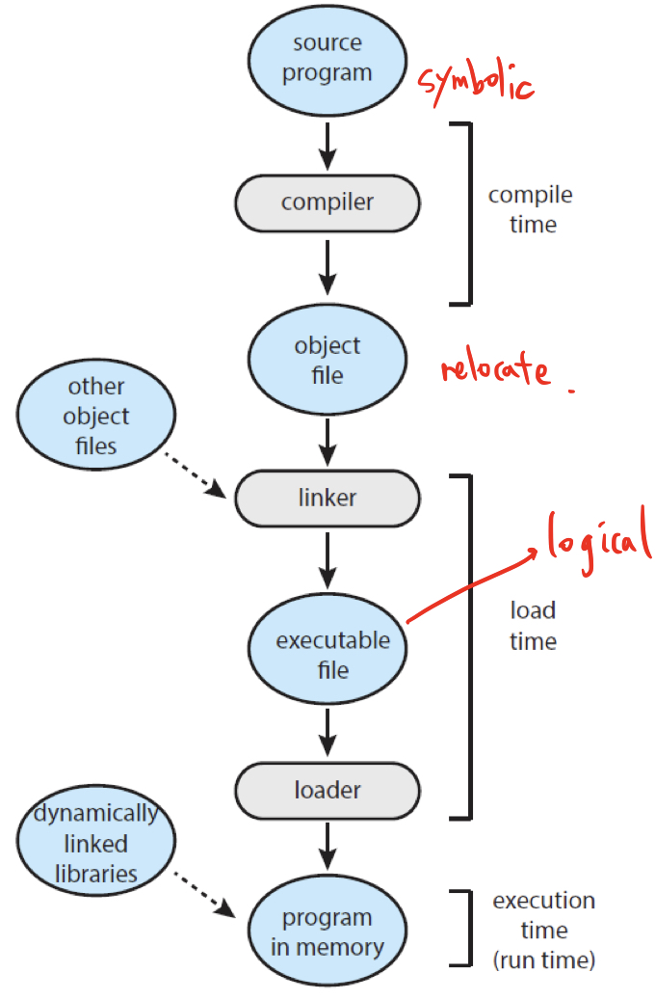

1. compile time 바인딩
   - 컴파일 때 물리적 메모리 주소가 결정
   - 논리적 주소 == 물리적 주소
   - 메모리 어떤 상황일지…? → 폐기
2. load time 바인딩
   - 로드 타임에 물리적 메모리 주소 결정
   - 논리적 주소 사용, 전체 로딩 시 프로세스 로딩되는 위치에 따라 물리적 주소 매핑
   - 프로세스 실행 시 마다 주소 매핑, 변경 시 매핑 새로 하면 로딩 시간 지연
     - ex) 코드 명령어 저장 세그먼트 백만개 ⇒ 백만번 매핑
3. **runtime 바인딩**
   - 실행 후 물리적 주소 변경하는 방식
   - CPU가 주소 참조 시 해당 데이터가 물리적 주소 어디에 잇는지 주소 매핑 테이블을 이용해 바인딩 확인
   - 세그먼트가 많을 때 HW가 작업 수행 = **MMU**

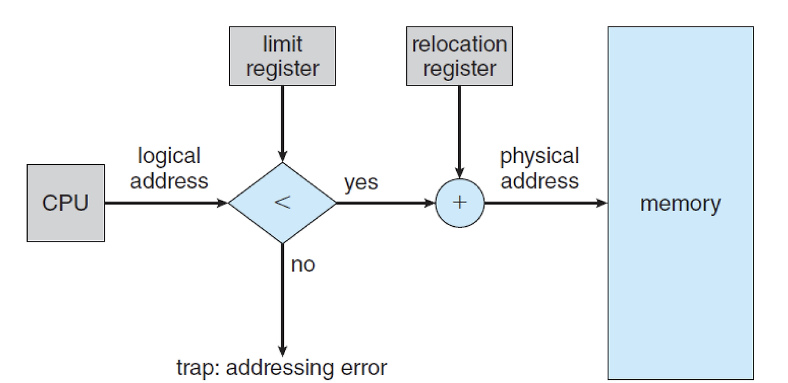

1. 논리적 주소 값은 프로세스마다 독립적으로 할당
2. A 프로세스의 논리적 주소 = 100, B 프로세스의 논리적 주소 = 100
3. **context switching** 발생 시 Relocation register 값을 바뀌는 프로세스에 해당하는 값으로 재설정
4. 결국 A의 물리적 주소 ≠ B의 물리적 주소
5. **limit register**는 주소가 접근하면 안되는 영역까지 가는지 확인하기 위해 사용

### 메모리 관리 배경

각각의 프로세스는 독립된 메모리 공간을 갖고, 운영체제 혹은 다른 프로세스의 메모리 공간에 접근할 수 없는 제한이 걸려있다.

단지 **운영체제만이 운영체제 메모리 영역과 사용자 메모리 영역의 접근에 제약을 받지 않는다.**

### 용어 정리

**Swapping** : 메모리의 관리를 위해 사용되는 기법. 표준 Swapping 방식으로는 round-robin과 같은 스케줄링의 다중 프로그래밍 환경에서 CPU 할당 시간이 끝난 프로세스의 메모리를 보조 기억장치(하드 디스크)로 내보내고 다른 프로세스의 메모리를 불러 들일 수 있다.

> 이 과정을 Swap 이라 한다. 주 기억장치(RAM)으로 불러오는 과정을 swap-in, 보조 기억장치로 내보내는 과정을 swap-out 이라 한다. swap에는 큰 디스크 전송 시간이 필요하기 때문에 현재에는 메모리 공간이 부족할 때 Swapping이 시작된다.

**단편화(Fragmentation)** : 프로세스들이 메모리에 적재되고 제거되는 일이 반복되다 보면, 프로세스들이 차지하는 메모리 틈 사이에 **사용하지 못할 만큼의 작은 자유 공간**이 늘어나게 되는데, 이것이 단편화이다. 단편화는 두가지 종류로 나뉜다.

- 외부 단편화 : 메모리 공간 중 사용하지 못하게 되는 일부분. 물리 메모리(RAM)에서 사이사이 남는 공간들을 모두 합치면 충분한 사용공간이 되는 부분들이 **분산되어 있을때 발생**한다고 볼 수 있다.
- 내부 단편화 : 프로세스가 사용하는 메모리 공간에 포함된 남는 부분. 예를 들어 **메모리 분할 자유 공간이 10,000B 있고 프로세스 A가 9,000B 사용하게 되면 1,000B라는 차이**가 존재하고, 이 현상이 내부 단편화다.

**압축(Compaction)** : 외부 단편화 해소를 위해 프로세스가 **사용하는 공간을 한쪽으로 몰아서 공간을 확보**하는 방법이지만, 작업 효율이 좋지 않다.

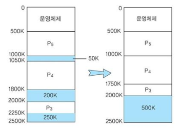

> **JAVA의 Mark-and-Compact Algorithm**

이전에 사용하던 Mark-and-Sweep Algorithm이 가지는 단편화 약점 극복을 위해 나온 알고리즘. OS에서 사용하는 Compact 와 같다.
Mark, Sweep은 동일, Compaction이 추가된 알고리즘
**Compaction을 통해 메모리 공간 효율은 올라갔지만, Object의 Reference 업데이트가 필요해
오버헤드 증가 = 작업 효율 감소**

> 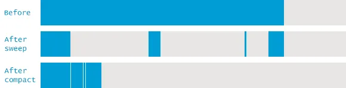

---

[메모리 할당의 분류]

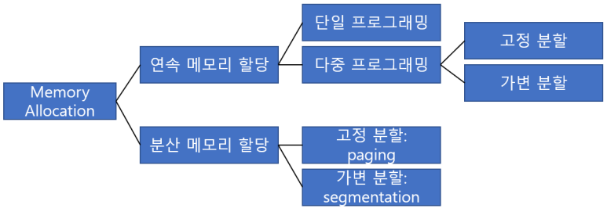

**단일 프로그래밍의 연속 메모리 할당**

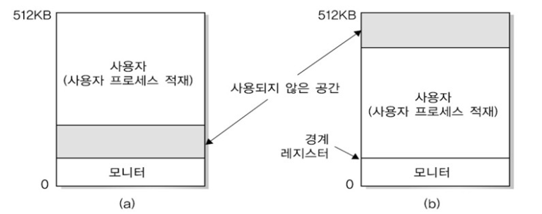

- 사용자 영역 + 운영체제 상주 영역(모니터)
  - 메모리 제어 권한 = 사용자 → 주소 지정 실수하면 모니터 건드림
  - **경계 레지스터** : 프로그램 영역이 저장되어 있는 크기 = **논리적 주소**
  - **기준 레지스터**는 사용자 프로그램의 시작 주소를 나타냄 = **물리적 주소**를 위해 사용
  - 메모리 관리 장치(MMU) : 기준 레지스터를 사용해 논리적 주소 → 물리적 주소 변환
    - 논리 주소 400, 기준값 1200 ⇒ 1200 + 400 = 1600 (물리 주소)
- 단순하고 이해하기 쉽지만 한 번에 프로그램 하나만 사용 가능 → 메모리 효율 안좋음
  - ex) 프로세서 사용 - 입출력 대기 - 프로세서 사용 - 입출력 대기 - 프로세서 사용
- 메모리 보다 큰 프로그램 = 스와핑

**고정 분할 방법**

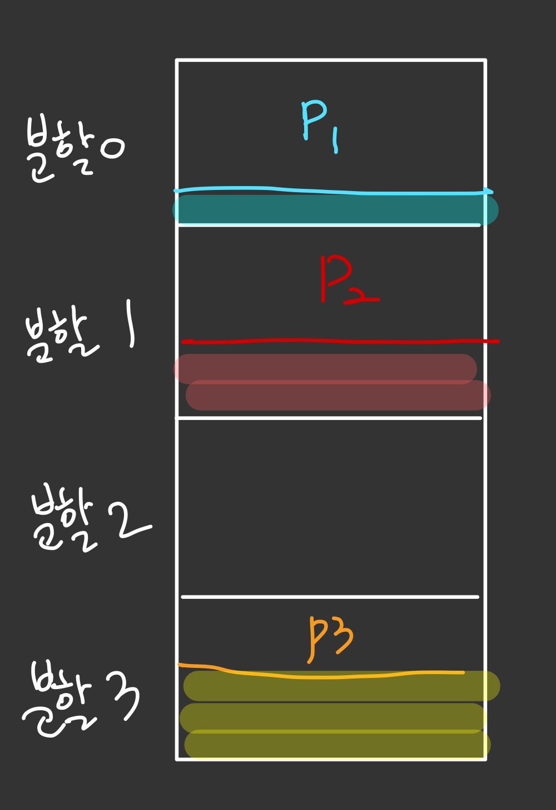

- 메모리를 고정된 크기로 분할 후 프로세스 실행
- 논리적 주소가 분할된 메모리보다 크면 오류, 작으면 내부 단편화
  - 분할 영영의 크기 결정
  - 영역 배치 → 작업 스케줄러가 필요함

**가변 분할 방법**

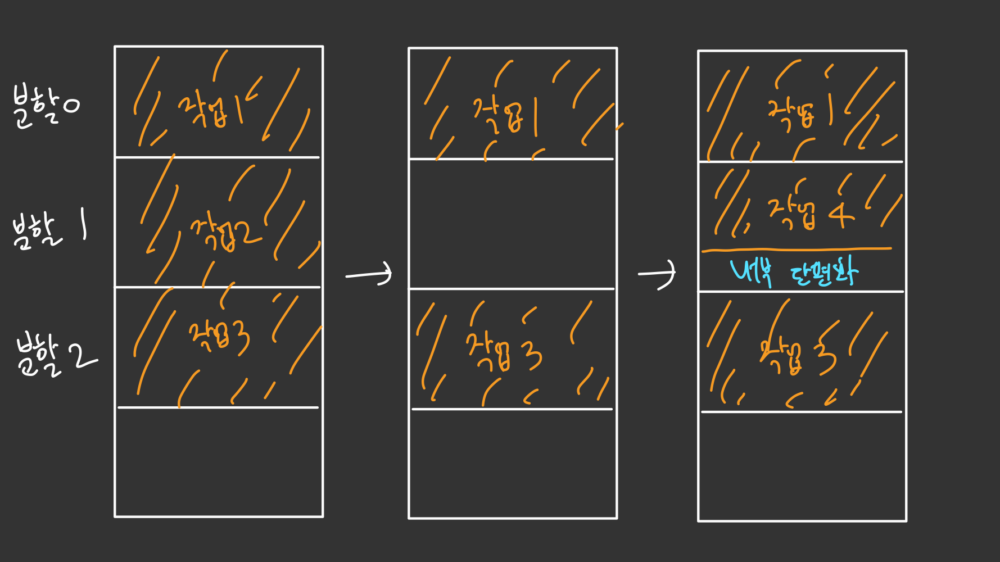

- 고정하지 않고 각 프로세스가 필요한 만큼 메모리 할당
- 운영체제가 메모리의 어떤 부분을 사용하고 사용할 수 있는지 알 수 있는 테이블을 유지해야 함
- 어떤 공간에 넣어야 하나요?
  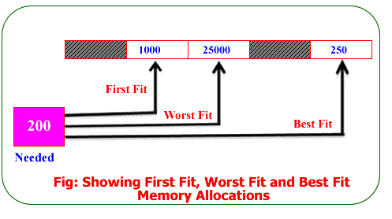
  - 최초 적합 First-Fit : 빠르지만 공간 활용률 떨어질 수 있음
  - 최적 적합 Best-Fit : 공간 활용률 높지만 할당 시간 느림
  - 최악 적합 Worst-Fit : 큰 공간에 배치 후 남은 공간에 다른 프로그램 배치 가능하지만 큰 프로그램이 사용할 공간 X
- 내부 단편화는 많이 줄었지만 외부 단편화는?
  - 압축(Compaction) 통해 해결할 수 있지만 압축 자체가 효율이 좋지 않다.

**버디 시스템**

- 고정 분할, 동적 분할 모두 단편화 문제 발생 ⇒ 버디 시스템 등장
- 메모리는 2^n 크기로 분할 가능
  - 프로세스 크기를 2^p 라 하면, 2^k-1 < 2^p < 2^k 를 만족하는 k를 찾아서 그 곳에 프로세스 배치
  - 모든 프로세스를 가장 적합한 곳에 위치 가능
- 하지만 페이징이나 세그멘테이션을 활용한 가상 메모리 선호
  → 유닉스의 커널 메모리 할당이나 병렬 처리 시스템에 활용

**Paging(페이징)**

<aside>
✅ 전공책 두께가 무려 10 m → 100개로 나눠서 들고 다녀야지!

</aside>

[전체 프로세스 설명]

> 1. 전공책이 너무 두꺼워서 하늘이 무너진다 (외부 단편화)
> 2. 전공책은 97개 챕터니까 10개의 챕터씩 10개로 분할해야겠다! (페이징)
> 3. 수업도 10 챕터 씩이니까 딱 맞네???? (수업 진도 = 메모리의 프레임 = 분할된 책 = 페이지 = 오프셋)
> 4. 찾기 힘드니 책 순서를 저장해놔야지 (페이지 테이블)
> 5. 아 마지막 챕터가 7개 뿐이라 3챕터 분이 남네…(내부 단편화)

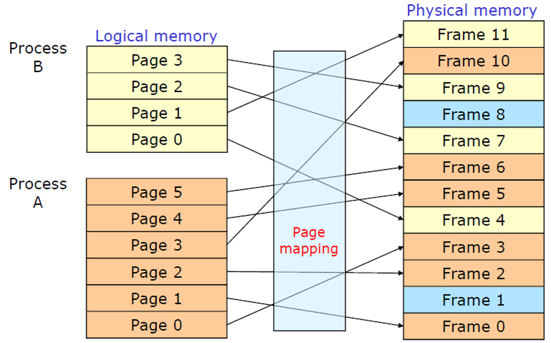

하나의 **프로세스가 사용하는 메모리 공간이 연속적이어야 한다는 제약을 없애는 (=불연속적)** 메모리 관리 방법이다.

외부 단편화와 압축 작업을 해소하기 위해 생긴 방법으로, **물리 메모리는 Frame이라는 고정 크기**로 분리되어 있고, **논리 메모리(프로세스가 점유하는)는 페이지라 불리는 고정 크기의 블록**으로 분리된다. (페이지 교체 알고리즘에 들어가는 페이지)

페이징 기법을 사용함으로써 논리 메모리는 물리 메모리에 저장될 때, 연속하게 저장될 필요가 없고 물리 메모리의 남는 프레임에 적절히 배치됨으로써 **외부 단편화를 해결**할 수 있는 큰 장점이 있다.

하나의 프로세스가 사용하는 공간은 여러 개의 페이지로 나뉘어서 관리되고(논리 메모리에서), 개별 페이지는 **순서에 상관없이** 물리 메모리에 있는 프레임에 mapping 되어 저장된다.

- 단점 : 내부 단편화 문제의 비중이 늘어가게 된다. 예를 들어 페이지 크기가 1,024B이고 프로세스 A가 3,172B의 메모리를 요구한다면 3개의 페이지 프레임(1,024 \* 3 = 3,072) + 100B가 남기 때문에 총 4개의 페이지 프레임이 필요하다. 결국 4번째 페이지 프레임에는 924B(1,024 - 100)의 여유 공간이 남게 되는 **내부 단편화 문제가 발생한다**.

**⇒ 그럼 페이지 테이블은 어떻게 만들지?**

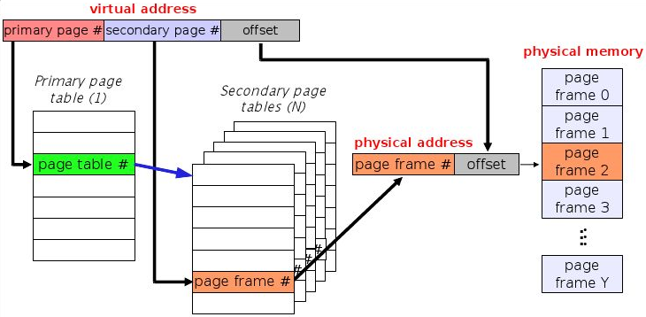

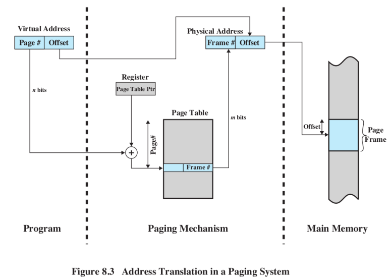

1. 논리 주소 구성 : [(디렉토리 번호) + 페이지 테이블 번호 + 오프셋]
   1. 디렉토리 번호 : 2단계 페이징 시 앞의 테이블 번호
   2. 페이지 테이블 번호 : 인덱스
   3. 오프셋 : 한 개의 페이지 내부에서 데이터의 상대적 위치 (크기)
2. 페이지 테이블 관리 == 메모리 엑세스 성능 : 효율성이 매우 중요
3. **페이지 테이블 기준 레지스터(PTBR)**의 변경을 통해 페이지 테이블을 지시 → 페이지 테이블 기준 주소 변경
4. 페이지 테이블 사용 시 메모리 엑세스를 두번함 ⇒ 페이지 테이블 사용 전 **TLB 체크**
   1. MMU에 저장할 수 있을까? = 너무 큼 ⇒ CPU가 아닌 램에 저장…해야함
   2. 그럼 두번 접근해야함 → 오버헤드 발생 → 해결방법 : 캐시 메모리 사용
   3. 캐시 매핑 사용
      1. 직접 매핑
      2. 연관 매핑
      3. 직접 + 연관 매핑

**Segmentation(세그멘테이션)**

<aside>
❓ 세그먼트가 뭔가요?
정의 : 메모리의 어느 곳에나 위치 가능, 프로그램 실행을 위해 필요한 공간과 데이터를 처리하는 명령어들을 위한 프로그램 or 메모리의 일부분 ⇒ 단위

하나의 프로세스 실행을 위해 최소한 코드, 데이터, 스택 세그먼트 필요함
모든 세그먼트의 크기가 같을까? ⇒ 논리적 단위로 쪼개기 때문에 일정하지 않음

</aside>

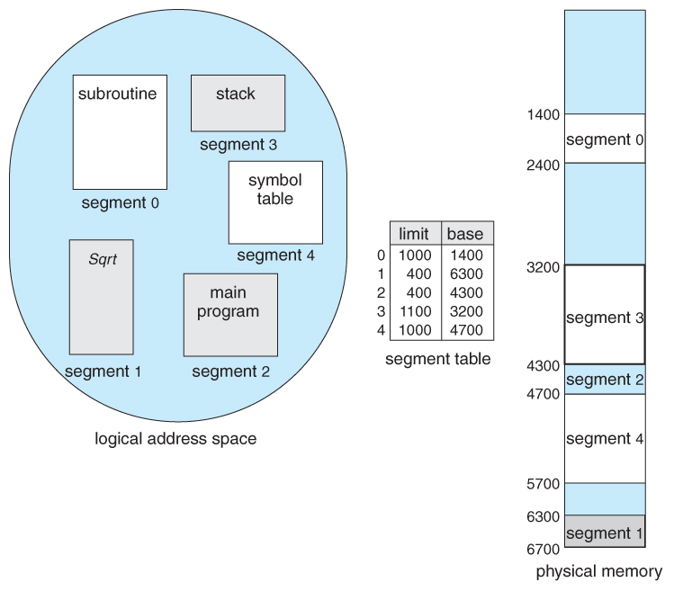

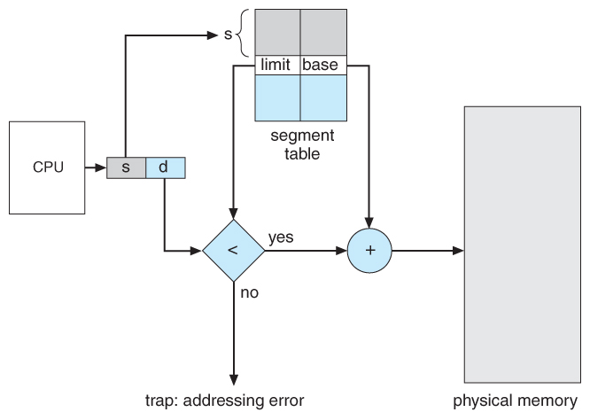

페이징에서 처럼 논리 메모리와 물리 메모리를 같은 크기의 블록이 아닌, 서로 **다른 크기의 논리적 단위인 세그먼트**(Segment)로 분할, 사용자가 두 개의 주소로 지정(세그먼트 번호 + 변위) 세그먼트 테이블에는 각 세그먼트 기준(세그먼트의 시작 물리 주소)과 한계(세그먼트의 길이)를 저장

1. 프로세스의 논리 주소 (#segment, offset) 으로 표현 (offset = 변위)
2. 세그먼트 테이블에 논리 주소 값이 들어가면 세그먼트 번호는 세그먼트 테이블의 인덱스 값으로 인식
3. 그 인덱스를 토대로 시작 위치와 한계 값 파악 ⇒ 물리적 주소 도출

- 단점 : 서로 다른 크기의 세그먼트들이 메모리에 적재되고 제거되는 일이 반복되다 보면, **자유 공간들이 많은 수의 작은 조각들로 나누어져 못 쓰게 될 수도 있다.(외부 단편화)**

**Paging(페이징) + Segmentation(세그멘테이션)**

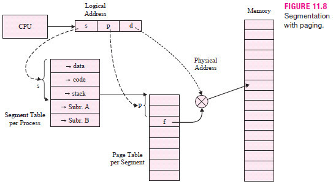

- 세그먼트를 페이징하는 방식
- 세그먼트의 페이지를 물리적 메모리에 매핑
- 세그먼트의 장점인 보호와 공유 기능 + 외부 단편화 해결 (논리적 단위보다 더 작게 페이징)
- **하지만 테이블을 두 번 거치기 때문에 속도가 떨어짐**

> > 하고 싶은 질문 3가지 <<
