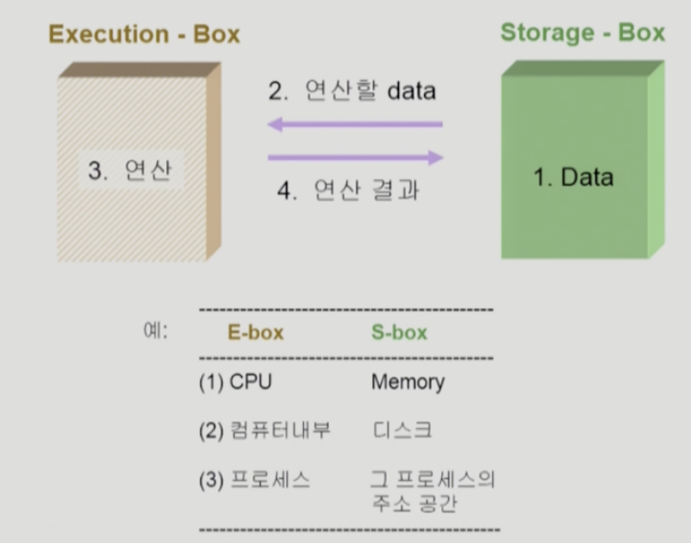
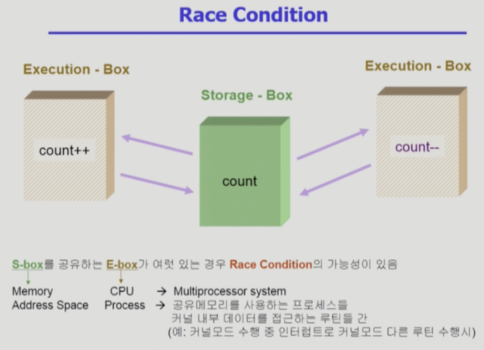
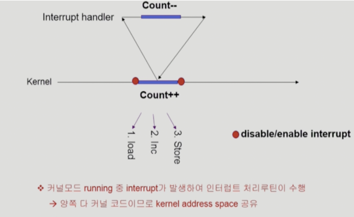
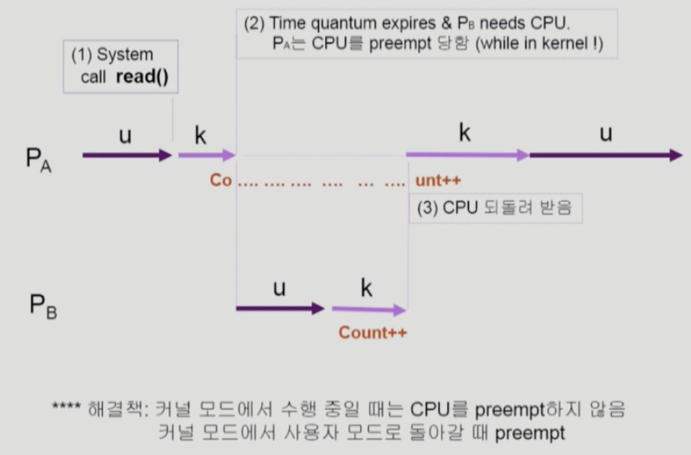
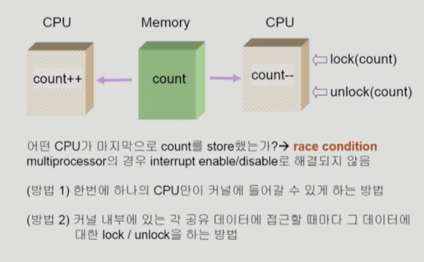
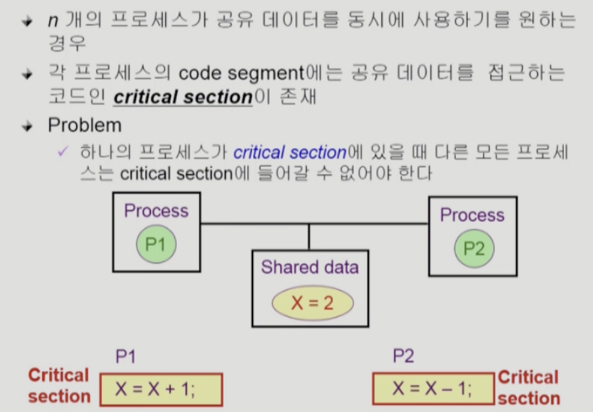
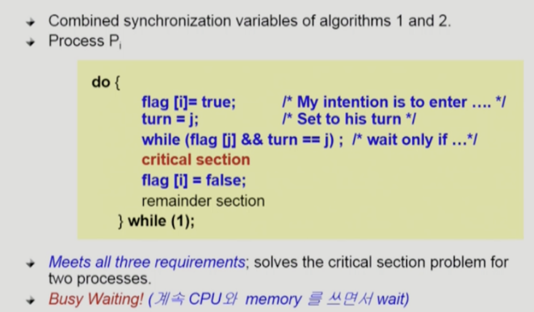
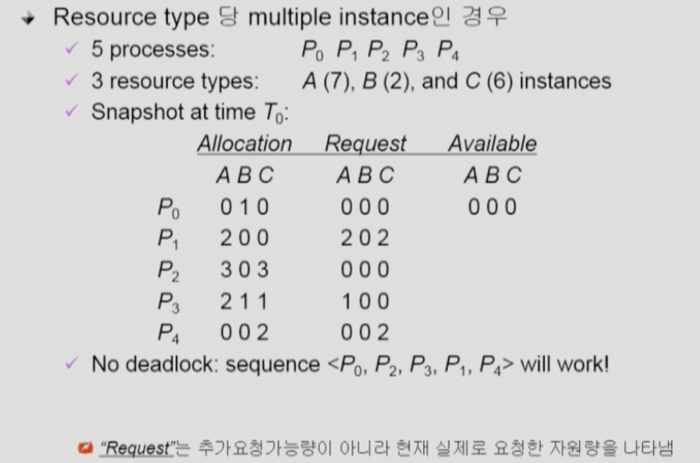

# 프로세스 동기화


## race condition

#### 컴퓨터의 데이터 접근 방식
 

컴퓨터가 작업 중, 디스크의 데이터를 이용할 때, 디스크에 저장되어 있는 값을 읽어서 연산하고 다시 저장하는 작업을 거침 => 문제는 쓰기
 

위 처럼, 같은 count라는 공유자원에서 ++, -- 할 때, 결국 저장된 데이터는 +1 or -1 일 것이고 원하는 결과를 얻을 수 없다.

`이렇게 공유 자원에 대한 접근에서 생기는 문제가 Race Condition`이다.

## OS에서 생길 수 있는 Race Condition

#### 커널 수행 중 인터럽트 발생
 

load 단계에서 읽어들인 후, Interrupt Hanlder에 의한 인터럽트 처리루틴 결과는 무시되고 증가만 되는 경우

=> **`해당 위험이 있는 종류의 작업인 경우 인터럽트 루틴이 끼어들 수 없도록 처리`**

#### 프로세스가 시스템 콜 중에 선점된 경우 
 

프로세스A가 시스템콜하는 과정에서 프로세스B가 선점하는 경우 

=> **`시스템 콜로 커널모드에 진입해있때는 CPU를 선점하지 않는 방식으로 해결`**

#### 멀티 프로세서인 경우


## Process Synchronization

#### 기본 개념
공유 자원의 동시 접근으로 인한 Race Condition을 막기 위해 **`공유 메모리 접근에 대한 순서`** 를 정해주는 것

#### 임계 구역 문제(Critical Section Problem)
프로세스는 고유한 주소 공간과 데이터를 활용하므로 모든 부분에서 문제가 발생하는 것은 아님

여러 프로세스가 함께 공유하는 메모리에 접근하는 코드 블록을 임계구역이라고 함


#### 해결 방법 3가지 조건

**`상호 배제(Mutual Exclusion)`** : P1이 들어가면 P2는 임계구역에 들어가면 안됨

**`진행(Progress)`** : 아무도 임계 구역에 있지 않는 상태에서 임계 구역에 들어가고자하는 프로세스가 있다면 들어가게 해야함

**`한정된 대기(Bounded Waiting)`** : 프로세스가 임계 구역에 들어가려고 요청한 후, 그 요청이 허용될 떄까지 다른 프로세스는 제한이 있어야함(시도하다보면 언젠간 들어가야 한다)

#### 프로그램적 해결 알고리즘
- 피터슨의 해결책



i프로세스가 임계구역에 들어 가고자 함. 현재 턴은 j프로세스는 차례이고, j프로세스가 점유하고 있다면 i프로세스는 기다리다가 j프로세스가 끝나면 i프로세스가 진입한다.

=> 3가지 조건을 모두 충족함
- 한계점
1.  Busy Waiting(=Spin Lock) 문제
2. 최신 컴퓨터 아키텍쳐에서는 성능 향상을 위해 재정렬할 수 있음 => 제대로된 작동안될 수도 있음 

## 하드웨어적 해결 방법 
기본적으로 읽고 쓰는 작업은 서로 다른 인스트럭션으로 이루어짐. 읽기와 쓰기의 인스트럭션이 하나로 이루어진다면 간단하게 프로그램 작성 및 문제 해결


## 고수준 소프트웨어 해결방법

### 뮤텍스 락(Mutex Lock)
뮤텍스라는 단어는 상호 배제에서 나왔고, 임계구역을 보호하고 레이스 컨디션을 방지하는 소프트웨어 도구.

정말 간단한 아이디어
- 임계 구역에 들어가기 락 획득
- 임계 구역에 나갈 때 락 반환 

acquire
```
acquire() {
		/* busy wait */
        while(!available); 
        
		available = false;
}
```
release
```
release() {
        available = true;
}
```
Mutex Lock
```
while (true) {
	acquire lock
	
	/*	critical section */

	release lock

	/* remainder section */	
}
```

#### 뮤택스 락의 단점
`Busy Waiting`를 해야한다는 것이 단점. 하지만, CPU가 여유있거나 Context Switch 비용이 클 때는 스핀락이 선호되기도 함.

## Semaphore
뮤택스를 추상화한 것. 세마포어는 정수 변수를 이용한 락 방식으로 `wait(), signal()` 를 이용한다

wait(S)
```
wait(S) {
	while (S <= 0)
		; // busy wait
	S--;
}
```
signal(S)
```
signal(S) {
	S++;
}
```
여기서 wait와 signal은 원자적으로 실행되어야하며 함

#### 두 가지 사용법
- 공통적으로 각 자원을 사용하려는 프로세스는 세마포어에 wait() 연산으로 세마포어 값을 감소하고 자원을 방출할 때는 signal() 연산으로 세마포어 값이 증가  
- 카운팅 세마포어

    가용할 수 있는 자원의 개수로 초기화
- 이진 세마포어

    0,1로만 가능하고 뮤텍스 락과 비슷하게 동작 


## 모니터 
세마포어는 signal()을 호출해야 하는 코드에 실수로 wait()를 호출하는 식의 오류가 발생할 수 
있음. 

이러한 오류를 처리하기 위해 간단한 동기화 도구들을 통합한 것이 **`모니터`** 타입

#### 모니터 사용법 
자바의 캡슐화된 객체와 유사하며 wait()와 signal()만 호출할 수 있음 
```
condition x, y;
// 만약 x.wait()가 호출된다면
x.wait();
// 다른 프로세스가 x.signal()을 호출할 때 까지 일시중지
x.signal();
```
x.signal() 연산은 정확히 하나의 일시중지된 프로세스를 재개. `일시 중지된 프로세스가 없다면, signal()은 무시` 세마포어에서는 signal()하게 되면 내부 변수에 +1를 하는 것과는 아예 다름 

특정 프로세스부터 실행
```
x.wait(c);
```
c는 우선순위 번호를 가진 프로세스가 먼저 실행됨. 일시 중지된 프로세스는 이름과 함께 저장됨. (번호가 없을 때는 우선 순위 대로 실행)

## MySQL 동기화 문제
- 공유락(s-lock) : 쓰기는 금지. 동시에 읽을 수 있음
- 베타락(x-lock) : 베타락인 레코드를 읽거나 쓰고 있으면 다른 쓰레드는 둘 다 금지

## Java에서의 동기화 
자바는 쓰레드 동기화를 위해 모니터와 같은 방식으로 `synchronized`키워드를 지원하고 있음

예시
```
	public void Test() {
		synchornized {
			
		}
        /* next */
	}
```
만약 다른 스레드가 락을 획득했다면 `진입 집합(entry set)`에 추가됨.(락이 풀리면 진입하고자하는 스레드 집합)

## DeadLock 

교착상태는 간단하게 서로가 가진 **자원** 을 기다리며 스스로 자신의 상태를 바꿀 수 잆는 상태를 의미함


### 데드락 발생 조건

1. 상호 배제(Mutual exclusion)
    - 한 프로세스가 자원을 사용할 때 다른 프로세스는 사용할 수 없음
2. 점유 및 대기(Hold and Wait)
    - 한 자원을 점유한 상태에서 다른 자원을 요청하기 위해 대기하는 것
3. 비선점 (No preemption)
    - 한 프로세스가 자원을 할당 받으면 작업을 끝날 때까지 다른 프로세스가 뻇을 수 없음 
4. 순환 대기(Circular-wait)
    - 여러 프로세스가 자원을 요청하는데 해당 구조가 원 

### 처리 방법 4가지

#### 예방
- 위 발생조건 4가지 중 하나가 만족되지 않도록 하는 건데 비효적이라 잘 활용 안됨 
1. 상호 배제(Mutual exclusion)
    - 읽기의 경우 비상호 배제를 적용 
2. 점유 및 대기(Hold and Wait)
    - 필요한 것을 미리 모두 할당
    - 자원이 필요할 때 보유 자원을 모두 놓고 다시 요청
3. 비선점
    - 어떤 자원을 기다리는 경우 현재 들고 있는 것을 선점으로 변경  
4. 순환 대기(Circular-wait)
    - 순서를 할당  

#### 회피
 - safe state
    - 시스템 내에 프로세스들에 대한 safe sequence가 존재하는 상태
- safe sequence
    - 프로세스의 자원 요청이 `프로세스들이 할당받은 자원들 + 가용자원`에 의해 충족될 수 있어야 한다. 

`시스템이 unsafe state에 들어가지않도록 보장하는 것` 이 바로 회피 

이 방법은 데드락의 가능성이 있다면 프로세스 진입을 아예 거부하므로 가용 자원이 적다면 비효율을 초래할 수 있음

- 회피 알고리즘
    - 자원 하나

        Resource Allocation Graph Algorithm
    - 자원 여러개

        Banker’s Algorithm

#### 탐지 및 회복 

- 자원 당 인스턴스 하나 

    데드락이 되는 사이클을 찾는 데 드는 비용은 O(n^2)
- 자원 당 인스턴스 여러 개 


낙관적으로 할당된 자원이 있다면 반납할 것이라고 예상하고, 요청만큼 할당해줄 수 없다면 데드락

- 회복 방법
    - 프로세스 킬 
    1. 모두 죽이기
    2. 데드락 해소될 때 까지, 하나씩 죽이기 
    - 자원 선점
    1. 비용 최소화할 victim 선정
    2. safe state로 롤백해서 다시 시작
    
        -> 기아 문제가 발생할 수 있음(같은 victim이 선정 되는 경우) 
    
#### 무시
- 데드락 발견시 무시
- 데드락 예방, 탐지&회복에 대한 오버헤드가 클 수 있으므로 대처X
- 데드락은 드물게 발생하므로 대부분의 OS가 채택하는 방식 
