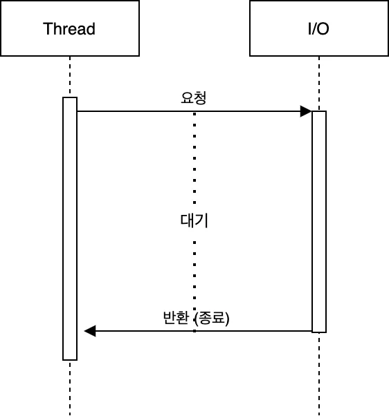
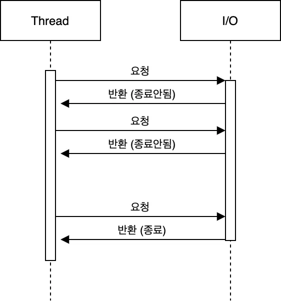
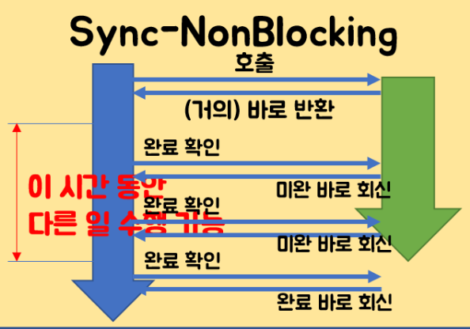
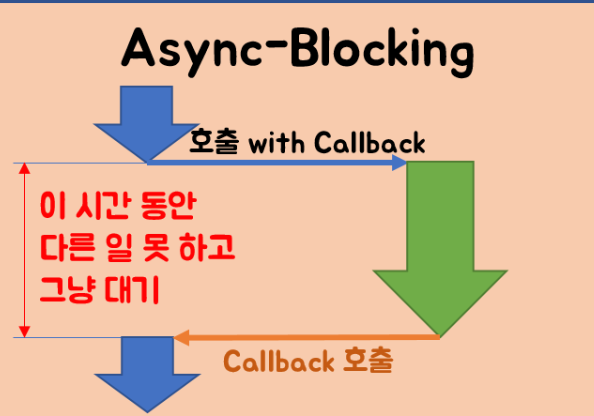

## 동기와 비동기의 차이

---

`동기(Synchronous)` : 호출된 함수가 작업이 완료될 때까지 호출자가 기다리는 방식

- 순차적으로 작업을 실행
- 호출자는 호출된 함수가 완료되면 즉시 결과를 반환받는다
- 함수가 끝나는 시간과 다음 함수가 시작되는 시간이 동일하다

---

`비동기(Asynchronous)` : 호출된 함수가 작업을 완료하지 않아도 호출자가 기다리지 않고 다음 작업을 수행할 수 있는 방식

- 오래 걸리는 작업을 비동기 방식으로 처리하곤 한다
- 작업이 완료되면 콜백, 이벤트 등을 통해 결과를 처리

---

`Blocking` : 작업이나 함수를 호출하면 제어권을 상대방에게 넘겨준다. 제어권을 넘겨주면 호출자는 작업을 잠시 멈춘다.



블로킹은 요청에 대한 결과가 올 때 까지 스레드는 아무것도 하지 못하고 대기하게 된다.

제어권을 상대방에게 넘겨주고, 종료가 될 때까지 기다린다.

---

`Non-Blocking` : A함수가 B함수를 호출하면 제어권은 그대로 둔 채 B함수를 실행한다. A함수와 B함수가 동시에 실행되는 것.



호출된 함수나 작업이 즉시 반환되어 호출한 쪽이 기다리지 않고 다른 작업을 계속 할 수 있다.

호출자가 즉시 제어권을 반환받아 다른 작업을 수행할 수 있다.

---

## Sync/Async 와 Blocking/Non-Blocking의 차이점

A가 B에게 작업을 요청했다고 가정한다면

Sync/Async는 B의 작업 결과가 있어야만 다음 연산을 진행할 수 있을 때

Blocking/Non-Blocking은 B의 작업 결과랑은 관계없이 작업을 수행하고 싶을 때

---

### Sync - NonBlocking 방식

NonBlocking 함수 호출 후 바로 반환 받아서 다른 작업을 할 수 있게 되지만, 메서드 호출에 의해 수행되는 작업이 완료된 것은 아니고, 호출하는 메서드가 호출되는 메서드 쪽에 작업 완료 여부를 계속 문의한다.



```java
Future ft = asyncFileChannel.read(~~~);

while(!ft.isDone()) {
    // isDone()은 asyncChannle.read() 작업이 완료되지 않았다면 false를 바로 리턴해준다.
    // isDone()은 물어보면 대답을 해줄 뿐 작업 완료를 스스로 신경쓰지 않고,
    //     isDone()을 호출하는 쪽에서 계속 isDone()을 호출하면서 작업 완료를 신경쓴다.
    // asyncChannle.read()이 완료되지 않아도 여기에서 다른 작업 수행 가능 
}
```

### Async - Blocking 방식

호출되는 함수가 바로 리턴하지 않고, 호출하는 함수는 작업 완료 여부를 신경쓰지 않는다



**Async-NonBlocking 방식을 쓰는데 그 과정 중에 하나라도 Blocking으로 동작하는 작업이 포함되어 있다면 의도하지 않게 Async-Blocking으로 동작**할 수 있다..
