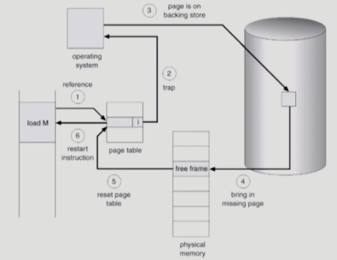
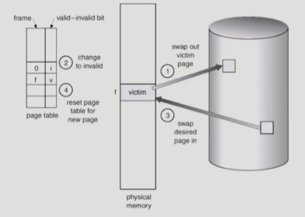
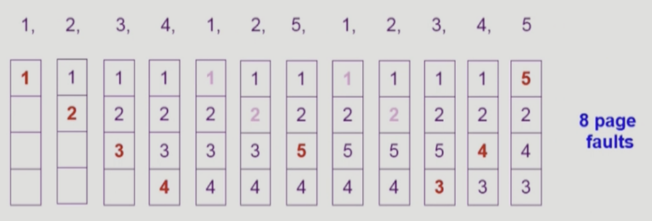
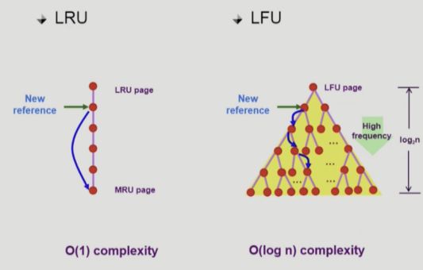

# 가상 메모리

## Demand Paging

#### Basic Concept
실제 필요할 때 Page를 메모리에 올리는 것!
 - Disk I/O 양 감소 
    - 아무리 요즘 기술이 좋아졌어도 DISK 접근하는 것은 여전히 힘듬
 - Memory 사용량 감소
 - 많은 프로세스 수용

 -> 전체적으로 빠른 응답 시간! 

#### Valid / Invalid bit 활용
 - Valid? Invalid?
    - 사용 여부를 나타냄
    - Invalid : 사용X, 페이지가 물리적 메모리에 없음
 - 처음에는 모든 Page Entry를 Invalid로 초기화 
 - Address translation 시 invalid bit가 set되어 있다면 ``Page Fault``라고 부르는 트랩이 발생함 

#### Page Fault 시 동작 과정
 - invalid page로 접근하면 MMU가 트랩을 발생 시킨다
 - 커널 모드로 들어가서 Page Fault Handler가 invoke
    - Invalid Reference인지 확인(주소가 잘못, 권한 잘못인지 => 맞다면 취소)
    - 메모리에서 빈 페이지 프레임을 찾아 가져옴
    - 해당 페이지를 Disk에서 Memory로 읽어온다
        - Disk I/O 끝나기 전까지 이 프로세스가 CPU 선점
        - Disk Read가 끝나면 Page Table Entry를 기록하고 Valid Bit를 Valid로 설정
        - 프로세스를 Job Queue로 돌려 보냄
    - 프로세스가 CPU를 잡고 다시 재개
    - Trap이 발생하기 전 중단되었던 인터렙션이 재개 

#### Page Replacement

- Free Frame이 없는 경우, 어떤 페이지를 빼앗아올지 결정해야 하는데 이를 Page Replacement라고 함

#### Replacement Algorithm
- 목표 : Page Fault Rate를 최소화 하는 것

1. MIN(Optimal) : 가장 먼 미래에 참조되는 Page를 Replace
    - 미래의 참조를 알 수 없음
    - 다른 알고리즘에 대한 성능에 대한 측정 도구

2. FIFO : 가장 먼저 들어온 것을 먼저 내보냄 

3. LRU(Least Recently Used Alogrithm) : 가장 오래전에 참조된 것을 지움

4. LFU(Least Frequently Used Algorithm) : 가장 참조횟수가 적은 페이지를 지움
    - 최저 참조 횟수 Page가 여럿 있는 경우
        - LFU 알고리즘 자체에서는 여러 페이지 중 임의로 선정
        - 실제 활용할 때는 가장 오래전에 참조된 Page를 지우게 구현할 수 있음
    - 장점
        - LRU처럼 시간으로 보는게 아니라 Page의 인기도를 반영 
    - 단점
        - 참조 시점의 최근성 반영 X
        - LRU보다 구현의 복잡성
          

=> 하지만, 페이지 폴트가 일어날 때만 OS에게 CPU가 넘어가니까, OS가 어떤 페이지가 가장 오래된 것인지, 많이 참조된 것인지 알 수 없음

#### Page Frame의 Allocation
- 할당 문제 : 각 프로세스에 얼마만큼의 Page Frame을 할당할 것인가?

- Allocation의 필요성 
    - 명령어 수행을 위해 최소한으로 할당되어야하는 Frame의 수가 존재
    - Loop 구성하는 Page들은 한꺼번에 Allocate 되는 것이 유리
        - 최소한의 Allocation이 없으면 매 Loop 마다 Page Fault를 겪음 
- Allocation Scheme
    - Equal Allocation
    - Proportional Allocation : 프로세스 크기를 비례하여 할당
    - Priority Allocation : 자주 사용되는 빈도에 따라 다르게 할당 

## Thrashing

### 기본 개념
- 멀티프로그래밍에 동시에 사용하는 프로세스를 늘리면 CPU 사용률이 증가??

    오히려 지나치게 많아지면, 낮아짐 => Thrashing
- Thrashing은 프로세스가 원활한 수행에 필요한 Page Frame 수를 할당 받지 못해 Page Fault가 빈번하게 발생하는 현상

### 현상
 - Page Fault rage가 매우 높아짐
 - CPU 사용률 낮아짐
 - OS MPD(Mutiprogramming Degree)를 높여야 한다고 판단
 - 또 다른 프로세스를 추가
 - 프로세스 당 할당된 Frame의 수가 더욱 감소
 - 프로세스는 Page를 Swap in / swap out 으로 매우 바쁨

 => 대부분의 시간에 CPU는 한가해짐

 ## Thrashing 방지 
- Locality of refence
    - 프로세스는 특정 시간 동안 일정 장소만을 집중적으로 참조
    - 집중적으로 참조되는 해당 Page들의 집합을 Locality Set 이라고 함
- Working-set model
    - Locality에 기반하여 일정 시간 동안 원활하게 수행되기 위해 한꺼번에 메모리에 올라와야하는 집합을 Woring Set
    - 워킹셋 모델에서는 프로세스의 워킹셋 전체가 메모리에 올라와 있으면 수행 아니면 모든 프레임을 Swap Out
=> Thrashing이 방지되고, Multiprogramming degree를 결정  

### Page Size의 결정
 - Page size가 감소하면 페이지 수가 증가
 - 장점
    - 내부 조각 감소
    - 필요한 정보만 메모리에 올려 효율적
 - 단점
    - 페이지 테이블 크기 증가
    - Locality. 큰 페이지가 page falut를 줄일 수 있기에 비효율적일 수 있음
    - disk transfer 효율성 감소

=> 트렌드는 페이지 크기를 크게 4KB

### 캐시 지역성(Locality)

#### 기본 개념
    - 데이터에 대한 접근이 시간적/공간적으로 가깝게 발생한다
    - 기억장치 내의 정보를 균등하게 액세스하는게 아니라 어느 한 순간에 특정 부분을 집중적으로 참조

#### 지역성 종류
- 시간적 지역성 
    - 특정 데이터가 한번 참조된 경우, 가까운 미래에 또 한번 참조될 가능성 높음
- 공간적 지역성
    - 특정 데이터와 인접한 주소의 데이터가 참조될 가능성이 높음 

### 캐싱 라인

#### 기본 개념
- 캐시에서 데이터를 바로 찾지 못하고 모든 데이터를 순회한다면 성능이 매우 떨어짐
- 캐시 메모리의 매핑 프로세스로 주기억장치에서 캐시 메모리에 데이터를 가져와 저장하는 방법
    - 캐시에서 원하는 데이터에 바로 접근하기 위해 특정 자료구조를 사용해서 묶음으로 저장해놓은 것

#### 캐싱 라인 종류
- 직접 매핑
    - 메모리 주소와 캐시의 순서를 일치시킴
    - 메모리 특정 블럭은 특정 캐싱 라인에만 저장
    - 장점
        - 구현은 간단하고 빠름
    - 단점
        - 충돌로 인한 잦은 스와핑이 발생할 가능성이 높음
- 연관 매핑
    - 순서 일치시키지 않고, 필요한 메모리 값을 캐시 어디든 저장
    - 장점
        - 충돌이 적으며 필요한 캐시 위주로만 저장한다면 적중률 높음
    - 단점
        - 찾는 과정이 복잡하고 느림
- 집합 연관 매핑
    - 집합 간의 순서는 일치시키는 반면 집합 내에서는 순서 X
    - 직접 매핑과 연관 매핑의 장점만 취함
